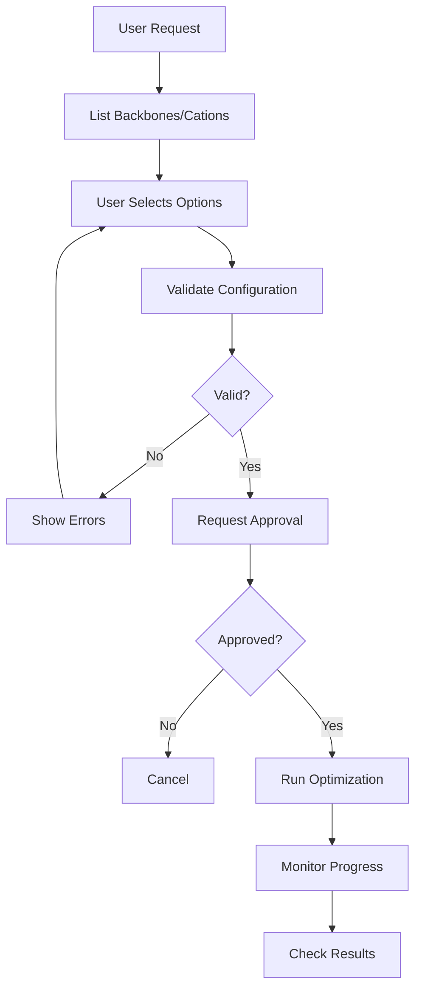

# HEM Agent

> Expert agent for Hydroxide Exchange Membrane (HEM) design, Particle Swarm Optimization (PSO), and cation/backbone management.

## Table of Contents

- [Overview](#overview)
- [Capabilities](#capabilities)
- [Available Tools](#available-tools)
- [Workflow](#workflow)
- [Example Prompts](#example-prompts)
- [Configuration](#configuration)
- [See Also](#see-also)

## Overview

The HEM Agent specializes in designing and optimizing cations for Hydroxide Exchange Membranes. It uses Particle Swarm Optimization (PSO) with a Junction Tree VAE to explore the chemical space and find optimal cation structures for specific polymer backbones.

### Expertise Areas

- Cation design for anion exchange membranes
- PSO-based molecular optimization
- Backbone structure selection (PBF_BB_1, PP_BB_1, etc.)
- Cation families: tetraalkylammonium, imidazolium, benzimidazolium, guanidinium, piperidinium, spiro_undecane
- HEM properties: alkaline stability, ionic conductivity, water uptake, swelling ratio
- Multi-objective optimization

### MCP Server

The HEM Agent connects to the **OHMind-HEMDesign** MCP server for tool access.

## Capabilities

| Capability | Description |
|------------|-------------|
| List Backbones | Enumerate available polymer backbone structures |
| List Cations | Show available cation families and templates |
| Validate Config | Check optimization configuration before running |
| Run Optimization | Execute PSO-based cation optimization |
| Check Results | Retrieve and display optimization results |
| Monitor Jobs | View logs from running optimizations |
| Kill Jobs | Terminate running optimization processes |

## Available Tools

### `list_hem_backbones`

List available polymer backbones for HEM design.

**Returns**: List of backbones with SMILES and identifiers

**Available Backbones**:
- `PBF_BB_1`, `PBF_BB_2` - Polybenzofuran backbones
- `PP_BB_1`, `PP_BB_2`, `PP_BB_3` - Polyphenylene backbones
- `PX_BB_1` - Polyxylene backbone
- `PAI_BB_1` - Polyarylimidazolium backbone
- `PF_BB_1` - Polyfluorene backbone
- `PPO_BB_1`, `PPO_BB_2`, `PPO_BB_3` - Polyphenylene oxide backbones

### `list_cation_types`

List available cation families and initial SMILES templates.

**Returns**: List of cation types with example structures

**Available Cations**:
- `tetraalkylammonium` - Quaternary ammonium cations
- `imidazolium` - Imidazolium-based cations
- `benzimidazolium` - Benzimidazolium cations
- `guanidinium` - Guanidinium cations
- `piperidinium` - Piperidinium cations
- `spiro_undecane` - Spirocyclic cations

### `validate_optimization_config`

Validate a prospective optimization configuration before running.

**Parameters**:
- `backbone` (str): Backbone identifier
- `cation_name` (str): Cation family name
- `property` (str): Property mode (`multi`, `ec`, `ewu`, `esr`)

**Returns**: Validation result with any issues found

### `optimize_hem_design`

⚠️ **EXPENSIVE OPERATION** - Requires user approval

Launch PSO-based optimization to design new cation structures.

**Parameters**:
- `backbone` (str): Target backbone (e.g., `PBF_BB_1`)
- `cation_name` (str): Cation family (e.g., `piperidinium`)
- `property` (str): Optimization target
  - `multi` - Multi-objective (EC, EWU, ESR)
  - `ec` - Electrical conductivity only
  - `ewu` - Equilibrium water uptake only
  - `esr` - Equivalent series resistance only
- `num_part` (int): Number of particles (default: 250)
- `steps` (int): Number of PSO steps (default: 5)
- `save_path` (str, optional): Results directory

**Returns**: Job status and results location

**Estimated Time**: 10-15 minutes

### `check_optimization_results`

Check results from completed optimization runs.

**Parameters**:
- `save_path` (str): Workspace directory
- `backbone` (str): Backbone used
- `cation_name` (str): Cation type used

**Returns**: Top solutions from CSV logs with SMILES and scores

### `show_optimization_logs`

Stream recent optimization log lines for monitoring.

**Parameters**:
- `backbone` (str): Backbone identifier
- `cation_name` (str): Cation type
- `lines` (int): Number of lines to show

**Returns**: Recent log content

### `kill_optimization_job`

List running optimization jobs or terminate one.

**Parameters**:
- `backbone` (str, optional): Filter by backbone
- `cation_name` (str, optional): Filter by cation
- `job_id` (str, optional): Specific job to kill

**Returns**: Job status or termination confirmation

## Workflow

### Standard Optimization Workflow



### Validation Flow

The HEM Agent implements a validation flow for expensive operations:

1. User requests optimization
2. Agent validates configuration
3. Agent displays estimated time and requests approval
4. User approves or cancels
5. If approved, optimization runs

```python
# Validation message format
"⚠️ **HEM Optimization requires approval**

**Configuration:**
- Backbone: `PBF_BB_1`
- Cation: `piperidinium`
- Particles: 250
- Steps: 5
- Results will be saved to: `/OHMind_workspace/HEM`

This is a computationally expensive operation.
Estimated time: 10-15 minutes.

Please approve to continue."
```

## Example Prompts

### Discover Design Space

```
Using your OHMind-HEMDesign tools, list all available backbones and cation 
types, then recommend 2-3 promising backbone-cation combinations for 
alkaline-stable AEMs. Summarize why these combinations are interesting.
```

### Run Multi-Objective Optimization

```
Design new piperidinium-based cations for backbone PBF_BB_1 optimizing 
multi-objective HEM performance (conductivity, ESR, and water uptake). 
Please run PSO using your default settings and summarize the top 10 candidates.
```

### Check Optimization Results

```
Show me the results from the PBF_BB_1 piperidinium optimization. 
Display the top 5 candidates with their SMILES and property scores.
```

### Compare Backbones

```
For backbones PBF_BB_1 and PP_BB_1, design the best tetraalkylammonium 
cations using your HEM optimization tools. Compare the top candidates 
for each backbone in terms of alkaline stability, ESR, and conductivity.
```

### Monitor Running Job

```
Using your HEMDesign job-management tools, find any currently running 
optimizations. Show me a short snippet of the latest log lines for each job.
```

## Configuration

### Environment Variables

| Variable | Purpose | Default |
|----------|---------|---------|
| `HEM_SAVE_PATH` | Results storage directory | `$OHMind_workspace/HEM` |
| `OHMind_workspace` | Base workspace path | `/OHMind_workspace` |

### Results Storage

Optimization results are saved to:

```
$HEM_SAVE_PATH/
├── best_solutions_<BACKBONE>_<CATION>.csv
├── best_fitness_history_<BACKBONE>_<CATION>.csv
└── optimization_<BACKBONE>_<CATION>.log
```

### CSV Output Format

The `best_solutions_*.csv` file contains:

| Column | Description |
|--------|-------------|
| `smiles` | Optimized cation SMILES |
| `ec_score` | Electrical conductivity score |
| `ewu_score` | Water uptake score |
| `esr_score` | ESR score |
| `fitness` | Combined fitness value |

## See Also

- [Agent Reference](./index.md) - Overview of all agents
- [HEMDesign MCP Server](../mcp-servers/hem-server.md) - Tool documentation
- [HEM Optimization Tutorial](../tutorials/hem-optimization.md) - Step-by-step guide
- [OHPSO Module](../core-library/ohpso.md) - PSO implementation details

---
*Last updated: 2025-12-22 | OHMind v1.0.0*
