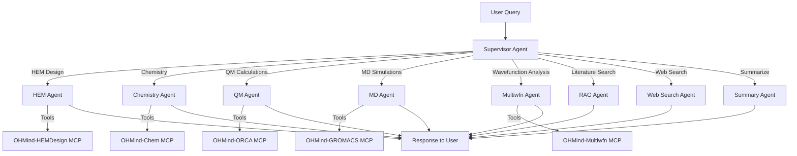

# Agent Reference

> Comprehensive documentation for OHMind's multi-agent system, including agent capabilities, routing logic, and usage patterns.

## Table of Contents

- [Overview](#overview)
- [Agent Architecture](#agent-architecture)
- [Agent Comparison](#agent-comparison)
- [Capabilities Matrix](#capabilities-matrix)
- [Routing Summary](#routing-summary)
- [See Also](#see-also)

## Overview

OHMind employs a LangGraph-based multi-agent architecture with a supervisor pattern. The system consists of **8 specialized agents**, each designed for specific computational chemistry and HEM design tasks. The supervisor agent analyzes user requests and routes them to the appropriate specialized agent.

### Key Features

- **Intelligent Routing**: Supervisor automatically detects query complexity and routes to appropriate agents
- **Task Planning**: Complex multi-step queries are decomposed into execution plans
- **Tool Integration**: Each agent has access to domain-specific MCP tools
- **Streaming Support**: Real-time token streaming with agent activity visualization
- **Validation Flow**: Expensive operations require user approval before execution

## Agent Architecture

## Agent Comparison

| Agent | Purpose | MCP Server | Typical Use Cases |
|-------|---------|------------|-------------------|
| [Supervisor](./supervisor.md) | Route requests, task planning | None | All queries (entry point) |
| [HEM Agent](./hem-agent.md) | HEM design & optimization | OHMind-HEMDesign | PSO optimization, backbone/cation selection |
| [Chemistry Agent](./chemistry-agent.md) | Molecular operations | OHMind-Chem | SMILES conversion, molecular properties |
| [QM Agent](./qm-agent.md) | Quantum chemistry | OHMind-ORCA | DFT calculations, geometry optimization |
| [MD Agent](./md-agent.md) | Molecular dynamics | OHMind-GROMACS | MD simulations, trajectory analysis |
| [Multiwfn Agent](./multiwfn-agent.md) | Wavefunction analysis | OHMind-Multiwfn | HOMO/LUMO, orbital visualization |
| [RAG Agent](./rag-agent.md) | Literature search | None (Qdrant) | Scientific paper retrieval |
| [Web Search Agent](./web-search-agent.md) | Web information | OHMind-Chem | Latest research, protocols |

## Capabilities Matrix

| Capability | HEM | Chemistry | QM | MD | Multiwfn | RAG | Web |
|------------|-----|-----------|----|----|----------|-----|-----|
| PSO Optimization | ✅ | ❌ | ❌ | ❌ | ❌ | ❌ | ❌ |
| SMILES Operations | ❌ | ✅ | ❌ | ❌ | ❌ | ❌ | ❌ |
| Molecular Properties | ❌ | ✅ | ❌ | ❌ | ❌ | ❌ | ❌ |
| DFT Calculations | ❌ | ❌ | ✅ | ❌ | ❌ | ❌ | ❌ |
| Geometry Optimization | ❌ | ❌ | ✅ | ❌ | ❌ | ❌ | ❌ |
| Frequency Calculations | ❌ | ❌ | ✅ | ❌ | ❌ | ❌ | ❌ |
| MD Simulations | ❌ | ❌ | ❌ | ✅ | ❌ | ❌ | ❌ |
| Trajectory Analysis | ❌ | ❌ | ❌ | ✅ | ❌ | ❌ | ❌ |
| Orbital Analysis | ❌ | ❌ | ❌ | ❌ | ✅ | ❌ | ❌ |
| Population Analysis | ❌ | ❌ | ❌ | ❌ | ✅ | ❌ | ❌ |
| Literature Search | ❌ | ❌ | ❌ | ❌ | ❌ | ✅ | ❌ |
| Real-time Web Info | ❌ | ❌ | ❌ | ❌ | ❌ | ❌ | ✅ |

## Routing Summary

The supervisor uses keyword-based fast routing combined with LLM-based analysis for complex queries:

### Fast Routing Keywords

| Keywords | Target Agent |
|----------|--------------|
| `optimize hem`, `design hem`, `pso`, `backbone`, `cation`, `piperidinium` | HEM Agent |
| `smiles`, `molecular weight`, `functional group`, `similarity` | Chemistry Agent |
| `dft`, `single point`, `geometry optim`, `frequency calc`, `orca` | QM Agent |
| `molecular dynamics`, `md simulation`, `gromacs`, `diffusion` | MD Agent |
| `homo`, `lumo`, `orbital`, `wavefunction`, `electron density` | Multiwfn Agent |
| `paper`, `literature`, `research`, `publication` | RAG Agent |
| `latest`, `recent`, `current`, `news` | Web Search Agent |

### Complex Query Handling

When the supervisor detects a complex multi-step query (e.g., "Calculate and analyze HOMO/LUMO"), it:

1. Creates a task plan with sequential steps
2. Saves the plan to a markdown file in the workspace
3. Executes each step in order, routing to appropriate agents
4. Generates a final summary after all steps complete

### Validation Flow

Expensive operations require user approval:

- **HEM Optimization**: ~10-15 minutes
- **QM Geometry Optimization**: ~5-30 minutes
- **QM Frequency Calculations**: ~5-30 minutes
- **MD Simulations**: ~1-4 hours

## See Also

- [Supervisor Agent](./supervisor.md) - Detailed routing logic
- [Architecture Overview](../architecture/overview.md) - System architecture
- [Multi-Agent System](../architecture/multi-agent-system.md) - LangGraph workflow
- [MCP Servers](../mcp-servers/index.md) - Tool documentation

---
*Last updated: 2025-12-22 | OHMind v1.0.0*
