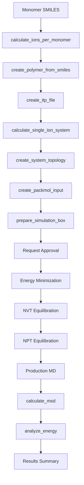

# MD Agent

> Expert agent for molecular dynamics simulations of polymer membranes using GROMACS.

## Table of Contents

- [Overview](#overview)
- [Capabilities](#capabilities)
- [Available Tools](#available-tools)
- [Workflow](#workflow)
- [Example Prompts](#example-prompts)
- [Configuration](#configuration)
- [See Also](#see-also)

## Overview

The MD Agent specializes in molecular dynamics simulations for ion exchange membranes using GROMACS. It handles system preparation, force field parameterization, simulation execution, and trajectory analysis.

### Expertise Areas

- GROMACS MD simulations
- Force field parameterization (AMBER/GAFF)
- System preparation (solvation, ion addition)
- Polymer building from SMILES
- Trajectory analysis
- Transport properties (diffusion, conductivity)

### MCP Server

The MD Agent connects to the **OHMind-GROMACS** MCP server for tool access.

### Important Note

Full MD workflows are **VERY time-consuming** (1-4 hours). The agent will request validation before running expensive simulations.

## Capabilities

| Capability | Description | Expensive |
|------------|-------------|-----------|
| Ion Analysis | Calculate ions per monomer | No |
| Polymer Building | Create polymer from SMILES | No |
| Parameterization | Generate force field parameters | No |
| System Setup | Prepare simulation box | No |
| Full IEM Workflow | Complete membrane simulation | ⚠️ Very High |
| Full MD Simulation | EM → NVT → NPT → Production | ⚠️ Very High |
| MSD Analysis | Diffusion coefficient calculation | No |
| Energy Analysis | Thermodynamic observables | No |

## Available Tools

### Analysis Tools

#### `calculate_ions_per_monomer_tool`

Calculate ion content from monomer SMILES.

**Parameters**:
- `smiles` (str): Monomer SMILES string

**Returns**: Number of ionizable sites per monomer

#### `analyze_ion_exchange_groups_tool`

Advanced analysis of ion-exchange groups in monomers.

**Parameters**:
- `smiles` (str): Monomer SMILES string

**Returns**: Detailed analysis of functional groups

### Building Tools

#### `create_polymer_from_smiles_tool`

Build oligomer/polymer PDB structures from monomer SMILES.

**Parameters**:
- `smiles` (str): Monomer SMILES
- `degree_of_polymerization` (int): Number of repeat units
- `num_chains` (int): Number of polymer chains

**Returns**: Path to generated PDB file

#### `create_itp_file_tool`

End-to-end workflow from polymer PDB to GROMACS `.itp` file.

**Parameters**:
- `pdb_file` (str): Path to polymer PDB
- `charge_method` (str): Charge calculation method

**Returns**: Path to generated ITP file

Uses Antechamber + tleap + conversion + extraction pipeline.

### Parameterization Tools

#### `parameterize_molecule_antechamber_tool`

Run Antechamber on a molecule for charges and atom types.

**Parameters**:
- `pdb_file` (str): Input PDB file
- `charge_method` (str): AM1-BCC or other method

**Returns**: Parameterization results

#### `prepare_mainchain_files_tool`

Produce HEAD/CHAIN/TAIL mainchain definitions.

**Parameters**:
- `antechamber_output` (str): Path to Antechamber output

**Returns**: Mainchain definition files

#### `run_prepgen_tool`

Generate PREPI residue files from mainchain definitions.

**Parameters**:
- `mainchain_files` (str): Path to mainchain files

**Returns**: PREPI file path

#### `build_polymer_with_tleap_tool`

Build polymer chains with tleap for topology generation.

**Parameters**:
- `prepi_file` (str): PREPI residue file
- `num_chains` (int): Number of chains
- `chain_length` (int): Monomers per chain

**Returns**: AMBER topology and coordinate files

#### `convert_amber_to_gromacs_tool`

Convert AMBER topologies to GROMACS formats.

**Parameters**:
- `prmtop` (str): AMBER parameter file
- `inpcrd` (str): AMBER coordinate file

**Returns**: GROMACS `.top` and `.gro` files

#### `extract_ff_and_itp_tool`

Extract `forcefield.itp` and monomer `.itp` from a `.top` file.

**Parameters**:
- `top_file` (str): GROMACS topology file

**Returns**: Extracted ITP files

### System Preparation Tools

#### `calculate_single_ion_system_tool`

Compute system composition and charge balance.

**Parameters**:
- `polymer_charge` (int): Total polymer charge
- `target_water_content` (float): Water uptake target
- `ion_type` (str): Counter-ion type

**Returns**: System composition details

#### `create_system_topology_tool`

Build system `.top` with polymers, ions, and water.

**Parameters**:
- `polymer_itp` (str): Polymer ITP file
- `num_polymers` (int): Number of polymer chains
- `num_ions` (int): Number of counter-ions
- `water_model` (str): Water model name

**Returns**: System topology file

#### `create_packmol_input_tool`

Run PACKMOL-based initial packing.

**Parameters**:
- `components` (list): System components
- `box_size` (list): Box dimensions

**Returns**: Packed coordinate file

#### `prepare_simulation_box_tool`

Use `gmx editconf` to define simulation box.

**Parameters**:
- `input_gro` (str): Input coordinate file
- `box_type` (str): Box type (cubic, dodecahedron)
- `box_size` (list): Box dimensions

**Returns**: Box-defined coordinate file

### Simulation Tools

#### `create_mdp_file_tool`

Generate MDP files for different simulation phases.

**Parameters**:
- `simulation_type` (str): `em`, `nvt`, `npt`, or `md`
- `temperature` (float): Target temperature in K
- `pressure` (float): Target pressure in bar
- `nsteps` (int): Number of steps
- `dt` (float): Timestep in ps

**Returns**: Path to MDP file

#### `run_grompp_tool`

Prepare TPR files via `gmx grompp`.

**Parameters**:
- `mdp_file` (str): MDP parameter file
- `gro_file` (str): Coordinate file
- `top_file` (str): Topology file

**Returns**: TPR file path

#### `run_mdrun_tool`

⚠️ **EXPENSIVE OPERATION** - Requires user approval

Execute MD runs with `gmx mdrun`.

**Parameters**:
- `tpr_file` (str): TPR input file
- `ntomp` (int): OpenMP threads

**Returns**: Trajectory and output files

### High-Level Workflow Tools

#### `run_complete_iem_workflow_tool`

⚠️ **VERY EXPENSIVE** - Requires user approval

Complete IEM MD workflow from monomer SMILES.

**Parameters**:
- `smiles` (str): Monomer SMILES
- `num_chains` (int): Number of polymer chains
- `degree_of_polymerization` (int): Chain length
- `temperature` (float): Simulation temperature
- `water_model` (str): Water model
- `simulation_time` (float): Production time in ns

**Returns**: Complete simulation results

**Estimated Time**: 1-4 hours

#### `run_complete_md_simulation_tool`

⚠️ **VERY EXPENSIVE** - Requires user approval

Full EM → NVT → NPT → MD pipeline.

**Parameters**:
- `gro_file` (str): Initial coordinates
- `top_file` (str): Topology file
- `temperature` (float): Target temperature
- `pressure` (float): Target pressure
- `production_time` (float): Production time in ns

**Returns**: Simulation trajectory and analysis

**Estimated Time**: 1-4 hours

### Analysis Tools

#### `calculate_msd_tool`

Compute MSD and diffusion coefficients from trajectories.

**Parameters**:
- `trajectory` (str): Trajectory file (.xtc, .trr)
- `topology` (str): Topology file
- `selection` (str): Atom selection

**Returns**: MSD data and diffusion coefficient

#### `analyze_energy_tool`

Analyze energies from `.edr` files.

**Parameters**:
- `edr_file` (str): Energy file
- `terms` (list): Energy terms to extract

**Returns**: Energy time series and averages

### Configuration Tools

#### `get_water_model_info_tool`

Get detailed info for a water model.

**Parameters**:
- `model_name` (str): Water model name (SPC/E, TIP3P, etc.)

**Returns**: Model parameters and usage notes

#### `list_available_water_models_tool`

List all configured water models.

**Returns**: Available models with recommendations

#### `get_current_config_tool`

Report current configuration and work directory.

**Returns**: Configuration details

#### `update_work_directory_tool`

Change the default work directory.

**Parameters**:
- `new_directory` (str): New work directory path

**Returns**: Confirmation

## Workflow

### Complete IEM Simulation Workflow



## Example Prompts

### Small AEM System from SMILES

```
Using your OHMind-GROMACS tools, start from this monomer SMILES: [SMILES].

1) Estimate ions per monomer and suggest an appropriate ion type and water model.
2) Build an oligomer, parameterize it, generate a real `.itp` file, and create 
   a small system (e.g. 10 chains, DP 25, reasonable water uptake).
3) Run a short MD simulation at 400 K and summarize key properties such as 
   density and qualitatively estimated conductivity.
```

### Focused MD Pipeline Control

```
I already have `system_initial.pdb` and `system.top`.

Use your GROMACS MCP tools to:
a) Build a simulation box
b) Generate NVT and NPT MDP files with 400 K and 1 bar
c) Run grompp and mdrun for a short production run
d) Analyze MSD and key energy terms

Return a human-readable summary of the MD setup and results.
```

### Water Model Selection

```
With your configuration tools, list available water models and recommend 
one for hydroxide-conducting AEMs.

Then update the MD work directory to a new folder under my project 
(e.g. `./simulations/aem_test`) and confirm the change.
```

### Temperature Sweep

```
Using your MD tools, design a small AEM system and run short test 
simulations at 300 K, 350 K, and 400 K.

Compare how water uptake and ionic conductivity change with temperature, 
and provide a brief discussion.
```

## Configuration

### Environment Variables

| Variable | Purpose | Default |
|----------|---------|---------|
| `MD_WORK_DIR` | Working directory | `$OHMind_workspace/GROMACS` |
| `OHMind_workspace` | Base workspace | `/OHMind_workspace` |

### Results Storage

MD results are saved to:

```
$MD_WORK_DIR/
├── system_setup/
│   ├── polymer.pdb
│   ├── polymer.itp
│   └── system.top
├── em/
│   ├── em.mdp
│   └── em.gro
├── nvt/
│   ├── nvt.mdp
│   └── nvt.gro
├── npt/
│   ├── npt.mdp
│   └── npt.gro
├── production/
│   ├── md.mdp
│   ├── md.xtc
│   └── md.edr
└── analysis/
    ├── msd.xvg
    └── energy.xvg
```

### Expensive Operations

The following tools require validation:

- `run_complete_iem_workflow_tool` (1-4 hours)
- `run_complete_md_simulation_tool` (1-4 hours)
- `run_mdrun_tool` (varies)

## See Also

- [Agent Reference](./index.md) - Overview of all agents
- [GROMACS MCP Server](../mcp-servers/gromacs-server.md) - Tool documentation
- [MD Simulations Tutorial](../tutorials/md-simulations.md) - Step-by-step guide
- [OHMD Module](../core-library/ohmd.md) - MD utilities

---
*Last updated: 2025-12-22 | OHMind v1.0.0*
