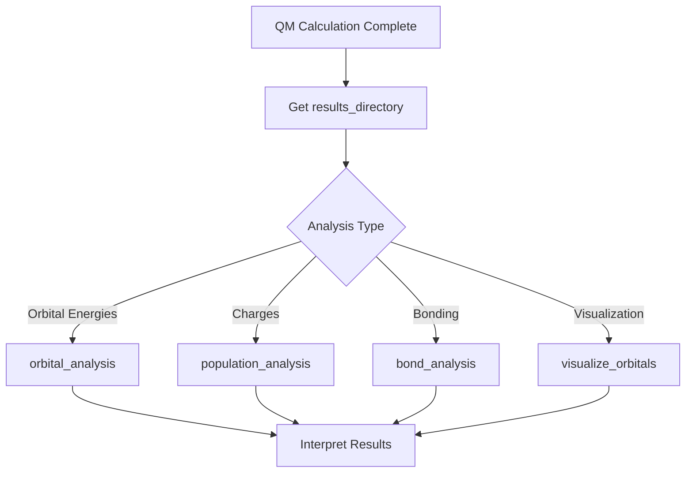

# Multiwfn Agent

> Expert agent for wavefunction analysis and quantum chemistry post-processing using Multiwfn.

## Table of Contents

- [Overview](#overview)
- [Capabilities](#capabilities)
- [Available Tools](#available-tools)
- [Workflow](#workflow)
- [Example Prompts](#example-prompts)
- [Configuration](#configuration)
- [See Also](#see-also)

## Overview

The Multiwfn Agent specializes in wavefunction analysis and electronic structure post-processing. It analyzes ORCA output files to extract orbital energies, electron density information, population analysis, and generates visualizations.

### Expertise Areas

- Wavefunction analysis using Multiwfn
- Orbital energies (HOMO/LUMO) and orbital analysis
- Electron density analysis (AIM, ELF, LOL)
- Population analysis (Mulliken, Hirshfeld, ADCH, RESP)
- Orbital visualization and composition
- Bond and interaction analysis
- Spectral simulation

### MCP Server

The Multiwfn Agent connects to the **OHMind-Multiwfn** MCP server for tool access.

### Important Note

The Multiwfn Agent **analyzes** results from QM calculations. It requires wavefunction files (`.out`, `.gbw`) generated by the QM Agent.

## Capabilities

| Capability | Description |
|------------|-------------|
| Orbital Analysis | HOMO/LUMO energies, compositions, properties |
| Wavefunction Analysis | General wavefunction diagnostics |
| Population Analysis | Various charge schemes |
| Electron Density | AIM, ELF, LOL, Laplacian analysis |
| Bond Analysis | Bond orders and strength descriptors |
| Weak Interactions | RDG, NCI, IGMH, IRI analyses |
| Aromaticity | NICS and related indices |
| Spectrum Simulation | UV-Vis, IR, Raman, NMR, ECD, VCD |
| Orbital Visualization | 2D slices and 3D renders |

## Available Tools

### Core Analysis Tools

#### `orbital_analysis`

Analyze HOMO, LUMO, and other molecular orbitals.

**Parameters**:
- `input_file` (str): Path to `.out` or `.gbw` file, OR results_directory from ORCA
- `orbital_number` (str): `"HOMO"`, `"LUMO"`, `"HOMO-1"`, `"LUMO+1"`, or integer
- `composition_method` (str): `"Mulliken"` (default), `"Hirshfeld"`, `"NAO"`, `"Becke"`

**Returns**: Orbital energies, compositions, and properties

**Example**:
```python
# Analyze LUMO from ORCA results
orbital_analysis(
    input_file="/OHMind_workspace/ORCA/results",
    orbital_number="LUMO",
    composition_method="Mulliken"
)
```

#### `analyze_wavefunction`

Basic wavefunction analysis for a given input file.

**Parameters**:
- `input_file` (str): Path to wavefunction file (fchk/wfn/gbw)

**Returns**: Wavefunction diagnostics and summary

#### `population_analysis`

Calculate atomic charges using various methods.

**Parameters**:
- `input_file` (str): Path to wavefunction file
- `methods` (list): Charge methods to use
  - `"mulliken"` - Mulliken population analysis
  - `"hirshfeld"` - Hirshfeld charges
  - `"adch"` - ADCH charges
  - `"resp"` - RESP charges
  - `"cm5"` - CM5 charges
  - `"mbis"` - MBIS charges

**Returns**: Charges per atom for each method

#### `electron_density_analysis`

Analyze electron density using various methods.

**Parameters**:
- `input_file` (str): Path to wavefunction file
- `analysis_type` (str): `"aim"`, `"elf"`, `"lol"`, `"laplacian"`

**Returns**: Electron density analysis results

#### `bond_analysis`

Analyze chemical bonds and bond orders.

**Parameters**:
- `input_file` (str): Path to wavefunction file
- `bond_order_type` (str): `"mayer"`, `"wiberg"`, `"fuzzy"`

**Returns**: Bond orders and strength descriptors

### Interaction Analysis Tools

#### `weak_interaction_analysis`

Analyze noncovalent interactions.

**Parameters**:
- `input_file` (str): Path to wavefunction file
- `analysis_type` (str): `"rdg"`, `"nci"`, `"igmh"`, `"iri"`

**Returns**: Weak interaction analysis results

#### `aromaticity_analysis`

Calculate aromaticity indices.

**Parameters**:
- `input_file` (str): Path to wavefunction file
- `ring_atoms` (list): Atom indices defining the ring

**Returns**: NICS values and related aromaticity measures

#### `energy_decomposition`

Energy decomposition analysis.

**Parameters**:
- `input_file` (str): Path to wavefunction file
- `method` (str): `"lmo-eda"`, `"sapt"`

**Returns**: Energy decomposition results

### Spectrum Simulation Tools

#### `simulate_spectrum`

Simulate various spectra from computed properties.

**Parameters**:
- `input_file` (str): Path to wavefunction/output file
- `spectrum_type` (str): `"uv-vis"`, `"ir"`, `"raman"`, `"nmr"`, `"ecd"`, `"vcd"`
- `broadening` (float): Peak broadening parameter

**Returns**: Simulated spectrum data

### Visualization Tools

#### `generate_cube_files`

Generate cube files for densities and orbitals.

**Parameters**:
- `input_file` (str): Path to wavefunction file
- `property` (str): Property to generate (`"density"`, `"orbital"`, `"elf"`, etc.)
- `orbital_number` (int, optional): Orbital index for orbital cubes

**Returns**: Path to generated cube file

#### `visualize_orbitals`

High-level orbital visualization orchestration.

**Parameters**:
- `input_file` (str): Path to wavefunction file
- `orbitals` (list): Orbital numbers to visualize
- `output_format` (str): Output format (`"png"`, `"cube"`)

**Returns**: Paths to visualization files

#### `quick_visualize_homo_lumo`

Convenience tool to quickly visualize HOMO/LUMO.

**Parameters**:
- `input_file` (str): Path to wavefunction file

**Returns**: HOMO and LUMO visualization files

#### `render_orbitals_2d`

2D slice plotting of orbitals/densities.

**Parameters**:
- `cube_file` (str): Path to cube file
- `plane` (str): Slice plane (`"xy"`, `"xz"`, `"yz"`)
- `slice_position` (float): Position along perpendicular axis

**Returns**: 2D plot image

#### `render_orbitals_3d`

3D orbital rendering with VMD/Tachyon style.

**Parameters**:
- `cube_file` (str): Path to cube file
- `isovalue` (float): Isosurface value
- `style` (str): Rendering style

**Returns**: 3D render image

### MD Analysis Tools

#### `md_analysis`

Post-processing of MD trajectories.

**Parameters**:
- `trajectory` (str): Path to trajectory file
- `topology` (str): Path to topology file
- `analysis_type` (str): `"rdf"`, `"coordination"`, `"hbond"`

**Returns**: MD analysis results

### Advanced Analysis Tools

#### `adndp_analysis`

Adaptive Natural Density Partitioning analysis.

**Parameters**:
- `input_file` (str): Path to wavefunction file

**Returns**: AdNDP bonding analysis

## Workflow

### Typical Analysis Workflow



### Finding ORCA Files

The Multiwfn Agent can locate ORCA output files automatically:

1. If the QM Agent mentioned a `results_directory` path, use that as `input_file`
2. The tool will automatically find `single_point.out` or `single_point.gbw` in that directory
3. The workspace is typically: `$OHMind_workspace/ORCA` or `$QM_WORK_DIR`

### Multi-Turn Tool Calling

The Multiwfn Agent supports iterative tool calling (up to 5 iterations) to handle complex analysis workflows.

## Example Prompts

### Charge and Reactive Hot-Spot Analysis

```
For the optimized cation geometry from my QM calculation (assume I have 
already generated a suitable wavefunction file), use your Multiwfn tools 
to analyze charge distribution and identify likely degradation hot spots 
under alkaline conditions.

Report which atoms or fragments are most positively charged or otherwise reactive.
```

### Orbital Visualization

```
Starting from the wavefunction of a candidate cation, generate HOMO and 
LUMO visualizations (both 2D slices and 3D renders).

Describe where the LUMO is localized and what that suggests about 
degradation pathways.
```

### HOMO/LUMO Energy Analysis

```
For the ORCA calculation results in /OHMind_workspace/ORCA, analyze the 
HOMO and LUMO energies using Mulliken composition analysis.

Report the orbital energies in eV and explain what the HOMO-LUMO gap 
implies for the molecule's reactivity.
```

### Spectrum Simulation from MD Snapshot

```
Take a representative structure from an MD snapshot of my membrane system 
and use Multiwfn to simulate an approximate UV-Vis or IR spectrum, 
highlighting features that correlate with specific structural motifs.
```

### Comprehensive Electronic Analysis

```
Using your Multiwfn tools, perform a comprehensive electronic analysis 
of this cation:

1) Calculate Hirshfeld and ADCH charges
2) Analyze the LUMO orbital composition
3) Identify any weak interactions using NCI analysis
4) Generate a 3D visualization of the LUMO

Summarize which parts of the molecule are most vulnerable to nucleophilic attack.
```

## Configuration

### Environment Variables

| Variable | Purpose | Default |
|----------|---------|---------|
| `MULTIWFN_PATH` | Path to Multiwfn executable | Required |
| `MULTIWFN_WORK_DIR` | Working directory | `$OHMind_workspace/Multiwfn` |
| `QM_WORK_DIR` | QM results directory | `$OHMind_workspace/ORCA` |

### Results Storage

Multiwfn results are saved to:

```
$MULTIWFN_WORK_DIR/
├── <job-name>/
│   ├── input.*           # Input files
│   ├── analysis.log      # Analysis log
│   ├── *.dat             # Data files
│   ├── *.cube            # Cube files
│   └── *.png             # Visualization images
```

### Visualization Output

Cube files can be visualized with external tools:
- VMD (Visual Molecular Dynamics)
- PyMOL
- Avogadro
- Custom Python scripts with matplotlib

## See Also

- [Agent Reference](./index.md) - Overview of all agents
- [QM Agent](./qm-agent.md) - For running calculations
- [Multiwfn MCP Server](../mcp-servers/multiwfn-server.md) - Tool documentation
- [QM Calculations Tutorial](../tutorials/qm-calculations.md) - Step-by-step guide

---
*Last updated: 2025-12-22 | OHMind v1.0.0*
