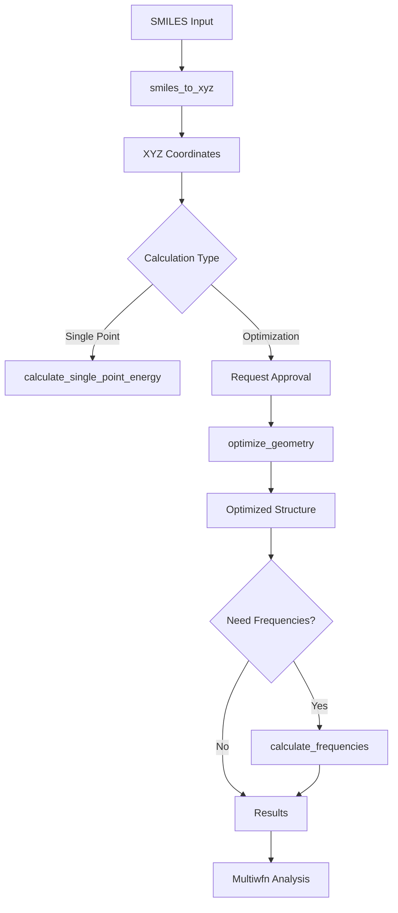

# QM Agent

> Expert agent for quantum chemistry calculations using ORCA, including DFT, geometry optimization, and property calculations.

## Table of Contents

- [Overview](#overview)
- [Capabilities](#capabilities)
- [Available Tools](#available-tools)
- [Workflow](#workflow)
- [Example Prompts](#example-prompts)
- [Configuration](#configuration)
- [See Also](#see-also)

## Overview

The QM Agent specializes in running quantum chemistry calculations using ORCA. It handles structure preparation, DFT calculations, geometry optimization, frequency calculations, and various property predictions relevant to HEM design.

### Expertise Areas

- DFT calculations (B3LYP, PBE0, M06-2X)
- Geometry optimization
- Frequency calculations and thermochemistry
- Electronic structure calculations
- Proton affinity and pKa estimation
- Binding energy calculations
- NMR chemical shift prediction

### MCP Server

The QM Agent connects to the **OHMind-ORCA** MCP server for tool access.

### Important Note

The QM Agent **runs** calculations. For **analysis** of results (HOMO/LUMO energies, orbital properties), the Multiwfn Agent should be used after calculations complete.

## Capabilities

| Capability | Description | Expensive |
|------------|-------------|-----------|
| SMILES to XYZ | Convert molecular structures | No |
| Single Point Energy | Calculate energy at fixed geometry | No |
| Geometry Optimization | Find minimum energy structure | ⚠️ Yes |
| Frequency Calculation | Vibrational analysis, thermochemistry | ⚠️ Yes |
| Charge Analysis | Mulliken, Löwdin, Hirshfeld charges | No |
| Proton Affinity | pKa estimation | No |
| Binding Energy | Ion-functional group interactions | No |
| NMR Shifts | Chemical shift prediction | ⚠️ Yes |
| Transition State | TS search and verification | ⚠️ Yes |

## Available Tools

### Core Tools

#### `smiles_to_xyz`

Convert SMILES to 3D XYZ coordinates using RDKit.

**Parameters**:
- `smiles` (str): Input SMILES string

**Returns**: XYZ coordinate string

**Note**: Always use this tool first before running calculations.

#### `calculate_single_point_energy`

Single-point energy calculation at fixed geometry.

**Parameters**:
- `xyz_string` (str): XYZ coordinates
- `method` (str): DFT functional (default: `B3LYP`)
- `basis` (str): Basis set (default: `def2-SVP`)
- `dispersion` (str): Dispersion correction (default: `D3BJ`)

**Returns**: Energy in Hartree, output file paths

#### `optimize_geometry`

⚠️ **EXPENSIVE OPERATION** - Requires user approval

Optimize molecular geometry to find minimum energy structure.

**Parameters**:
- `xyz_string` (str): Initial XYZ coordinates
- `method` (str): DFT functional
- `basis` (str): Basis set
- `dispersion` (str): Dispersion correction

**Returns**: Optimized coordinates, final energy, results directory

**Estimated Time**: 5-30 minutes

#### `calculate_frequencies`

⚠️ **EXPENSIVE OPERATION** - Requires user approval

Vibrational frequency calculation for thermochemistry.

**Parameters**:
- `xyz_string` (str): XYZ coordinates (should be optimized)
- `method` (str): DFT functional
- `basis` (str): Basis set
- `temperature` (float): Temperature in K (default: 298.15)

**Returns**: Frequencies, IR spectrum, thermochemistry, Gibbs free energy

**Estimated Time**: 5-30 minutes

### IEM-Focused Tools

#### `calculate_proton_affinity`

Proton affinity and approximate pKa for acidic groups.

**Parameters**:
- `xyz_string` (str): XYZ coordinates
- `acidic_site` (int): Atom index of acidic proton
- `solvent` (str, optional): Solvent for implicit solvation

**Returns**: Gas-phase and solution-phase proton affinity, estimated pKa

#### `calculate_binding_energy`

Ion-functional group binding energies.

**Parameters**:
- `complex_xyz` (str): Ion-molecule complex coordinates
- `ion_xyz` (str): Isolated ion coordinates
- `molecule_xyz` (str): Isolated molecule coordinates
- `bsse_correction` (bool): Apply BSSE correction
- `solvent` (str, optional): Implicit solvation

**Returns**: Binding energy with/without corrections

#### `calculate_ionic_solvation_energy`

Solvation/hydration energies for ions.

**Parameters**:
- `xyz_string` (str): Ion or ion-water cluster coordinates
- `charge` (int): Total charge
- `solvent` (str): Solvent model

**Returns**: Solvation energy and free energy

#### `analyze_atomic_charges`

Calculate atomic charges using various methods.

**Parameters**:
- `xyz_string` (str): XYZ coordinates
- `methods` (list): Charge methods (`mulliken`, `loewdin`, `hirshfeld`)

**Returns**: Charges per atom, dipole/quadrupole moments

#### `search_transition_state`

⚠️ **EXPENSIVE OPERATION** - Requires user approval

Transition state search with optional frequency verification.

**Parameters**:
- `xyz_string` (str): Initial TS guess coordinates
- `method` (str): DFT functional
- `verify_frequencies` (bool): Run frequency calculation to verify

**Returns**: TS geometry, activation energy, imaginary frequency

#### `predict_nmr_chemical_shifts`

⚠️ **EXPENSIVE OPERATION** - Requires user approval

NMR shielding and chemical shifts.

**Parameters**:
- `xyz_string` (str): XYZ coordinates
- `nuclei` (list): Nuclei to calculate (`1H`, `13C`, `19F`, `31P`)
- `reference` (str): Reference compound

**Returns**: Chemical shifts for selected nuclei

#### `calculate_polymer_reactivity`

HOMO/LUMO energies and conceptual DFT descriptors.

**Parameters**:
- `xyz_string` (str): Monomer XYZ coordinates

**Returns**: HOMO/LUMO energies, gap, chemical potential, hardness

## Workflow

### Standard QM Calculation Workflow



### Validation Flow

Expensive operations require user approval:

```python
# Validation message format
"⚠️ **Quantum Chemistry Calculation requires approval**

**Requested operations:**
- optimize_geometry: {'method': 'B3LYP', 'basis': 'def2-SVP'}

**Results will be saved to:** `/OHMind_workspace/ORCA`

This calculation is computationally expensive and may take 5-30 minutes.

Please approve to continue."
```

### Multi-Turn Tool Calling

The QM Agent supports iterative tool calling (up to 5 iterations) to handle complex workflows that require multiple sequential calculations.

## Example Prompts

### End-to-End QM Descriptor Pipeline

```
Using your OHMind-ORCA QM tools, start from the SMILES `C[N+]1(C)CCCCC1` and:

1) Convert to a reasonable 3D geometry.
2) Optimize the structure at B3LYP/def2-SVP with D3BJ.
3) Compute frequencies to confirm there are no imaginary modes.
4) Report LUMO energy and any descriptors relevant to alkaline stability, 
   and interpret them qualitatively.
```

### Proton Affinity and pKa Estimation

```
For a sulfonic-acid-containing fragment, use your proton affinity tool to 
estimate gas-phase and solution-phase proton affinity and the corresponding pKa.

Explain what these values imply for acid strength and membrane behavior.
```

### Binding and Solvation Comparison

```
Compare the binding energy and hydration energy of OH⁻ vs Cl⁻ to a model 
quaternary ammonium site using your ORCA binding and solvation tools.

Summarize which ion binds more strongly and how solvation competes with binding.
```

### Simple Single Point Calculation

```
Calculate the single point energy for this cation: C[N+]1(C)CCCCC1
Use B3LYP/def2-SVP with D3BJ dispersion correction.
```

## Configuration

### Environment Variables

| Variable | Purpose | Default |
|----------|---------|---------|
| `OHMind_ORCA` | Path to ORCA binary | Required |
| `OHMind_MPI` | Path to MPI binaries | Required for parallel |
| `QM_WORK_DIR` | Working directory | `$OHMind_workspace/ORCA` |

### Results Storage

QM results are saved to:

```
$QM_WORK_DIR/
├── temp_*/           # Per-job temporary directories
│   ├── input.inp     # ORCA input file
│   ├── input.out     # ORCA output file
│   ├── input.gbw     # Wavefunction file
│   └── input.xyz     # Final geometry
└── results/          # Preserved results
```

### Expensive Operations

The following tools require validation before execution:

- `optimize_geometry`
- `calculate_frequencies`
- `predict_nmr_chemical_shifts`
- `search_transition_state`

## See Also

- [Agent Reference](./index.md) - Overview of all agents
- [Multiwfn Agent](./multiwfn-agent.md) - For result analysis
- [ORCA MCP Server](../mcp-servers/orca-server.md) - Tool documentation
- [QM Calculations Tutorial](../tutorials/qm-calculations.md) - Step-by-step guide
- [OHQM Module](../core-library/ohqm.md) - QM utilities

---
*Last updated: 2025-12-22 | OHMind v1.0.0*
