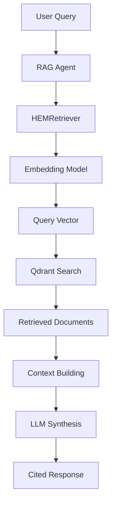

# RAG Agent

> Expert agent for retrieving and synthesizing information from scientific literature using Retrieval-Augmented Generation.

## Table of Contents

- [Overview](#overview)
- [Capabilities](#capabilities)
- [How It Works](#how-it-works)
- [Example Prompts](#example-prompts)
- [Configuration](#configuration)
- [Troubleshooting](#troubleshooting)
- [See Also](#see-also)

## Overview

The RAG Agent specializes in searching and synthesizing information from a knowledge base of scientific papers on HEM research. It uses vector similarity search to find relevant documents and generates comprehensive answers with proper citations.

### Expertise Areas

- Scientific literature retrieval
- HEM and AEM research papers
- Cation design literature
- Alkaline stability studies
- Membrane property research
- Citation and source management

### Backend

The RAG Agent uses **Qdrant** vector database for document storage and retrieval, with embeddings generated by a configured embedding model.

## Capabilities

| Capability | Description |
|------------|-------------|
| Document Retrieval | Find relevant papers based on semantic similarity |
| Context Synthesis | Combine information from multiple sources |
| Citation Management | Track and cite sources properly |
| Knowledge Gap Identification | Identify areas lacking research |
| Research Direction Suggestions | Propose relevant research directions |

## How It Works

### Architecture



### Retrieval Process

1. **Query Processing**: User query is converted to an embedding vector
2. **Similarity Search**: Qdrant finds the k most similar document chunks
3. **Context Building**: Retrieved documents are formatted with metadata
4. **Synthesis**: LLM generates a response using the retrieved context
5. **Citation**: Sources are cited using `[Source X] Author et al. (Year)` format

### HEMRetriever

The `HEMRetriever` class handles document retrieval:

```python
class HEMRetriever:
    def retrieve_with_context(self, query: str, k: int = 5) -> dict:
        """
        Retrieve relevant documents with context.
        
        Returns:
            {
                'context': str,      # Formatted context for LLM
                'sources': list,     # Source metadata
                'num_sources': int   # Number of sources found
            }
        """
```

### Response Format

The RAG Agent generates responses with:

- Synthesized information from multiple sources
- Proper citations: `[Source X] Author et al. (Year)`
- Source count summary at the end

## Example Prompts

### Literature-Driven Design

```
Retrieve recent literature on cation designs for hydroxide exchange membranes 
with high alkaline stability. Summarize typical structural motifs and then 
propose 5 new candidate cations that follow those design principles.
```

### Mechanism and Design Loop

```
Explain the main degradation mechanisms for quaternary ammonium cations in 
AEMs under alkaline conditions. Then propose new cation designs that mitigate 
these mechanisms, and evaluate them using your available tools.
```

### Research Survey

```
What does the literature say about the relationship between cation structure 
and ionic conductivity in anion exchange membranes? Cite the relevant studies.
```

### Gap Analysis

```
Based on the available literature, what are the main knowledge gaps in 
understanding alkaline stability of imidazolium-based cations? 
Suggest research directions to address these gaps.
```

### Comparative Analysis

```
Compare the reported alkaline stability of piperidinium vs tetraalkylammonium 
cations based on the scientific literature. Which structural features 
contribute to better stability?
```

## Configuration

### Environment Variables

| Variable | Purpose | Default |
|----------|---------|---------|
| `QDRANT_URL` | Qdrant server URL | `http://localhost:6333` |
| `QDRANT_API_KEY` | Qdrant API key (if required) | None |
| `EMBEDDING_MODEL` | Embedding model name | Configured in settings |

### Qdrant Setup

The RAG system requires a running Qdrant instance with indexed documents:

```bash
# Start Qdrant (Docker)
docker run -p 6333:6333 qdrant/qdrant

# Or use the embedded Qdrant storage
# Located at: OHMind_agent/qdrant_storage/
```

### Document Ingestion

Scientific papers are ingested using the ingestion script:

```bash
python OHMind_agent/scripts/ingest_papers.py
```

Documents are stored in:
```
OHMind_agent/data/scientific_papers/
```

### Embedding Configuration

The embedding model is configured in `OHMind_agent/rag/embeddings.py`:

```python
# Typical configuration
embedding_model = "text-embedding-ada-002"  # OpenAI
# or
embedding_model = "BAAI/bge-large-en"  # Local model
```

## Troubleshooting

### Common Issues

#### "Embeddings not configured"

**Cause**: The embedding service is not available.

**Solutions**:
1. Check that the embedding API endpoint is accessible
2. Verify API credentials are set correctly
3. Ensure the vector database is initialized

#### No Results Found

**Cause**: Query doesn't match indexed documents.

**Solutions**:
1. Try rephrasing the query
2. Use more specific HEM-related terminology
3. Check that documents have been ingested

#### Connection Errors

**Cause**: Qdrant server not running.

**Solutions**:
1. Start the Qdrant server
2. Check `QDRANT_URL` environment variable
3. Verify network connectivity

### Error Messages

The RAG Agent provides helpful error messages:

```python
# Example error handling
if "Embeddings not configured" in error_msg:
    user_msg = (
        "I couldn't search the literature database because the embedding "
        "service is not available. This could be due to:\n"
        "- The embedding API endpoint is not accessible\n"
        "- Missing or invalid API credentials\n"
        "- The vector database is not initialized\n\n"
        "Please check your configuration and try again."
    )
```

## Data Sources

### Indexed Content

The RAG system indexes scientific papers related to:

- Hydroxide exchange membranes (HEM)
- Anion exchange membranes (AEM)
- Cation design and synthesis
- Alkaline stability studies
- Ionic conductivity research
- Polymer membrane properties

### Document Format

Documents are chunked and indexed with metadata:

```python
{
    "content": "Document text chunk...",
    "metadata": {
        "title": "Paper Title",
        "authors": "Author et al.",
        "year": 2023,
        "doi": "10.1234/example",
        "source": "filename.pdf"
    }
}
```

## See Also

- [Agent Reference](./index.md) - Overview of all agents
- [Web Search Agent](./web-search-agent.md) - For real-time web information
- [Literature Search Tutorial](../tutorials/literature-search.md) - Step-by-step guide
- [Configuration Reference](../configuration/index.md) - Qdrant setup

---
*Last updated: 2025-12-22 | OHMind v1.0.0*
