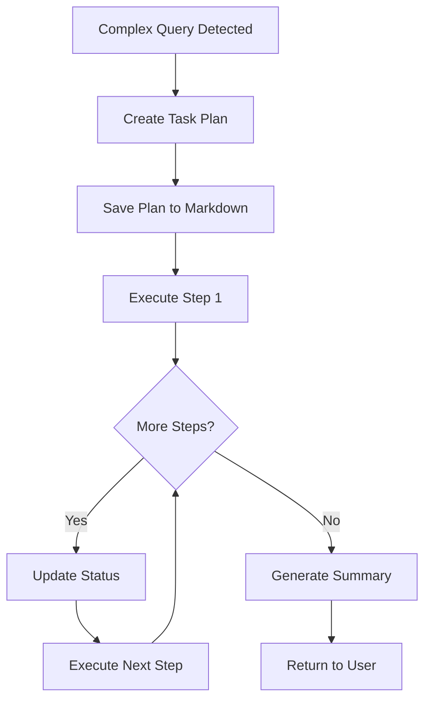
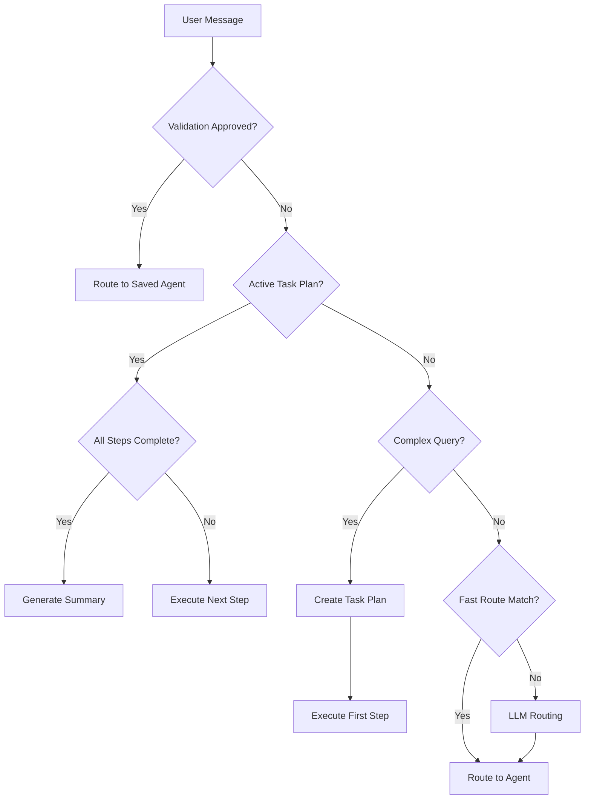

# Supervisor Agent

> The central coordinator that analyzes user requests, detects complexity, creates task plans, and routes to specialized agents.

## Table of Contents

- [Overview](#overview)
- [Routing Logic](#routing-logic)
- [Task Planning](#task-planning)
- [Complexity Detection](#complexity-detection)
- [Decision Flow](#decision-flow)
- [Configuration](#configuration)
- [See Also](#see-also)

## Overview

The Supervisor Agent is the entry point for all user queries in OHMind. It performs three key functions:

1. **Request Analysis**: Understands user intent and identifies required capabilities
2. **Complexity Detection**: Determines if a query requires single or multi-step execution
3. **Routing**: Directs requests to appropriate specialized agents

The supervisor does not have access to MCP tools directly—it orchestrates other agents that do.

## Routing Logic

### Fast Routing (Keyword-Based)

For common patterns, the supervisor uses fast keyword matching to avoid LLM overhead:

```python
# HEM design keywords -> hem_agent
hem_keywords = ["optimize hem", "design hem", "pso", "backbone", "cation",
               "piperidinium", "tetraalkylammonium", "imidazolium", 
               "pbf_bb", "pp_bb", "px_bb", "pai_bb", "pf_bb", "ppo_bb"]

# QM keywords -> qm_agent
qm_keywords = ["dft", "single point", "geometry optim", "frequency calc",
              "run calculation", "quantum", "orca"]

# Multiwfn keywords -> multiwfn_agent
multiwfn_keywords = ["homo", "lumo", "orbital", "wavefunction", 
                    "electron density", "population analysis"]
```

### LLM-Based Routing

When fast routing doesn't match, the supervisor uses an LLM with structured output to make routing decisions:

```python
class RouteDecision(BaseModel):
    next_agent: Literal[
        "hem_agent",
        "chemistry_agent",
        "qm_agent",
        "md_agent",
        "multiwfn_agent",
        "rag_agent",
        "web_search_agent",
        "RESPOND",
        "FINISH"
    ]
    reasoning: str
    response: str  # Only if next_agent is RESPOND
```

### Routing Rules

| User Intent | Target Agent | Example Query |
|-------------|--------------|---------------|
| HEM optimization | `hem_agent` | "Design piperidinium cations for PBF_BB_1" |
| Molecular properties | `chemistry_agent` | "What is the molecular weight of this SMILES?" |
| QM calculations | `qm_agent` | "Run DFT optimization on this molecule" |
| MD simulations | `md_agent` | "Simulate this polymer at 400K" |
| Orbital analysis | `multiwfn_agent` | "Analyze HOMO/LUMO from the calculation" |
| Literature search | `rag_agent` | "Find papers on alkaline stability" |
| Web information | `web_search_agent` | "What's the latest on AEM research?" |
| General questions | `RESPOND` | "Hello, what can you do?" |
| End conversation | `FINISH` | "Goodbye" |

## Task Planning

### When Task Planning Activates

The supervisor creates a task plan when it detects complex multi-step queries:

- Multiple action verbs (e.g., "calculate AND analyze")
- Sequential indicators (e.g., "then", "after")
- Comparison tasks (e.g., "compare properties of X and Y")

### Task Plan Structure

```python
class TaskStep(BaseModel):
    step_number: int
    agent: str
    description: str
    status: str  # pending, in_progress, completed, failed
```

### Task Plan Execution Flow



### Example Task Plan

For the query: "Calculate HOMO/LUMO energy for this cation and analyze the results"

```markdown
# Task Plan

**Created:** 2025-12-22 10:30:00

## Question
Calculate HOMO/LUMO energy for this cation and analyze the results

## Tasks

1. ⏳ **Run quantum chemistry calculation** → `qm_agent`
2. ⏳ **Analyze orbital energies (HOMO/LUMO) from calculation results** → `multiwfn_agent`
```

### Plan File Location

Task plans are saved to the workspace directory:
```
$OHMind_workspace/task_plan_YYYYMMDD_HHMMSS.md
```

## Complexity Detection

The supervisor uses pattern matching to detect complex queries:

### Multi-Step Patterns

| Pattern | Example | Reasoning |
|---------|---------|-----------|
| `and (then)? analyze` | "Calculate and analyze" | Calc + analysis |
| `calculate.*and.*analyze` | "Calculate energy and analyze orbitals" | Multiple operations |
| `compare.*properties` | "Compare properties of A and B" | Comparison task |
| `optimize.*and.*(run\|simulate)` | "Optimize and run MD" | Optimization + simulation |
| `then` | "First calculate, then analyze" | Sequential indicator |

### Action Verb Detection

The supervisor identifies computational action verbs:
- `calculate`, `compute`, `analyze`, `compare`
- `optimize`, `simulate`, `find`, `determine`
- `evaluate`, `predict`

Multiple action verbs (≥2) trigger task planning.

## Decision Flow



### State Management

The supervisor maintains state across the conversation:

```python
# Task plan state
task_plan: Dict          # Current plan data
task_plan_path: str      # Path to markdown file
current_step: int        # Current step number
completed_steps: List    # List of completed step numbers

# Validation state
validation_approved: bool
operation_metadata: Dict  # Saved tool calls for expensive operations
```

## Configuration

### Environment Variables

The supervisor uses these environment variables:

| Variable | Purpose | Default |
|----------|---------|---------|
| `OHMind_workspace` | Workspace for task plans | `/OHMind_workspace` |

### LLM Configuration

The supervisor uses two LLM instances:

1. **Routing LLM**: `temperature=0.0`, non-streaming, for structured routing decisions
2. **Response LLM**: `temperature=0.7`, streaming, for direct responses

### Structured Output Support

The supervisor attempts to use structured output for routing decisions. If the LLM provider doesn't support it (e.g., some OpenAI-compatible APIs), it falls back to JSON parsing.

```python
# Check provider support
provider = llm_config.get("provider", "")
use_structured = provider in ["openai", "azure"]
```

## See Also

- [Agent Reference](./index.md) - Overview of all agents
- [Multi-Agent System](../architecture/multi-agent-system.md) - LangGraph architecture
- [State Management](../architecture/state-management.md) - AgentState schema

---
*Last updated: 2025-12-22 | OHMind v1.0.0*
