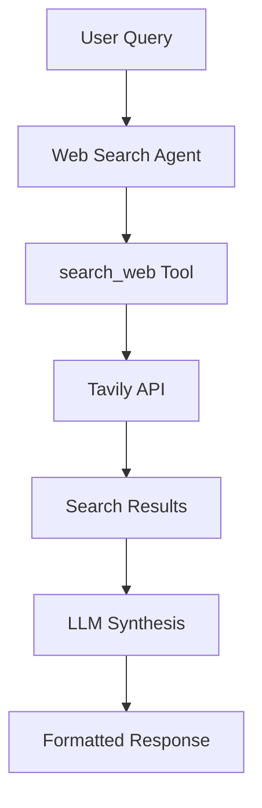

# Web Search Agent

> Expert agent for searching the web for real-time information using Tavily.

## Table of Contents

- [Overview](#overview)
- [Capabilities](#capabilities)
- [How It Works](#how-it-works)
- [Example Prompts](#example-prompts)
- [Configuration](#configuration)
- [See Also](#see-also)

## Overview

The Web Search Agent searches the web for the latest information that may not be available in the local knowledge base. It uses Tavily for chemistry-aware web search and synthesizes results into helpful responses.

### Expertise Areas

- Latest research papers and preprints
- Chemical protocols and procedures
- Material safety information
- Recent developments in membrane science
- Technical specifications
- Current news and updates

### Tool Source

The Web Search Agent uses the `search_web` tool from the **OHMind-Chem** MCP server (Tavily-backed).

## Capabilities

| Capability | Description |
|------------|-------------|
| Web Search | Search the internet for current information |
| Result Synthesis | Combine and summarize search results |
| Context Awareness | Distinguish web info from knowledge base |
| Chemistry Focus | Chemistry-aware search optimization |

## How It Works

### Architecture



### Search Process

1. **Query Extraction**: Extract search query from user message
2. **Web Search**: Call Tavily API via `search_web` MCP tool
3. **Result Processing**: Parse and format search results
4. **Synthesis**: LLM generates a comprehensive response
5. **Attribution**: Results are marked as web-sourced

### Response Format

Responses are prefixed with a web search indicator:

```
🔍 **Web Search Results:**

[Synthesized information from web search...]
```

## Example Prompts

### Latest Research

```
What's the latest research on alkaline-stable cations for anion exchange 
membranes? Focus on papers from the last year.
```

### Technical Protocols

```
Find current protocols for synthesizing piperidinium-based cations. 
Include any safety considerations.
```

### Recent Developments

```
What are the recent developments in hydroxide exchange membrane technology? 
Are there any new commercial products?
```

### Material Safety

```
Search for safety data and handling procedures for quaternary ammonium 
compounds used in membrane synthesis.
```

### News and Updates

```
What's new in the field of fuel cell membranes? Any recent breakthroughs 
or announcements?
```

### Comparative Information

```
Search for comparisons between different types of anion exchange membranes 
in terms of performance and durability.
```

## Configuration

### Environment Variables

| Variable | Purpose | Default |
|----------|---------|---------|
| `TAVILY_API_KEY` | Tavily API key for web search | Required |

### API Key Setup

1. Get a Tavily API key from [tavily.com](https://tavily.com)
2. Set the environment variable:

```bash
export TAVILY_API_KEY="tvly-your-api-key-here"
```

Or add to your `.env` file:

```
TAVILY_API_KEY=tvly-your-api-key-here
```

### Tool Availability

The web search tool is loaded from the OHMind-Chem MCP server:

```python
# Tool discovery
chem_tools = session_manager.get_tools("OHMind-Chem")
web_search_tool = None
for tool in chem_tools:
    if tool.name == "search_web":
        web_search_tool = tool
        break
```

## Error Handling

### Tool Not Available

If the web search tool is not loaded:

```
Web search is currently unavailable. The search tool could not be loaded.
```

**Solutions**:
1. Check that OHMind-Chem MCP server is running
2. Verify `TAVILY_API_KEY` is set
3. Check MCP server logs for errors

### Search Failures

If the search fails:

```
Web search failed: [error message]
```

**Common causes**:
- Invalid API key
- Network connectivity issues
- Rate limiting
- Query too long or malformed

## Best Practices

### When to Use Web Search

Use the Web Search Agent for:
- Current/recent information (last few months)
- News and announcements
- Technical specifications not in knowledge base
- Safety data and protocols
- Comparative market information

### When to Use RAG Instead

Use the RAG Agent for:
- Scientific literature review
- Established research findings
- Historical data
- Peer-reviewed content

### Query Tips

- Be specific about time frames ("last year", "recent")
- Include relevant technical terms
- Specify the type of information needed
- Mention if you need safety or regulatory information

## See Also

- [Agent Reference](./index.md) - Overview of all agents
- [RAG Agent](./rag-agent.md) - For literature search
- [Chemistry Agent](./chemistry-agent.md) - For molecular operations
- [Chem MCP Server](../mcp-servers/chem-server.md) - Tool documentation

---
*Last updated: 2025-12-22 | OHMind v1.0.0*
