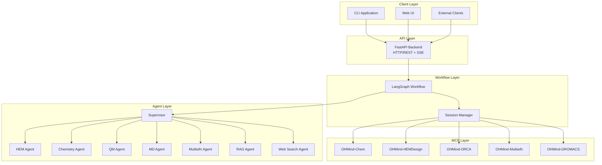

# API Reference

> Comprehensive API documentation for integrating with OHMind programmatically

## Table of Contents

- [Overview](#overview)
- [API Architecture](#api-architecture)
- [Base URLs](#base-urls)
- [Authentication](#authentication)
- [Response Formats](#response-formats)
- [Error Handling](#error-handling)
- [API Components](#api-components)
- [Quick Start](#quick-start)
- [See Also](#see-also)

## Overview

OHMind provides multiple API interfaces for programmatic access to its multi-agent system:

| API Component | Purpose | Protocol |
|---------------|---------|----------|
| [Backend API](./backend-api.md) | FastAPI REST endpoints for agent interaction | HTTP/REST + SSE |
| [Workflow API](./workflow-api.md) | LangGraph workflow state and execution | Python/Async |
| [Session Manager](./session-manager.md) | MCP server connection management | MCP Protocol |

## API Architecture



## Base URLs

### Backend API

| Environment | Base URL | Description |
|-------------|----------|-------------|
| Development | `http://localhost:8005` | Default FastAPI backend |
| Production | Configurable via `API_HOST` and `API_PORT` | Custom deployment |

### MCP Servers (HTTP Transport)

| Server | Default URL | Port Variable |
|--------|-------------|---------------|
| OHMind-Chem | `http://localhost:8101/` | `MCP_CHEM_PORT` |
| OHMind-HEMDesign | `http://localhost:8102/` | `MCP_HEMDESIGN_PORT` |
| OHMind-ORCA | `http://localhost:8103/` | `MCP_ORCA_PORT` |
| OHMind-Multiwfn | `http://localhost:8104/` | `MCP_MULTIWFN_PORT` |
| OHMind-GROMACS | `http://localhost:8105/` | `MCP_GROMACS_PORT` |

## Authentication

### Current Implementation

The OHMind backend currently operates without authentication for local development. For production deployments, authentication should be implemented at the reverse proxy level or through custom middleware.

### Web UI Authentication

The Chainlit-based Web UI uses its own authentication system:

```python
# Default credentials (from OHMind_ui/.env)
ADMIN_USER = "admin"
ADMIN_PASSWORD = "admin"
```

### Recommended Production Setup

For production deployments, consider:

1. **API Gateway**: Use Kong, AWS API Gateway, or similar
2. **OAuth2/OIDC**: Integrate with identity providers
3. **API Keys**: For programmatic access
4. **Rate Limiting**: Protect against abuse

## Response Formats

### Standard JSON Response

Most endpoints return JSON with consistent structure:

```json
{
  "status": "success|error",
  "data": { ... },
  "message": "Optional message"
}
```

### Streaming Response (SSE)

The `/threads/{thread_id}/runs/stream` endpoint uses Server-Sent Events:

```
event: metadata
data: {"run_id": "uuid", "thread_id": "uuid"}

event: values
data: {"messages": [...], "next": "agent_name"}

event: custom
data: {"type": "agent_status", "agent": "hem_agent", "status": "active"}

event: custom
data: {"type": "tool_start", "tool_name": "optimize_hem_design", "input": "..."}

event: custom
data: {"type": "tool_end", "output": "..."}

event: end
data: {"status": "completed"}
```

### Event Types

| Event | Description |
|-------|-------------|
| `metadata` | Run metadata (run_id, thread_id) |
| `values` | State updates with messages |
| `custom` | Agent status, tool events |
| `error` | Error information |
| `end` | Stream completion |

## Error Handling

### HTTP Status Codes

| Code | Meaning | Common Causes |
|------|---------|---------------|
| 200 | Success | Request completed |
| 400 | Bad Request | Missing or invalid parameters |
| 404 | Not Found | Thread or resource not found |
| 500 | Server Error | Internal processing error |

### Error Response Format

```json
{
  "detail": "Error description",
  "type": "ErrorType"
}
```

### Streaming Error Events

```
event: error
data: {"error": "Error message", "type": "ErrorType"}
```

## API Components

### Backend API

The FastAPI backend provides REST endpoints for:

- Thread management (create, list, get)
- Run execution (streaming and non-streaming)
- System information and health checks

See [Backend API Reference](./backend-api.md) for complete documentation.

### Workflow API

The LangGraph workflow API provides:

- State management via `AgentState`
- Conditional routing between agents
- Task planning for complex queries
- Checkpointing for conversation persistence

See [Workflow API Reference](./workflow-api.md) for complete documentation.

### Session Manager

The MCP Session Manager provides:

- Persistent MCP server connections
- Tool loading and distribution
- Multi-server coordination

See [Session Manager Reference](./session-manager.md) for complete documentation.

## Quick Start

### 1. Start the Backend

```bash
cd OHMind
./start_OHMind.sh
```

### 2. Create a Thread

```bash
THREAD_ID=$(curl -s -X POST \
  http://localhost:8005/threads \
  -H "Content-Type: application/json" \
  -d '{"metadata": {"purpose": "api_test"}}' | jq -r '.thread_id')

echo "Thread ID: $THREAD_ID"
```

### 3. Send a Message (Non-Streaming)

```bash
curl -s -X POST \
  "http://localhost:8005/threads/$THREAD_ID/runs" \
  -H "Content-Type: application/json" \
  -d '{
    "input": {
      "content": "What backbones are available for HEM optimization?"
    }
  }' | jq
```

### 4. Send a Message (Streaming)

```bash
curl -N -X POST \
  "http://localhost:8005/threads/$THREAD_ID/runs/stream" \
  -H "Content-Type: application/json" \
  -d '{
    "input": {
      "content": "Optimize piperidinium cations for PBF_BB_1 backbone"
    }
  }'
```

### 5. Python Client Example

```python
import requests
import json

BASE_URL = "http://localhost:8005"

# Create thread
response = requests.post(f"{BASE_URL}/threads", json={"metadata": {}})
thread_id = response.json()["thread_id"]

# Send message
response = requests.post(
    f"{BASE_URL}/threads/{thread_id}/runs",
    json={"input": {"content": "List available HEM backbones"}}
)

result = response.json()
print(json.dumps(result, indent=2))
```

### 6. Streaming Python Client

```python
import requests
import sseclient

BASE_URL = "http://localhost:8005"

# Create thread
response = requests.post(f"{BASE_URL}/threads", json={})
thread_id = response.json()["thread_id"]

# Stream response
response = requests.post(
    f"{BASE_URL}/threads/{thread_id}/runs/stream",
    json={"input": {"content": "Design new cations for HEM"}},
    stream=True,
    headers={"Accept": "text/event-stream"}
)

client = sseclient.SSEClient(response)
for event in client.events():
    print(f"Event: {event.event}")
    print(f"Data: {event.data}\n")
```

## See Also

- [Backend API Reference](./backend-api.md) - Complete REST endpoint documentation
- [Workflow API Reference](./workflow-api.md) - LangGraph workflow details
- [Session Manager Reference](./session-manager.md) - MCP connection management
- [Architecture Overview](../architecture/overview.md) - System architecture
- [MCP Integration](../architecture/mcp-integration.md) - MCP protocol details

---

*Last updated: 2025-12-23 | OHMind v0.1.0*
