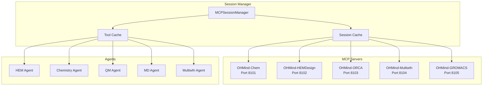
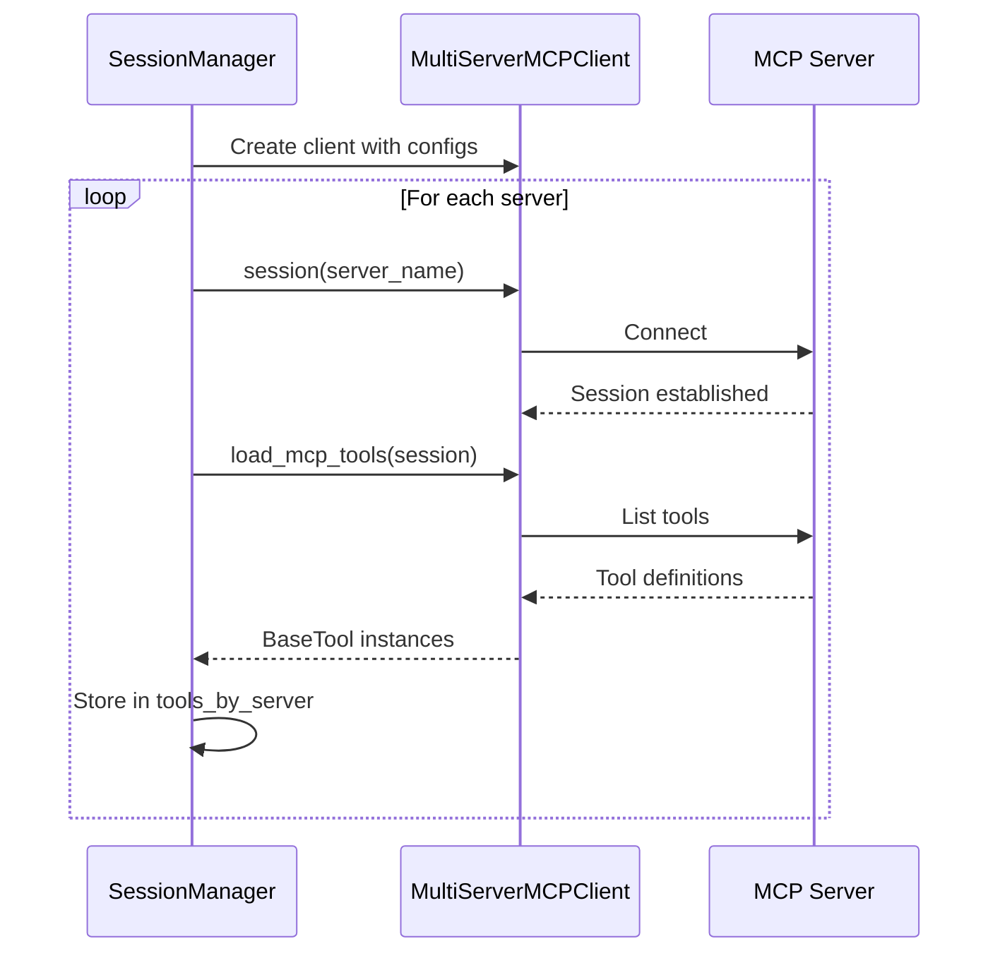
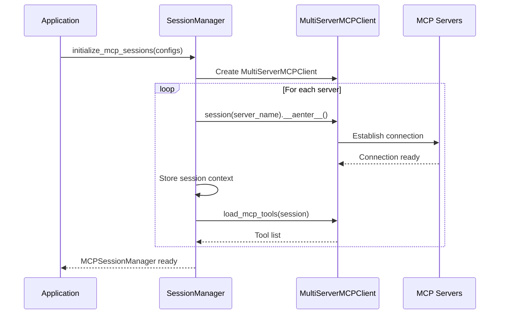
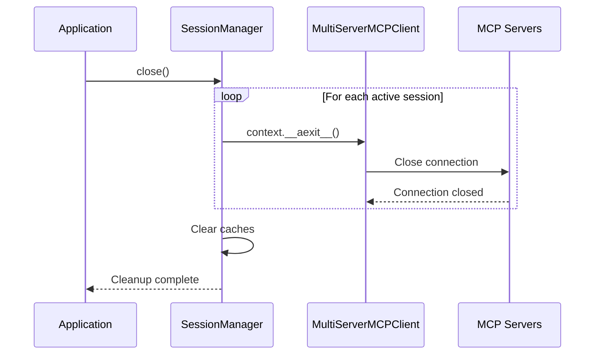

# Session Manager API Reference

> MCP session management for persistent server connections and tool distribution

## Table of Contents

- [Overview](#overview)
- [MCPSessionManager Class](#mcpsessionmanager-class)
- [Initialization Functions](#initialization-functions)
- [Server Configuration](#server-configuration)
- [Tool Management](#tool-management)
- [Connection Lifecycle](#connection-lifecycle)
- [Transport Modes](#transport-modes)
- [Integration Examples](#integration-examples)
- [Troubleshooting](#troubleshooting)
- [See Also](#see-also)

## Overview

The MCP Session Manager provides persistent connections to MCP servers using `langchain-mcp-adapters`. It maintains long-lived sessions for efficient tool execution across multiple agent interactions.

### Key Features

- **Persistent Connections**: Sessions remain active throughout application lifecycle
- **Multi-Server Support**: Manages multiple MCP servers simultaneously
- **Tool Distribution**: Loads and distributes tools to agents by server
- **Transport Flexibility**: Supports both stdio and HTTP transports
- **Priority Tools**: Filter tools to load only essential ones

### Architecture



## MCPSessionManager Class

### Class Definition

```python
from typing import Dict, Any, List, Optional
from langchain_mcp_adapters.client import MultiServerMCPClient
from langchain_core.tools import BaseTool

class MCPSessionManager:
    """
    Manages MCP servers and tools using MultiServerMCPClient.
    
    Provides a unified interface to multiple MCP servers with
    persistent connections.
    """
    
    def __init__(self):
        self.client: Optional[MultiServerMCPClient] = None
        self.server_configs: Dict[str, Dict[str, Any]] = {}
        self.tools_by_server: Dict[str, List[BaseTool]] = {}
        self._active_sessions: Dict[str, Any] = {}
```

### Attributes

| Attribute | Type | Description |
|-----------|------|-------------|
| `client` | `MultiServerMCPClient` | The underlying MCP client |
| `server_configs` | `Dict[str, Dict]` | Server configuration dictionary |
| `tools_by_server` | `Dict[str, List[BaseTool]]` | Tools organized by server |
| `_active_sessions` | `Dict[str, Any]` | Active session contexts |

### Methods

#### initialize

```python
async def initialize(
    self,
    server_configs: Dict[str, Dict[str, Any]]
) -> None:
    """
    Initialize MCP client with multiple server configurations.
    
    Args:
        server_configs: Dict mapping server_name -> config
                       Config format: {command, args, env, transport, url}
    
    Example:
        await manager.initialize({
            "OHMind-Chem": {
                "transport": "streamable_http",
                "url": "http://localhost:8101/"
            },
            "OHMind-HEMDesign": {
                "transport": "stdio",
                "command": "python",
                "args": ["-m", "OHMind_agent.MCP.HEMDesign.server"],
                "env": {"HEM_SAVE_PATH": "/workspace/HEM"}
            }
        })
    """
```

#### get_tools

```python
def get_tools(self, server_name: str) -> List[BaseTool]:
    """
    Get tools for a specific server.
    
    Args:
        server_name: Name of the MCP server
    
    Returns:
        List of BaseTool instances
    
    Example:
        hem_tools = manager.get_tools("OHMind-HEMDesign")
        for tool in hem_tools:
            print(f"Tool: {tool.name}")
    """
```

#### get_all_tools

```python
def get_all_tools(self) -> List[BaseTool]:
    """
    Get all tools from all servers.
    
    Returns:
        Combined list of all tools
    
    Example:
        all_tools = manager.get_all_tools()
        print(f"Total tools: {len(all_tools)}")
    """
```

#### close

```python
async def close(self) -> None:
    """
    Close the MCP client and all persistent sessions.
    
    Should be called during application shutdown.
    
    Example:
        await manager.close()
    """
```

## Initialization Functions

### initialize_mcp_sessions

```python
async def initialize_mcp_sessions(
    server_configs: Dict[str, Dict[str, Any]]
) -> MCPSessionManager:
    """
    Initialize MCP sessions using MultiServerMCPClient.
    
    Args:
        server_configs: Dict mapping server_name -> server_config
                       Format: {command, args, env, priority_tools}
    
    Returns:
        MCPSessionManager instance with all tools loaded
    
    Example:
        manager = await initialize_mcp_sessions({
            "OHMind-Chem": {
                "transport": "streamable_http",
                "url": "http://localhost:8101/",
                "priority_tools": ["smiles_to_mol", "get_molecular_weight"]
            }
        })
    """
```

### cleanup_mcp_sessions

```python
async def cleanup_mcp_sessions() -> None:
    """
    Cleanup MCP sessions.
    
    Closes all active sessions and releases resources.
    
    Example:
        await cleanup_mcp_sessions()
    """
```

### get_session_manager

```python
def get_session_manager() -> MCPSessionManager:
    """
    Get or create the global session manager.
    
    Returns:
        The global MCPSessionManager instance
    
    Example:
        manager = get_session_manager()
        tools = manager.get_all_tools()
    """
```

## Server Configuration

### Configuration Format

```python
server_config = {
    # Transport type (required)
    "transport": "stdio" | "streamable_http" | "sse",
    
    # For stdio transport
    "command": "python",
    "args": ["-m", "OHMind_agent.MCP.Chem.server", "--transport", "stdio"],
    "env": {
        "PYTHONPATH": "/path/to/OHMind",
        "CHEM_WORK_DIR": "/workspace/Chem"
    },
    
    # For HTTP transport
    "url": "http://localhost:8101/",
    
    # Optional: Filter to specific tools
    "priority_tools": ["tool1", "tool2"]
}
```

### Transport-Specific Configuration

#### stdio Transport

```python
{
    "transport": "stdio",
    "command": "/path/to/python",
    "args": ["-m", "OHMind_agent.MCP.HEMDesign.server", "--transport", "stdio"],
    "env": {
        "PYTHONPATH": "/path/to/OHMind",
        "HEM_SAVE_PATH": "/workspace/HEM"
    }
}
```

#### streamable_http Transport

```python
{
    "transport": "streamable_http",
    "url": "http://localhost:8102/"
}
```

### Default Server Ports

| Server | Port | Environment Variable |
|--------|------|---------------------|
| OHMind-Chem | 8101 | `MCP_CHEM_PORT` |
| OHMind-HEMDesign | 8102 | `MCP_HEMDESIGN_PORT` |
| OHMind-ORCA | 8103 | `MCP_ORCA_PORT` |
| OHMind-Multiwfn | 8104 | `MCP_MULTIWFN_PORT` |
| OHMind-GROMACS | 8105 | `MCP_GROMACS_PORT` |

## Tool Management

### Tool Loading Process



### Priority Tools

Filter tools to load only essential ones:

```python
server_config = {
    "transport": "streamable_http",
    "url": "http://localhost:8101/",
    "priority_tools": [
        "smiles_to_mol",
        "get_molecular_weight",
        "get_functional_groups"
    ]
}
```

When `priority_tools` is specified, only those tools are loaded. Otherwise, all tools from the server are loaded.

### Tool Access Patterns

```python
# Get tools for a specific agent
hem_tools = session_manager.get_tools("OHMind-HEMDesign")
chem_tools = session_manager.get_tools("OHMind-Chem")

# Get all tools
all_tools = session_manager.get_all_tools()

# Check available tools
for server, tools in session_manager.tools_by_server.items():
    print(f"{server}: {len(tools)} tools")
    for tool in tools:
        print(f"  - {tool.name}: {tool.description[:50]}...")
```

## Connection Lifecycle

### Initialization Flow



### Session Persistence

Sessions are kept alive by storing the context manager:

```python
# Enter session context but DON'T exit - keep it alive
session_context = self.client.session(server_name)
session = await session_context.__aenter__()

# Store to keep alive
self._active_sessions[server_name] = {
    'session': session,
    'context': session_context
}
```

### Cleanup Flow



## Transport Modes

### stdio Transport

Used for local process communication:

```python
# Configuration
{
    "transport": "stdio",
    "command": "python",
    "args": ["-m", "OHMind_agent.MCP.Chem.server", "--transport", "stdio"],
    "env": {"PYTHONPATH": "/path/to/OHMind"}
}

# The session manager spawns the process and communicates via stdin/stdout
```

**Advantages:**
- No network overhead
- Process isolation
- Environment variable control

**Use Cases:**
- Local development
- Chainlit UI integration
- Single-machine deployments

### streamable_http Transport

Used for HTTP-based communication:

```python
# Configuration
{
    "transport": "streamable_http",
    "url": "http://localhost:8101/"
}

# The session manager connects to an already-running HTTP server
```

**Advantages:**
- Network accessible
- Server can be shared across clients
- Better for production deployments

**Use Cases:**
- Multi-client scenarios
- IDE integrations
- Distributed deployments

### Transport Selection Logic

```python
# In initialize method
if transport == "stdio":
    mcp_config["command"] = config.get("command")
    mcp_config["args"] = config.get("args", [])
    mcp_config["env"] = config.get("env")
elif transport in ["sse", "streamable_http", "streamable-http"]:
    if transport == "streamable-http":
        mcp_config["transport"] = "streamable_http"
    mcp_config["url"] = config.get("url")
```

## Integration Examples

### Basic Initialization

```python
from OHMind_agent.agents.mcp_session_manager import (
    initialize_mcp_sessions,
    cleanup_mcp_sessions,
    get_session_manager
)

async def setup_mcp():
    """Initialize MCP sessions."""
    server_configs = {
        "OHMind-Chem": {
            "transport": "streamable_http",
            "url": "http://localhost:8101/"
        },
        "OHMind-HEMDesign": {
            "transport": "streamable_http",
            "url": "http://localhost:8102/"
        }
    }
    
    manager = await initialize_mcp_sessions(server_configs)
    
    # List loaded tools
    for server, tools in manager.tools_by_server.items():
        print(f"{server}: {[t.name for t in tools]}")
    
    return manager

async def cleanup():
    """Cleanup on shutdown."""
    await cleanup_mcp_sessions()
```

### Agent Integration

```python
from OHMind_agent.agents.hem_agent import create_hem_agent

async def create_agent_with_tools(llm_config, session_manager):
    """Create an agent with MCP tools."""
    
    # Create HEM agent with session manager
    hem_agent = create_hem_agent(llm_config, session_manager)
    
    # The agent automatically gets tools from session_manager
    # via get_tools("OHMind-HEMDesign")
    
    return hem_agent
```

### Workflow Integration

```python
from OHMind_agent.graph.workflow import create_workflow
from OHMind_agent.agents.mcp_session_manager import initialize_mcp_sessions

async def create_workflow_with_mcp(llm_config, server_configs):
    """Create workflow with MCP session manager."""
    
    # Initialize sessions
    session_manager = await initialize_mcp_sessions(server_configs)
    
    # Create workflow with session manager
    workflow = create_workflow(
        llm_config=llm_config,
        mcp_clients={},  # Deprecated
        retriever=None,
        session_manager=session_manager
    )
    
    return workflow, session_manager
```

### Backend Integration

```python
# From OHMind_backend.py

async def initialize_thread_session(thread_id: str) -> MCPSessionManager:
    """Initialize or reuse the global MCP session manager."""
    
    if app_state.get("session_manager") is not None:
        return app_state["session_manager"]
    
    settings = get_settings()
    mcp_config = get_mcp_config()
    
    # Map server names to ports
    server_ports = {
        "OHMind-Chem": int(os.getenv("MCP_CHEM_PORT", "8101")),
        "OHMind-HEMDesign": int(os.getenv("MCP_HEMDESIGN_PORT", "8102")),
        "OHMind-ORCA": int(os.getenv("MCP_ORCA_PORT", "8103")),
        "OHMind-Multiwfn": int(os.getenv("MCP_MULTIWFN_PORT", "8104")),
        "OHMind-GROMACS": int(os.getenv("MCP_GROMACS_PORT", "8105")),
    }
    
    server_configs = {}
    for server_name in ["OHMind-HEMDesign", "OHMind-Chem", 
                        "OHMind-ORCA", "OHMind-Multiwfn", "OHMind-GROMACS"]:
        if mcp_config.is_server_enabled(server_name):
            config = mcp_config.get_server_config(server_name).copy()
            
            port = server_ports.get(server_name)
            if port:
                config["transport"] = "streamable_http"
                config["url"] = f"http://localhost:{port}/"
            
            server_configs[server_name] = config
    
    session_manager = await initialize_mcp_sessions(server_configs)
    app_state["session_manager"] = session_manager
    
    return session_manager
```

## Troubleshooting

### Common Issues

#### Connection Failed

```
ERROR: Failed to load tools for OHMind-Chem: Connection refused
```

**Solutions:**
1. Verify server is running: `curl http://localhost:8101/`
2. Check port configuration
3. Ensure server started before client

#### Tools Not Loading

```
WARNING: OHMind-HEMDesign: Loaded 0 tools
```

**Solutions:**
1. Check server logs for errors
2. Verify `priority_tools` list is correct
3. Test server manually with MCP client

#### Session Timeout

```
ERROR: Session timeout for OHMind-ORCA
```

**Solutions:**
1. Increase timeout in server configuration
2. Check for long-running operations
3. Verify network connectivity

### Debugging

```python
import logging

# Enable debug logging
logging.basicConfig(level=logging.DEBUG)
logger = logging.getLogger("OHMind_agent.agents.mcp_session_manager")
logger.setLevel(logging.DEBUG)

# Check session state
manager = get_session_manager()
print(f"Active sessions: {list(manager._active_sessions.keys())}")
print(f"Tools by server: {[(k, len(v)) for k, v in manager.tools_by_server.items()]}")
```

### Health Check

```python
async def check_mcp_health(manager: MCPSessionManager) -> Dict[str, bool]:
    """Check health of all MCP connections."""
    health = {}
    
    for server_name in manager.server_configs.keys():
        try:
            tools = manager.get_tools(server_name)
            health[server_name] = len(tools) > 0
        except Exception as e:
            health[server_name] = False
            print(f"{server_name}: {e}")
    
    return health
```

## See Also

- [API Overview](./index.md) - API architecture
- [Backend API](./backend-api.md) - REST endpoints
- [Workflow API](./workflow-api.md) - LangGraph workflow
- [MCP Integration](../architecture/mcp-integration.md) - MCP architecture
- [MCP Servers](../mcp-servers/index.md) - Server documentation

---

*Last updated: 2025-12-23 | OHMind v0.1.0*
