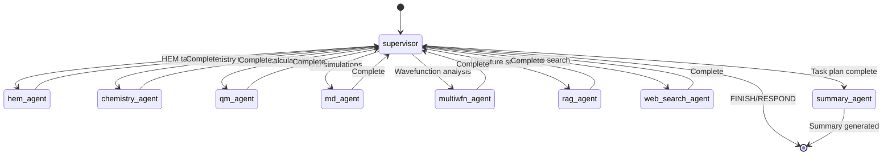
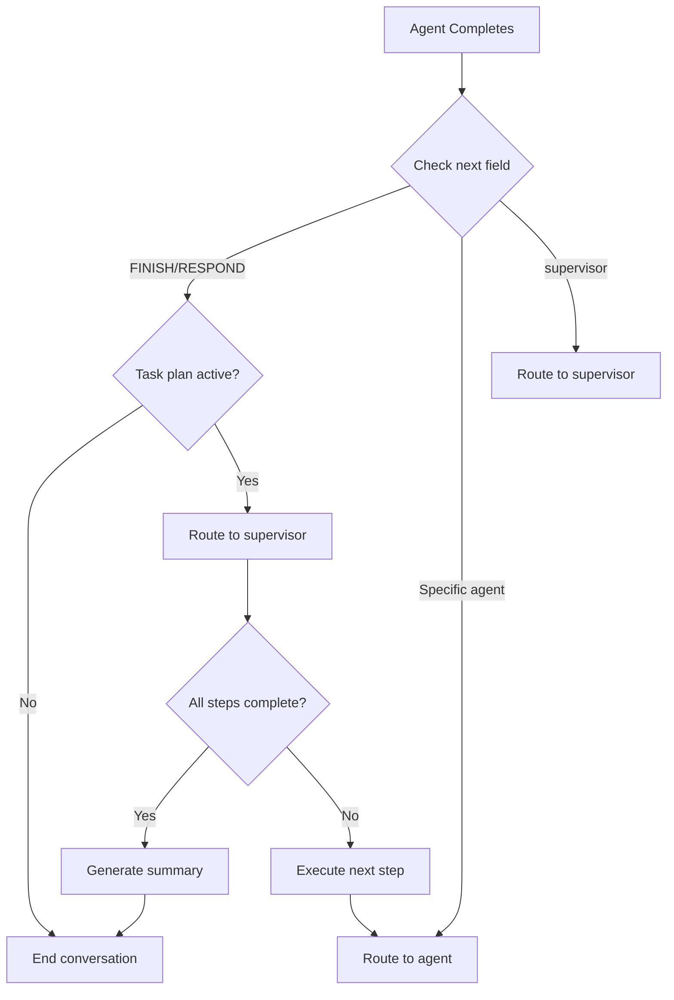

# Workflow API Reference

> LangGraph workflow API documentation for the OHMind multi-agent system

## Table of Contents

- [Overview](#overview)
- [AgentState Schema](#agentstate-schema)
- [Workflow Creation](#workflow-creation)
- [Routing Logic](#routing-logic)
- [Task Planning](#task-planning)
- [State Helper Functions](#state-helper-functions)
- [Supervisor Agent](#supervisor-agent)
- [Integration Examples](#integration-examples)
- [See Also](#see-also)

## Overview

The OHMind workflow is built on LangGraph's `StateGraph` abstraction, implementing a supervisor pattern with conditional routing between specialized agents.

### Key Components

| Component | Module | Purpose |
|-----------|--------|---------|
| `AgentState` | `OHMind_agent.graph.state` | Shared state schema |
| `create_workflow` | `OHMind_agent.graph.workflow` | Graph construction |
| `create_supervisor` | `OHMind_agent.graph.supervisor` | Routing logic |
| `route_after_agent` | `OHMind_agent.graph.workflow` | Conditional routing |

### Workflow Architecture



## AgentState Schema

The `AgentState` TypedDict defines the shared state that flows through the agent graph.

### State Definition

```python
from typing import TypedDict, Annotated, Sequence, Dict, Any, Optional, List
from langchain_core.messages import BaseMessage
from langgraph.graph.message import add_messages

class AgentState(TypedDict):
    """Shared state for the HEM design multi-agent system."""
    
    # Chat messages - core conversation history
    messages: Annotated[Sequence[BaseMessage], add_messages]
    
    # Agent routing
    next: str  # Next agent to call (e.g., "hem_agent", "FINISH")
    
    # MCP tool results
    mcp_results: Dict[str, Any]  # Results keyed by tool name
    
    # RAG context
    rag_context: List[Dict[str, Any]]  # Retrieved documents
    
    # Human-in-the-loop validation
    validation_required: bool
    validation_approved: Optional[bool]
    validation_message: str
    
    # Current operation tracking
    current_operation: str
    operation_metadata: Dict[str, Any]
    
    # Artifacts for UI rendering
    artifacts: Dict[str, Any]  # Molecules, charts, etc.
    
    # Error handling
    error: Optional[str]
    retry_count: int
    
    # Task planning (for complex multi-step workflows)
    task_plan: Optional[Dict[str, Any]]
    task_plan_path: Optional[str]
    current_step: int
    completed_steps: List[int]
    task_plan_needs_approval: bool
    task_plan_approved: Optional[bool]
```

### State Fields Reference

| Field | Type | Description |
|-------|------|-------------|
| `messages` | `Sequence[BaseMessage]` | Conversation history with automatic message merging |
| `next` | `str` | Next agent to route to |
| `mcp_results` | `Dict[str, Any]` | Results from MCP tool calls |
| `rag_context` | `List[Dict]` | Retrieved documents from RAG |
| `validation_required` | `bool` | Flag for human-in-the-loop |
| `validation_approved` | `Optional[bool]` | User approval status |
| `validation_message` | `str` | Message for validation prompt |
| `current_operation` | `str` | Description of current operation |
| `operation_metadata` | `Dict[str, Any]` | Additional operation context |
| `artifacts` | `Dict[str, Any]` | UI rendering data |
| `error` | `Optional[str]` | Error message if any |
| `retry_count` | `int` | Retry counter for failed operations |
| `task_plan` | `Optional[Dict]` | Multi-step task plan |
| `task_plan_path` | `Optional[str]` | Path to task plan markdown |
| `current_step` | `int` | Current step in task plan |
| `completed_steps` | `List[int]` | Completed step numbers |
| `task_plan_needs_approval` | `bool` | Task plan approval flag |
| `task_plan_approved` | `Optional[bool]` | Task plan approval status |

## Workflow Creation

### create_workflow Function

```python
from OHMind_agent.graph.workflow import create_workflow

def create_workflow(
    llm_config: Dict[str, Any],
    mcp_clients: Dict[str, Any],
    retriever: Any = None,
    session_manager: Any = None
) -> StateGraph:
    """
    Create the LangGraph workflow.
    
    Args:
        llm_config: LLM configuration dictionary
        mcp_clients: Dictionary of MCP clients (deprecated)
        retriever: HEM retriever for RAG (optional)
        session_manager: MCP session manager instance
    
    Returns:
        Compiled StateGraph with checkpointing
    """
```

### Usage Example

```python
from OHMind_agent.config import get_settings
from OHMind_agent.graph.workflow import create_workflow
from OHMind_agent.agents.mcp_session_manager import initialize_mcp_sessions

# Get configuration
settings = get_settings()
llm_config = settings.get_llm_config()

# Initialize MCP sessions
session_manager = await initialize_mcp_sessions(server_configs)

# Create workflow
workflow = create_workflow(
    llm_config=llm_config,
    mcp_clients={},  # Deprecated, use session_manager
    retriever=retriever,
    session_manager=session_manager
)

# Execute workflow
config = {"configurable": {"thread_id": "my-thread"}}
result = await workflow.ainvoke(
    {"messages": [HumanMessage(content="Design new HEM cations")]},
    config
)
```

### Workflow Graph Structure

```python
# Graph nodes
workflow.add_node("supervisor", supervisor)
workflow.add_node("summary_agent", summary_agent)
workflow.add_node("hem_agent", hem_agent)
workflow.add_node("chemistry_agent", chemistry_agent)
workflow.add_node("qm_agent", qm_agent)
workflow.add_node("md_agent", md_agent)
workflow.add_node("multiwfn_agent", multiwfn_agent)
workflow.add_node("rag_agent", rag_agent)
workflow.add_node("web_search_agent", web_search_agent)

# Entry point
workflow.set_entry_point("supervisor")

# Conditional routing from supervisor
workflow.add_conditional_edges(
    "supervisor",
    route_after_agent,
    {
        "supervisor": "supervisor",
        "summary_agent": "summary_agent",
        "hem_agent": "hem_agent",
        "chemistry_agent": "chemistry_agent",
        "qm_agent": "qm_agent",
        "md_agent": "md_agent",
        "multiwfn_agent": "multiwfn_agent",
        "rag_agent": "rag_agent",
        "web_search_agent": "web_search_agent",
        "__end__": END,
    }
)
```

## Routing Logic

### route_after_agent Function

```python
from typing import Literal

def route_after_agent(state: AgentState) -> Literal[
    "supervisor",
    "summary_agent",
    "hem_agent",
    "chemistry_agent",
    "qm_agent",
    "md_agent",
    "multiwfn_agent",
    "rag_agent",
    "web_search_agent",
    "__end__"
]:
    """
    Route after agent execution based on state.
    
    Handles task plan execution by routing back to supervisor
    after each step completion.
    """
```

### Routing Decision Flow



### Routing Rules

1. **FINISH/RESPOND without task plan**: End conversation
2. **FINISH/RESPOND with task plan**: Route back to supervisor for next step
3. **Specific agent name**: Route directly to that agent
4. **supervisor**: Route to supervisor for re-evaluation

## Task Planning

The supervisor automatically detects complex queries and creates multi-step execution plans.

### Complexity Detection

```python
def detect_complexity(question: str) -> Tuple[bool, str, List[str]]:
    """
    Detect if a question requires multi-step planning.
    
    Returns:
        (is_complex, reasoning, detected_actions)
    """
```

**Complexity Indicators:**

| Pattern | Example | Reasoning |
|---------|---------|-----------|
| `and then analyze` | "Calculate and then analyze" | Sequential operations |
| `compare...properties` | "Compare molecule properties" | Multiple calculations |
| `optimize...and...simulate` | "Optimize and simulate" | Multi-domain task |
| Multiple action verbs | "Calculate, analyze, compare" | Complex workflow |

### Task Plan Structure

```python
class TaskStep(BaseModel):
    """A single step in a task plan"""
    step_number: int
    agent: str
    description: str
    status: str = "pending"  # pending, in_progress, completed, failed
```

### Task Plan Creation

```python
def create_task_plan(question: str, detected_actions: List[str]) -> List[TaskStep]:
    """
    Create a task plan based on question analysis.
    
    Pattern-based plan generation:
    - Calculate + Analyze → qm_agent → multiwfn_agent
    - Compare molecules → chemistry_agent (multiple calls)
    - Optimize + Simulate → qm_agent → md_agent
    - Research + Calculate → rag_agent → qm_agent
    """
```

### Task Plan Markdown

Task plans are saved as markdown files in the workspace:

```markdown
# Task Plan

**Created:** 2025-12-23 10:30:00

## Question
Calculate HOMO/LUMO energies and analyze orbital distribution

## Tasks

1. ⏳ **Run quantum chemistry calculation** → `qm_agent`
2. ⏳ **Analyze orbital energies (HOMO/LUMO) from calculation results** → `multiwfn_agent`

---
```

Status icons:
- ⏳ Pending
- 🔄 In Progress
- ✅ Completed
- ❌ Failed

## State Helper Functions

### create_initial_state

```python
def create_initial_state(user_message: str) -> AgentState:
    """
    Create initial state for a new conversation.
    
    Args:
        user_message: The initial user message
    
    Returns:
        Initial AgentState with default values
    """
```

### update_state_with_message

```python
def update_state_with_message(
    state: AgentState,
    message: BaseMessage,
    next_agent: Optional[str] = None
) -> AgentState:
    """
    Helper to update state with a new message.
    """
```

### add_mcp_result

```python
def add_mcp_result(
    state: AgentState,
    tool_name: str,
    result: Any
) -> AgentState:
    """
    Add result from an MCP tool call.
    """
```

### add_artifact

```python
def add_artifact(
    state: AgentState,
    artifact_id: str,
    artifact_data: Any
) -> AgentState:
    """
    Add artifact for UI rendering.
    """
```

### Validation Helpers

```python
def mark_validation_required(
    state: AgentState,
    operation_description: str,
    metadata: Dict[str, Any]
) -> AgentState:
    """Mark that an operation requires human validation."""

def mark_validation_complete(
    state: AgentState,
    approved: bool,
    next_agent: str
) -> AgentState:
    """Mark validation as complete with user's decision."""

def should_continue_validation(state: AgentState) -> bool:
    """Check if validation is required and not yet approved/rejected."""
```

## Supervisor Agent

### RouteDecision Model

```python
class RouteDecision(BaseModel):
    """Routing decision from supervisor"""
    next_agent: Literal[
        "hem_agent",
        "chemistry_agent",
        "qm_agent",
        "md_agent",
        "multiwfn_agent",
        "rag_agent",
        "web_search_agent",
        "RESPOND",
        "FINISH"
    ]
    reasoning: str
    response: str = ""  # For direct responses
```

### Fast Routing

The supervisor uses keyword-based fast routing to avoid LLM calls for common patterns:

```python
def _fast_route(message: str) -> Optional[RouteDecision]:
    """
    Fast keyword-based routing.
    Returns None if no clear match, requiring LLM fallback.
    """
```

**Fast Route Keywords:**

| Agent | Keywords |
|-------|----------|
| `hem_agent` | optimize hem, design hem, pso, backbone, cation, piperidinium |
| `qm_agent` | dft, single point, geometry optim, frequency calc, orca |
| `md_agent` | molecular dynamics, md simulation, gromacs, diffusion |
| `multiwfn_agent` | homo, lumo, orbital, wavefunction, electron density |
| `chemistry_agent` | smiles, molecular weight, functional group, similarity |
| `rag_agent` | paper, literature, research, publication |
| `web_search_agent` | latest, recent, current, news |
| `RESPOND` | hello, hi, who are you, help, thanks |

### Supervisor Prompt

The supervisor uses a detailed system prompt defining:
- Available agents and their capabilities
- Routing keywords and patterns
- Special case handling
- Task planning triggers

## Integration Examples

### Basic Workflow Execution

```python
from langchain_core.messages import HumanMessage
from OHMind_agent.graph.workflow import create_workflow
from OHMind_agent.config import get_settings

# Setup
settings = get_settings()
llm_config = settings.get_llm_config()
workflow = create_workflow(llm_config, {}, retriever, session_manager)

# Execute
config = {"configurable": {"thread_id": "test-thread"}}
result = await workflow.ainvoke(
    {"messages": [HumanMessage(content="List HEM backbones")]},
    config
)

# Access results
for msg in result["messages"]:
    print(f"{msg.type}: {msg.content}")
```

### Streaming Execution

```python
async def stream_workflow(workflow, message: str, thread_id: str):
    """Stream workflow execution with state updates."""
    config = {"configurable": {"thread_id": thread_id}}
    input_state = {"messages": [HumanMessage(content=message)]}
    
    async for event in workflow.astream(input_state, config, stream_mode="updates"):
        for node_name, state_update in event.items():
            print(f"Node: {node_name}")
            if "messages" in state_update:
                for msg in state_update["messages"]:
                    print(f"  Message: {msg.content[:100]}...")
```

### Custom Agent Integration

```python
from OHMind_agent.graph.state import AgentState, add_mcp_result

async def custom_agent(state: AgentState) -> AgentState:
    """Custom agent implementation."""
    
    # Get last message
    messages = state["messages"]
    last_message = messages[-1].content
    
    # Process and create response
    response = f"Processed: {last_message}"
    
    # Update state
    updated_state = state.copy()
    updated_state["messages"] = messages + [AIMessage(content=response)]
    updated_state["next"] = "supervisor"  # Route back to supervisor
    
    return updated_state

# Add to workflow
workflow.add_node("custom_agent", custom_agent)
```

### Accessing Task Plan State

```python
async def monitor_task_plan(workflow, thread_id: str):
    """Monitor task plan execution."""
    config = {"configurable": {"thread_id": thread_id}}
    
    # Get current state
    state = await workflow.aget_state(config)
    
    task_plan = state.values.get("task_plan")
    if task_plan:
        print(f"Task Plan: {task_plan.get('original_question')}")
        print(f"Current Step: {state.values.get('current_step')}")
        print(f"Completed: {state.values.get('completed_steps')}")
        
        for step in task_plan.get("steps", []):
            status = "✅" if step["step_number"] in state.values.get("completed_steps", []) else "⏳"
            print(f"  {status} Step {step['step_number']}: {step['description']}")
```

## See Also

- [API Overview](./index.md) - API architecture
- [Backend API](./backend-api.md) - REST endpoints
- [Session Manager](./session-manager.md) - MCP connection management
- [Multi-Agent System](../architecture/multi-agent-system.md) - Architecture details
- [State Management](../architecture/state-management.md) - State flow

---

*Last updated: 2025-12-23 | OHMind v0.1.0*
