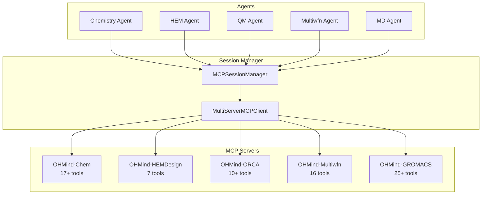
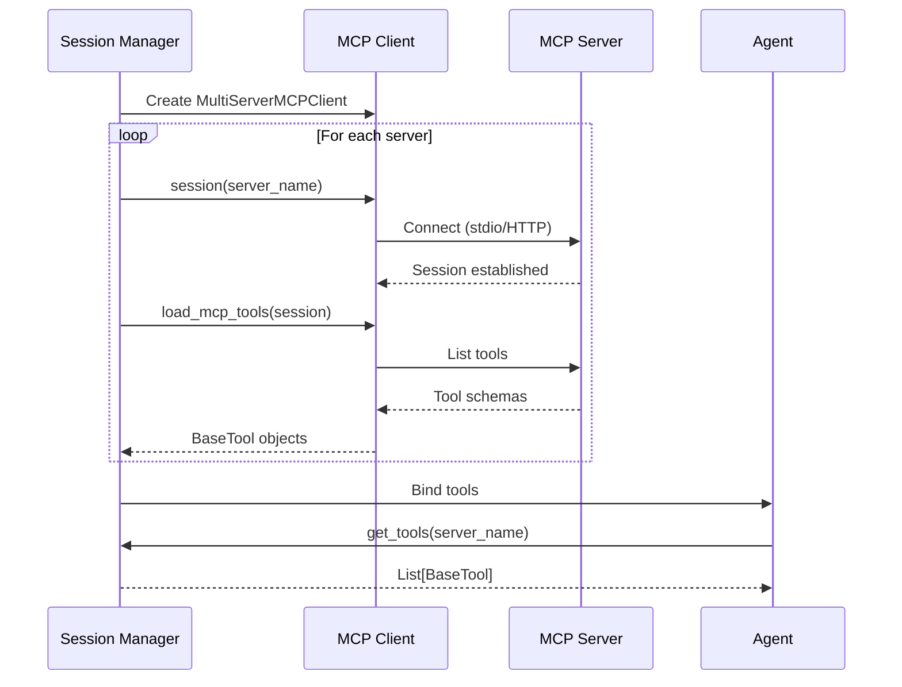

# MCP Integration

> MCP protocol overview, server architecture, tool distribution, and transport modes

## Table of Contents

- [Overview](#overview)
- [MCP Protocol](#mcp-protocol)
- [Server Architecture](#server-architecture)
- [Tool Distribution](#tool-distribution)
- [Transport Modes](#transport-modes)
- [Session Management](#session-management)
- [Configuration](#configuration)
- [See Also](#see-also)

## Overview

OHMind uses the Model Context Protocol (MCP) to provide a standardized interface between agents and domain-specific tools. The system includes five MCP servers, each providing specialized capabilities for different computational chemistry domains.

Key features:
- **Standardized tool interface**: Consistent API across all servers
- **Persistent sessions**: Long-lived connections for efficient tool execution
- **Multiple transports**: Support for both stdio and HTTP transports
- **Tool discovery**: Automatic tool loading and distribution to agents

## MCP Protocol

### What is MCP?

The Model Context Protocol (MCP) is a standardized protocol for communication between AI agents and external tools. It provides:

- **Tool Discovery**: Servers advertise available tools with schemas
- **Structured I/O**: JSON-based request/response format
- **Error Handling**: Standardized error reporting
- **Transport Abstraction**: Multiple transport mechanisms

### MCP in OHMind

OHMind integrates MCP through `langchain-mcp-adapters`:

```python
from langchain_mcp_adapters.client import MultiServerMCPClient
from langchain_mcp_adapters.tools import load_mcp_tools

# Create client with multiple servers
client = MultiServerMCPClient(server_configs)

# Load tools from a server session
session = await client.session(server_name).__aenter__()
tools = await load_mcp_tools(session)
```

## Server Architecture

### MCP Server Overview



### Server Details

| Server | Location | Tools | Purpose |
|--------|----------|-------|---------|
| **OHMind-Chem** | `MCP/Chem/` | 17+ | SMILES operations, molecular properties, functional groups |
| **OHMind-HEMDesign** | `MCP/HEMDesign/` | 7 | PSO optimization, backbone/cation management, job control |
| **OHMind-ORCA** | `MCP/ORCA/` | 10+ | QM calculations, geometry optimization, properties |
| **OHMind-Multiwfn** | `MCP/Multiwfn/` | 16 | Wavefunction analysis, orbital visualization |
| **OHMind-GROMACS** | `MCP/GROMACS/` | 25+ | MD simulations, system preparation, analysis |

### Server Implementation

Each MCP server implements:

1. **Tool Registration**: Define tools with input schemas
2. **Input Validation**: Validate parameters before execution
3. **Result Storage**: Save outputs to unified workspace
4. **Error Handling**: Return structured error messages
5. **Progress Monitoring**: Report status for long-running jobs

Example server structure:

```python
from mcp.server import Server
from mcp.types import Tool

server = Server("OHMind-Chem")

@server.tool()
async def molecular_weight(smiles: str) -> dict:
    """Calculate molecular weight from SMILES."""
    # Implementation
    return {"weight": weight, "formula": formula}
```

## Tool Distribution

### Agent-Server Mapping

Each agent receives tools from specific MCP servers:

| Agent | MCP Server(s) | Tool Categories |
|-------|---------------|-----------------|
| HEM Agent | OHMind-HEMDesign | Optimization, job management |
| Chemistry Agent | OHMind-Chem | SMILES, properties, similarity |
| QM Agent | OHMind-ORCA | DFT calculations, optimization |
| MD Agent | OHMind-GROMACS | Simulation, analysis |
| Multiwfn Agent | OHMind-Multiwfn | Wavefunction, orbitals |

### Tool Loading Process



### Priority Tools

Servers can specify priority tools to limit which tools are loaded:

```json
{
  "OHMind-Chem": {
    "priority_tools": ["MoleculeWeight", "SmilesCanonicalization", "FunctionalGroups"]
  }
}
```

## Transport Modes

OHMind supports two MCP transport modes:

### Stdio Transport

Standard input/output transport for local process communication:

```json
{
  "OHMind-Chem": {
    "type": "stdio",
    "command": "/path/to/python",
    "args": ["-m", "OHMind_agent.MCP.Chem.server", "--transport", "stdio"],
    "env": {
      "PYTHONPATH": "/path/to/OHMind"
    }
  }
}
```

**Characteristics**:
- Process spawned locally
- Communication via stdin/stdout
- Environment variables passed to process
- Used by CLI and backend

### HTTP Transport (Streamable)

HTTP-based transport for remote or IDE access:

```json
{
  "OHMind-Chem-HTTP": {
    "type": "streamable_http",
    "url": "http://127.0.0.1:8101/"
  }
}
```

**Characteristics**:
- Server runs as HTTP service
- Accessible from remote clients
- Used by IDE plugins and external tools
- No environment variable passing (server must be pre-configured)

### Default HTTP Endpoints

When using `start_OHMind.sh`, HTTP servers are available at:

| Server | HTTP Endpoint |
|--------|---------------|
| OHMind-Chem | `http://127.0.0.1:8101/` |
| OHMind-HEMDesign | `http://127.0.0.1:8102/` |
| OHMind-ORCA | `http://127.0.0.1:8103/` |
| OHMind-Multiwfn | `http://127.0.0.1:8104/` |
| OHMind-GROMACS | `http://127.0.0.1:8105/` |

## Session Management

### MCPSessionManager

The `MCPSessionManager` class manages MCP connections:

```python
class MCPSessionManager:
    """Manages MCP servers and tools using MultiServerMCPClient."""
    
    def __init__(self):
        self.client: Optional[MultiServerMCPClient] = None
        self.server_configs: Dict[str, Dict[str, Any]] = {}
        self.tools_by_server: Dict[str, List[BaseTool]] = {}
        self._active_sessions: Dict[str, Any] = {}
```

### Session Lifecycle

1. **Initialization**: Create `MultiServerMCPClient` with configs
2. **Session Entry**: Enter session context for each server
3. **Tool Loading**: Load tools from active sessions
4. **Session Persistence**: Keep sessions alive (don't exit context)
5. **Cleanup**: Exit all session contexts on shutdown

### Persistent Sessions

Sessions are kept alive to maintain tool references:

```python
# Enter session but DON'T exit - keep it alive
session_context = self.client.session(server_name)
session = await session_context.__aenter__()

# Store to keep alive
self._active_sessions[server_name] = {
    'session': session,
    'context': session_context
}

# Load tools from active session
tools = await load_mcp_tools(session)
```

### Global Session Manager

A singleton pattern provides global access:

```python
_session_manager: Optional[MCPSessionManager] = None

def get_session_manager() -> MCPSessionManager:
    """Get or create the global session manager."""
    global _session_manager
    if _session_manager is None:
        _session_manager = MCPSessionManager()
    return _session_manager
```

## Configuration

### mcp.json Format

The `mcp.json` file configures MCP servers:

```json
{
  "mcpServers": {
    "OHMind-Chem": {
      "disabled": false,
      "timeout": 300,
      "type": "stdio",
      "command": "/path/to/python",
      "args": ["-m", "OHMind_agent.MCP.Chem.server", "--transport", "stdio"],
      "env": {
        "PYTHONPATH": "/path/to/OHMind",
        "TAVILY_API_KEY": "your-api-key"
      }
    }
  }
}
```

### Configuration Fields

| Field | Type | Description |
|-------|------|-------------|
| `disabled` | boolean | Enable/disable server |
| `timeout` | number | Request timeout in seconds |
| `type` | string | Transport type: "stdio" or "streamable_http" |
| `command` | string | Python executable path (stdio only) |
| `args` | array | Command arguments (stdio only) |
| `env` | object | Environment variables (stdio only) |
| `url` | string | Server URL (HTTP only) |
| `priority_tools` | array | Optional list of tools to load |

### Environment Variables

Common environment variables for MCP servers:

| Variable | Server | Description |
|----------|--------|-------------|
| `PYTHONPATH` | All | Path to OHMind project |
| `TAVILY_API_KEY` | Chem | API key for web search |
| `OHMind_ORCA` | ORCA | Path to ORCA executable |
| `OHMind_MPI` | ORCA | Path to MPI binaries |
| `QM_WORK_DIR` | ORCA | QM calculation workspace |
| `MULTIWFN_PATH` | Multiwfn | Path to Multiwfn executable |
| `MULTIWFN_WORK_DIR` | Multiwfn | Multiwfn workspace |
| `MD_WORK_DIR` | GROMACS | MD simulation workspace |
| `HEM_SAVE_PATH` | HEMDesign | HEM optimization workspace |

## See Also

- [System Overview](./overview.md) - High-level architecture
- [Multi-Agent System](./multi-agent-system.md) - Agent workflow
- [MCP Configuration](../configuration/mcp-config.md) - Detailed configuration guide
- [MCP Server Reference](../mcp-servers/index.md) - Server documentation

---

*Last updated: 2025-12-22 | OHMind v1.0.0*
