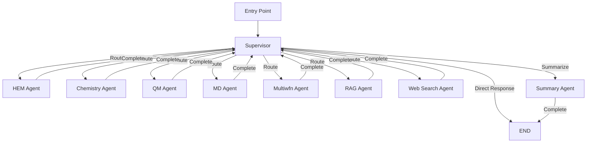
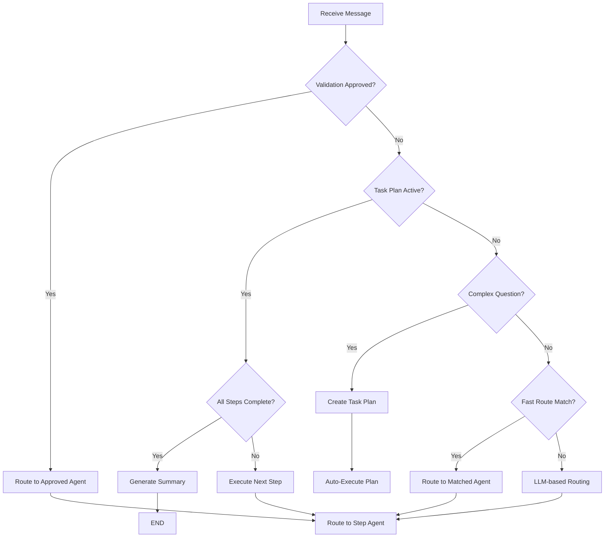

# Multi-Agent System Architecture

> Agent workflow, routing logic, and LangGraph integration in OHMind

## Table of Contents

- [Overview](#overview)
- [Agent Graph Structure](#agent-graph-structure)
- [Specialized Agents](#specialized-agents)
- [Supervisor Pattern](#supervisor-pattern)
- [Routing Logic](#routing-logic)
- [Task Planning](#task-planning)
- [LangGraph Integration](#langgraph-integration)
- [See Also](#see-also)

## Overview

The OHMind multi-agent system is built on LangGraph, providing a sophisticated orchestration layer for coordinating specialized agents. The system uses a supervisor pattern where a central coordinator analyzes user requests and routes them to appropriate domain-specific agents.

Key features include:
- **Supervisor-based routing**: Central coordinator with complexity detection
- **8 specialized agents**: Domain-specific expertise for different tasks
- **Task planning**: Automatic decomposition of complex queries
- **Conditional routing**: Dynamic agent selection based on query content
- **State management**: Shared state for message tracking and task progress

## Agent Graph Structure

The agent system is implemented as a LangGraph `StateGraph` with conditional edges:



### Graph Components

| Component | Description |
|-----------|-------------|
| **StateGraph** | LangGraph graph managing conversation flow |
| **Entry Point** | Supervisor agent receives all initial requests |
| **Conditional Edges** | Dynamic routing based on `route_after_agent()` function |
| **Checkpointing** | MemorySaver for state persistence |

## Specialized Agents

OHMind includes 8 specialized agents, each with domain-specific expertise:

### 1. HEM Agent (`hem_agent`)

**Purpose**: HEM design and PSO optimization

**Capabilities**:
- Run PSO-based cation optimization
- Manage backbone and cation configurations
- Monitor optimization jobs
- Check and retrieve optimization results

**Keywords**: optimize, design HEM, cation, backbone, PSO, piperidinium, tetraalkylammonium

**MCP Server**: `OHMind-HEMDesign`

### 2. Chemistry Agent (`chemistry_agent`)

**Purpose**: Molecular operations and SMILES handling

**Capabilities**:
- SMILES validation and conversion
- Molecular property calculations
- Functional group detection
- Molecular similarity analysis

**Keywords**: SMILES, molecular weight, functional groups, similarity

**MCP Server**: `OHMind-Chem`

### 3. QM Agent (`qm_agent`)

**Purpose**: Quantum chemistry calculations via ORCA

**Capabilities**:
- Single-point energy calculations
- Geometry optimization
- Frequency calculations
- Property extraction (HOMO/LUMO, charges)

**Keywords**: calculate, DFT, single point, optimize geometry, ORCA

**MCP Server**: `OHMind-ORCA`

### 4. MD Agent (`md_agent`)

**Purpose**: Molecular dynamics simulations via GROMACS

**Capabilities**:
- System preparation and parameterization
- MD simulation execution
- Trajectory analysis
- Property calculations (MSD, diffusion)

**Keywords**: simulate, MD, molecular dynamics, GROMACS, diffusion

**MCP Server**: `OHMind-GROMACS`

### 5. Multiwfn Agent (`multiwfn_agent`)

**Purpose**: Wavefunction and electronic structure analysis

**Capabilities**:
- Orbital analysis (HOMO/LUMO visualization)
- Population analysis (charges)
- Electron density analysis
- Spectrum simulation

**Keywords**: HOMO, LUMO, orbital, wavefunction, electron density

**MCP Server**: `OHMind-Multiwfn`

### 6. RAG Agent (`rag_agent`)

**Purpose**: Scientific literature search

**Capabilities**:
- Semantic search in HEM literature
- Document retrieval with citations
- Context-aware responses

**Keywords**: research, papers, literature, studies

**Backend**: Qdrant vector database

### 7. Web Search Agent (`web_search_agent`)

**Purpose**: Real-time web information retrieval

**Capabilities**:
- Web search for latest information
- Chemistry-aware search queries
- Protocol and method lookup

**Keywords**: latest, recent, current, what's new

**Backend**: Tavily API

### 8. Summary Agent (`summary_agent`)

**Purpose**: Summarize results from multi-step workflows

**Capabilities**:
- Aggregate results from multiple agents
- Generate comprehensive summaries
- Format final responses

**Usage**: Internal only (not directly routable)

## Supervisor Pattern

The supervisor agent is the central coordinator that:

1. **Analyzes incoming requests** to determine complexity and intent
2. **Routes to appropriate agents** based on keywords and context
3. **Manages task plans** for complex multi-step queries
4. **Handles direct responses** for general questions

### Supervisor Decision Flow



### Fast Routing

The supervisor uses keyword-based fast routing to avoid LLM calls for common patterns:

```python
# Example fast routing patterns
hem_keywords = ["optimize hem", "design hem", "pso", "backbone", "cation"]
qm_keywords = ["dft", "single point", "geometry optim", "frequency calc"]
md_keywords = ["molecular dynamics", "md simulation", "gromacs", "diffusion"]
```

When keywords match, the supervisor routes directly without invoking the LLM.

## Routing Logic

### Route Decision Model

The supervisor uses a structured output model for routing decisions:

```python
class RouteDecision(BaseModel):
    next_agent: Literal[
        "hem_agent",
        "chemistry_agent",
        "qm_agent",
        "md_agent",
        "multiwfn_agent",
        "rag_agent",
        "web_search_agent",
        "RESPOND",
        "FINISH"
    ]
    reasoning: str
    response: str  # For direct responses
```

### Routing After Agent Execution

The `route_after_agent()` function determines the next step after an agent completes:

```python
def route_after_agent(state: AgentState) -> str:
    next_agent = state.get("next", "supervisor")
    task_plan = state.get("task_plan")
    
    # If task plan is active and agent finished, route back to supervisor
    if task_plan and next_agent in ["FINISH", "RESPOND"]:
        return "supervisor"
    
    # Normal routing
    if next_agent in ["FINISH", "RESPOND"]:
        return "__end__"
    
    return next_agent
```

## Task Planning

For complex multi-step queries, the supervisor creates and executes task plans.

### Complexity Detection

The system detects complex queries using pattern matching:

```python
# Multi-step indicators
patterns = [
    r'\band\s+(then\s+)?analyze',  # "and analyze"
    r'\bcalculate.*\band.*\banalyze',  # "calculate AND analyze"
    r'\bcompare.*\b(properties|molecules)',  # Comparison tasks
    r'\bthen\b',  # Sequential indicator
]

# Multiple action verbs also indicate complexity
action_verbs = ['calculate', 'compute', 'analyze', 'compare', 
                'optimize', 'simulate', 'find', 'determine']
```

### Task Plan Structure

```python
class TaskStep(BaseModel):
    step_number: int
    agent: str
    description: str
    status: str  # pending, in_progress, completed, failed
```

### Task Plan Execution

1. **Plan Creation**: Steps generated based on detected actions
2. **Markdown Export**: Plan saved to workspace as `.md` file
3. **Auto-Execution**: Steps executed sequentially
4. **Status Updates**: Markdown file updated with progress
5. **Summary Generation**: Final summary after all steps complete

Example task plan output:

```markdown
# Task Plan

**Created:** 2025-12-22 10:30:00

## Question
Calculate HOMO/LUMO energies and analyze orbital distribution for this cation.

## Tasks

1. ✅ **Run quantum chemistry calculation** → `qm_agent`
2. 🔄 **Analyze orbital energies (HOMO/LUMO)** → `multiwfn_agent`
```

## LangGraph Integration

### Workflow Creation

The workflow is created using LangGraph's `StateGraph`:

```python
from langgraph.graph import StateGraph, END
from langgraph.checkpoint.memory import MemorySaver

def create_workflow(llm_config, mcp_clients, retriever, session_manager):
    workflow = StateGraph(AgentState)
    
    # Add nodes
    workflow.add_node("supervisor", supervisor)
    workflow.add_node("hem_agent", hem_agent)
    # ... other agents
    
    # Set entry point
    workflow.set_entry_point("supervisor")
    
    # Add conditional edges
    workflow.add_conditional_edges(
        "supervisor",
        route_after_agent,
        {"hem_agent": "hem_agent", "__end__": END, ...}
    )
    
    # Compile with checkpointing
    memory = MemorySaver()
    return workflow.compile(checkpointer=memory)
```

### State Persistence

LangGraph's `MemorySaver` provides checkpointing for:
- Conversation history persistence
- Task plan state recovery
- Multi-turn conversation support

### Streaming Support

The workflow supports real-time token streaming:

```python
async for chunk in streaming_llm.astream(messages, config=config):
    if hasattr(chunk, 'content') and chunk.content:
        # Stream to UI
        yield chunk.content
```

## See Also

- [System Overview](./overview.md) - High-level architecture
- [State Management](./state-management.md) - AgentState details
- [MCP Integration](./mcp-integration.md) - MCP server communication
- [Agent Reference](../agents/index.md) - Detailed agent documentation

---

*Last updated: 2025-12-22 | OHMind v1.0.0*
