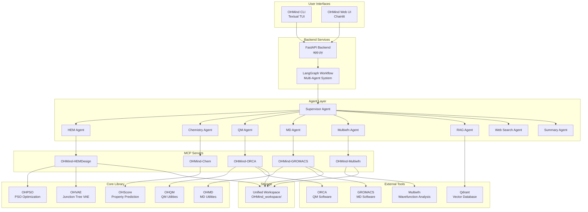
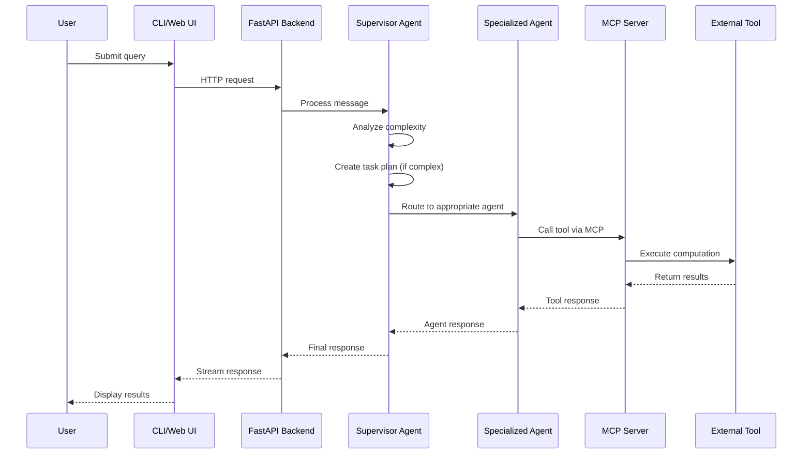

# System Architecture Overview

> High-level architecture and component interactions in the OHMind framework

## Table of Contents

- [Introduction](#introduction)
- [System Diagram](#system-diagram)
- [Core Components](#core-components)
- [Data Flow](#data-flow)
- [Component Interactions](#component-interactions)
- [Architecture Highlights](#architecture-highlights)
- [See Also](#see-also)

## Introduction

OHMind is a Language-Model Multi-Agent Framework designed to accelerate Hydroxide Exchange Membrane (HEM) discovery. The system combines advanced machine learning models with domain-specific computational chemistry tools through a sophisticated multi-agent architecture.

The platform is built around five main components that work together to provide an integrated environment for AI-driven molecular design, quantum chemistry calculations, molecular dynamics simulations, and literature-based research.

## System Diagram



## Core Components

### 1. Core Library (`OHMind/`)

The foundational Python library containing domain-specific algorithms and models:

| Module | Purpose |
|--------|---------|
| **OHVAE** | Junction Tree Variational Autoencoder for molecular generation and encoding |
| **OHPSO** | Particle Swarm Optimization for multi-objective molecular design |
| **OHQM** | Quantum chemistry utilities and ORCA integration |
| **OHMD** | Molecular dynamics utilities and GROMACS integration |
| **OHScore** | Property prediction metrics (EC, EWU, ESR) |
| **OHReaction** | Reaction prediction and analysis |

### 2. Multi-Agent System (`OHMind_agent/`)

LangGraph-based orchestration layer with specialized agents:

| Component | Description |
|-----------|-------------|
| **Supervisor Agent** | Central coordinator with complexity detection and task planning |
| **Specialized Agents** | 8 domain-specific agents (HEM, Chemistry, QM, MD, Multiwfn, RAG, Web Search, Summary) |
| **MCP Session Manager** | Manages persistent connections to MCP servers |
| **State Management** | Shared AgentState for message tracking and task progress |

### 3. CLI Application (`OHMind_cli/`)

Terminal User Interface built with Textual:

| Feature | Description |
|---------|-------------|
| **Interactive Chat** | Real-time streaming responses with agent visualization |
| **Workspace Sidebar** | File browser with drag-to-resize functionality |
| **File Preview** | Syntax highlighting for code, image preview support |
| **Export** | Markdown, HTML, and SVG screenshot export |

### 4. Web UI (`OHMind_ui/`)

Browser-based interface using Chainlit:

| Feature | Description |
|---------|-------------|
| **Chat Interface** | Multi-profile chat with workflow selection |
| **MCP Panel** | Server configuration and management |
| **Authentication** | User management with PostgreSQL backend |
| **File Storage** | MinIO-based file storage |

### 5. MCP Servers (`OHMind_agent/MCP/`)

Five domain-specific Model Context Protocol servers:

| Server | Tools | Domain |
|--------|-------|--------|
| **OHMind-Chem** | 17+ | Molecular informatics, SMILES operations |
| **OHMind-HEMDesign** | 7 | PSO optimization, job management |
| **OHMind-ORCA** | 10+ | Quantum chemistry calculations |
| **OHMind-Multiwfn** | 16 | Wavefunction analysis |
| **OHMind-GROMACS** | 25+ | Molecular dynamics simulations |

## Data Flow

### Request Processing Flow



### Workspace Data Flow

All computational results are stored in a unified workspace structure:

```
OHMind_workspace/
├── HEM/           # PSO optimization results
│   ├── best_solutions_*.csv
│   ├── best_fitness_history_*.csv
│   └── optimization_*.log
├── ORCA/          # QM calculation files
│   ├── temp_*/    # Per-job directories
│   └── results/   # Preserved results
├── GROMACS/       # MD simulation files
│   ├── *.pdb      # Structure files
│   ├── *.top      # Topology files
│   └── *.xtc      # Trajectory files
└── Multiwfn/      # Wavefunction analysis
    └── <job>/     # Per-analysis directories
```

## Component Interactions

### Agent-MCP Communication

Agents communicate with MCP servers through the MCP Session Manager:

1. **Session Initialization**: Long-lived connections established at startup
2. **Tool Discovery**: Agents receive available tools from their assigned servers
3. **Tool Invocation**: Structured JSON requests with input validation
4. **Result Handling**: Responses parsed and integrated into agent state

### Cross-Agent Coordination

The Supervisor agent coordinates multi-agent workflows:

1. **Query Analysis**: Determines complexity and required agents
2. **Task Planning**: Creates execution plans for complex queries
3. **Routing**: Directs requests to appropriate specialized agents
4. **Aggregation**: Combines results from multiple agents
5. **Summarization**: Uses Summary agent for final response formatting

## Architecture Highlights

### LangGraph Workflow

- **StateGraph**: Manages conversation flow and agent state
- **Conditional Routing**: Dynamic agent selection based on query content
- **Checkpointing**: State persistence for long-running workflows

### MCP Integration

- **Model Context Protocol**: Standardized tool communication
- **Transport Modes**: Both stdio and HTTP (streamable) transports
- **Persistent Sessions**: Efficient tool execution without reconnection overhead

### Task Planning

- **Complexity Detection**: Automatic identification of multi-step queries
- **Plan Generation**: Structured execution plans with dependencies
- **Progress Tracking**: Real-time status updates during execution

### RAG System

- **Qdrant Integration**: Vector database for literature embeddings
- **Semantic Search**: Context-aware document retrieval
- **Citation Support**: Source tracking for retrieved information

### Streaming Interface

- **Token Streaming**: Real-time response display
- **Agent Visualization**: Visual indicators for active agents
- **Tool Execution**: Progress feedback during tool calls

## See Also

- [Multi-Agent System](./multi-agent-system.md) - Detailed agent architecture
- [State Management](./state-management.md) - AgentState and data flow
- [MCP Integration](./mcp-integration.md) - MCP protocol details
- [Configuration Overview](../configuration/index.md) - System configuration

---

*Last updated: 2025-12-22 | OHMind v1.0.0*
