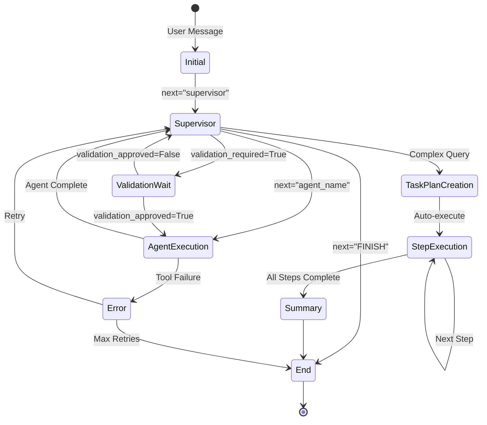

# State Management

> AgentState schema, data flow, state transitions, and message handling in OHMind

## Table of Contents

- [Overview](#overview)
- [AgentState Schema](#agentstate-schema)
- [State Fields](#state-fields)
- [State Transitions](#state-transitions)
- [Message Handling](#message-handling)
- [Helper Functions](#helper-functions)
- [See Also](#see-also)

## Overview

OHMind uses a shared state object (`AgentState`) that flows through the agent graph. This state maintains conversation history, routing information, tool results, and task planning data. The state is managed by LangGraph and persisted using checkpointing.

Key principles:
- **Immutable updates**: State is copied and modified, not mutated in place
- **Message accumulation**: Messages are appended using LangGraph's `add_messages` reducer
- **Centralized tracking**: All agents read from and write to the same state structure

## AgentState Schema

The `AgentState` is defined as a `TypedDict` with annotated fields:

```python
from typing import TypedDict, Annotated, Sequence, Dict, Any, Optional, List
from langchain_core.messages import BaseMessage
from langgraph.graph.message import add_messages

class AgentState(TypedDict):
    # Chat messages - core conversation history
    messages: Annotated[Sequence[BaseMessage], add_messages]
    
    # Agent routing
    next: str
    
    # MCP tool results
    mcp_results: Dict[str, Any]
    
    # RAG context
    rag_context: List[Dict[str, Any]]
    
    # Human-in-the-loop validation
    validation_required: bool
    validation_approved: Optional[bool]
    validation_message: str
    
    # Current operation tracking
    current_operation: str
    operation_metadata: Dict[str, Any]
    
    # Artifacts for UI rendering
    artifacts: Dict[str, Any]
    
    # Error handling
    error: Optional[str]
    retry_count: int
    
    # Task planning
    task_plan: Optional[Dict[str, Any]]
    task_plan_path: Optional[str]
    current_step: int
    completed_steps: List[int]
    task_plan_needs_approval: bool
    task_plan_approved: Optional[bool]
```

## State Fields

### Core Communication

| Field | Type | Description |
|-------|------|-------------|
| `messages` | `Sequence[BaseMessage]` | Conversation history with automatic message accumulation |
| `next` | `str` | Next agent to route to (e.g., "hem_agent", "FINISH") |

### MCP Integration

| Field | Type | Description |
|-------|------|-------------|
| `mcp_results` | `Dict[str, Any]` | Results from MCP tool calls, keyed by tool name |

### RAG System

| Field | Type | Description |
|-------|------|-------------|
| `rag_context` | `List[Dict[str, Any]]` | Retrieved documents with metadata |

### Human-in-the-Loop Validation

| Field | Type | Description |
|-------|------|-------------|
| `validation_required` | `bool` | Flag indicating if validation is needed |
| `validation_approved` | `Optional[bool]` | User approval status (None=pending) |
| `validation_message` | `str` | Message to display for validation |

### Operation Tracking

| Field | Type | Description |
|-------|------|-------------|
| `current_operation` | `str` | Description of current operation |
| `operation_metadata` | `Dict[str, Any]` | Additional metadata (includes `next_agent` for routing) |

### UI Artifacts

| Field | Type | Description |
|-------|------|-------------|
| `artifacts` | `Dict[str, Any]` | Data for custom UI components (molecules, charts) |

### Error Handling

| Field | Type | Description |
|-------|------|-------------|
| `error` | `Optional[str]` | Error message if something went wrong |
| `retry_count` | `int` | Number of retries for failed operations |

### Task Planning

| Field | Type | Description |
|-------|------|-------------|
| `task_plan` | `Optional[Dict[str, Any]]` | Task plan with steps |
| `task_plan_path` | `Optional[str]` | Path to task plan markdown file |
| `current_step` | `int` | Current step number in task plan |
| `completed_steps` | `List[int]` | List of completed step numbers |
| `task_plan_needs_approval` | `bool` | Flag for task plan approval |
| `task_plan_approved` | `Optional[bool]` | User approval status for task plan |

## State Transitions

### Initial State Creation

When a new conversation starts, the state is initialized:

```python
def create_initial_state(user_message: str) -> AgentState:
    from langchain_core.messages import HumanMessage
    
    return AgentState(
        messages=[HumanMessage(content=user_message)],
        next="supervisor",
        mcp_results={},
        rag_context=[],
        validation_required=False,
        validation_approved=None,
        validation_message="",
        current_operation="Initializing",
        operation_metadata={},
        artifacts={},
        error=None,
        retry_count=0,
        task_plan=None,
        task_plan_path=None,
        current_step=0,
        completed_steps=[],
        task_plan_needs_approval=False,
        task_plan_approved=None,
    )
```

### State Flow Diagram



### Routing State Transitions

| Current State | Condition | Next State |
|---------------|-----------|------------|
| `next="supervisor"` | Simple query | `next="agent_name"` |
| `next="supervisor"` | Complex query | Task plan created |
| `next="agent_name"` | Agent completes | `next="supervisor"` or `next="FINISH"` |
| `next="FINISH"` | Task plan active | `next="supervisor"` (for next step) |
| `next="FINISH"` | No task plan | End conversation |

### Task Plan State Transitions

| State | Condition | Action |
|-------|-----------|--------|
| `task_plan=None` | Complex query detected | Create task plan |
| `current_step=0` | Plan created | Execute step 1 |
| `current_step=N` | Step N completes | Add N to `completed_steps`, increment step |
| `completed_steps` full | All steps done | Generate summary, clear plan |

## Message Handling

### Message Accumulation

Messages are accumulated using LangGraph's `add_messages` reducer:

```python
messages: Annotated[Sequence[BaseMessage], add_messages]
```

This ensures:
- New messages are appended to existing history
- Message order is preserved
- Duplicate messages are handled correctly

### Message Types

| Type | Usage |
|------|-------|
| `HumanMessage` | User input |
| `AIMessage` | Agent responses |
| `SystemMessage` | System prompts |
| `ToolMessage` | Tool call results |

### Adding Messages to State

```python
def update_state_with_message(
    state: AgentState,
    message: BaseMessage,
    next_agent: Optional[str] = None
) -> AgentState:
    updated = state.copy()
    updated["messages"] = state["messages"] + [message]
    if next_agent:
        updated["next"] = next_agent
    return updated
```

## Helper Functions

### Validation Helpers

```python
def should_continue_validation(state: AgentState) -> bool:
    """Check if validation is required and not yet approved/rejected."""
    return state["validation_required"] and state["validation_approved"] is None

def mark_validation_required(
    state: AgentState,
    operation_description: str,
    metadata: Dict[str, Any]
) -> AgentState:
    """Mark that an operation requires human validation."""
    updated = state.copy()
    updated["validation_required"] = True
    updated["validation_approved"] = None
    updated["validation_message"] = operation_description
    updated["operation_metadata"] = metadata
    updated["next"] = "FINISH"  # Wait for user approval
    return updated

def mark_validation_complete(
    state: AgentState,
    approved: bool,
    next_agent: str
) -> AgentState:
    """Mark validation as complete with user's decision."""
    updated = state.copy()
    updated["validation_required"] = False
    updated["validation_approved"] = approved
    updated["next"] = next_agent if approved else "supervisor"
    return updated
```

### MCP Result Helpers

```python
def add_mcp_result(
    state: AgentState,
    tool_name: str,
    result: Any
) -> AgentState:
    """Add result from an MCP tool call."""
    updated = state.copy()
    existing_results = updated.get("mcp_results", {})
    mcp_results = existing_results.copy() if existing_results else {}
    mcp_results[tool_name] = result
    updated["mcp_results"] = mcp_results
    return updated
```

### Artifact Helpers

```python
def add_artifact(
    state: AgentState,
    artifact_id: str,
    artifact_data: Any
) -> AgentState:
    """Add artifact for UI rendering."""
    updated = state.copy()
    existing_artifacts = updated.get("artifacts", {})
    artifacts = existing_artifacts.copy() if existing_artifacts else {}
    artifacts[artifact_id] = artifact_data
    updated["artifacts"] = artifacts
    return updated
```

## State Persistence

### Checkpointing

LangGraph's `MemorySaver` provides state persistence:

```python
from langgraph.checkpoint.memory import MemorySaver

memory = MemorySaver()
app = workflow.compile(checkpointer=memory)
```

### Thread-based State

Each conversation thread maintains its own state:

```python
# Invoke with thread ID for state persistence
config = {"configurable": {"thread_id": "user-123-session-1"}}
result = await app.ainvoke(state, config)
```

### State Recovery

On reconnection, the state can be recovered from the checkpoint:

```python
# Get current state for a thread
state = app.get_state(config)
```

## See Also

- [System Overview](./overview.md) - High-level architecture
- [Multi-Agent System](./multi-agent-system.md) - Agent workflow details
- [MCP Integration](./mcp-integration.md) - MCP server communication
- [API Reference](../api/workflow-api.md) - Workflow API documentation

---

*Last updated: 2025-12-22 | OHMind v1.0.0*
