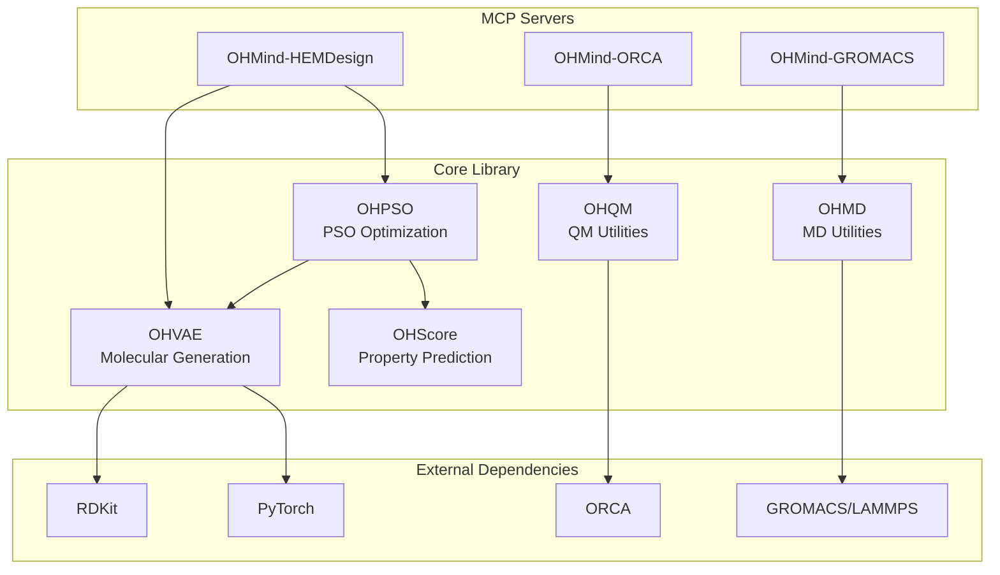

# Core Library Reference

> Comprehensive documentation for OHMind's core Python library modules that power the HEM design and optimization system.

## Table of Contents

- [Overview](#overview)
- [Module Architecture](#module-architecture)
- [Module Summary](#module-summary)
- [Import Examples](#import-examples)
- [Dependencies](#dependencies)
- [See Also](#see-also)

## Overview

The OHMind core library (`OHMind/`) provides the foundational Python modules for Hydroxide Exchange Membrane (HEM) design. These modules implement the computational chemistry algorithms, machine learning models, and simulation interfaces used by the multi-agent system.

### Package Structure

```
OHMind/
├── __init__.py          # Package initialization
├── OHVAE/               # Junction Tree VAE for molecular generation
├── OHPSO/               # Particle Swarm Optimization
├── OHQM/                # Quantum chemistry utilities
├── OHMD/                # Molecular dynamics utilities
├── OHScore/             # Property prediction and metrics
├── OHReaction/          # Reaction prediction (experimental)
└── Data/                # Training data and vocabularies
```

## Module Architecture



## Module Summary

| Module | Purpose | Key Classes/Functions |
|--------|---------|----------------------|
| [OHVAE](./ohvae.md) | Junction Tree VAE for molecular generation | `JTNNVAE`, `MolTree`, `Vocab` |
| [OHPSO](./ohpso.md) | Particle Swarm Optimization | `BasePSOptimizer`, `Swarm`, scoring functions |
| [OHQM](./ohqm.md) | Quantum chemistry utilities | `qprep`, `cmin`, conformer search |
| [OHMD](./ohmd.md) | Molecular dynamics utilities | `HEM_MD`, polymer building |
| [OHScore](./ohscore.md) | Property prediction metrics | Validity, novelty, FCD metrics |

### Module Relationships

1. **OHVAE** provides the molecular encoding/decoding backbone
2. **OHPSO** uses OHVAE for latent space optimization
3. **OHScore** provides scoring functions for OHPSO
4. **OHQM** handles quantum chemistry calculations
5. **OHMD** handles molecular dynamics simulations

## Import Examples

### Basic Imports

```python
# Import the main package
import OHMind

# Check version
print(OHMind.__version__)  # "1.0.0"
```

### OHVAE Module

```python
from OHMind.OHVAE import JTNNVAE, Vocab, MolTree
from OHMind.OHVAE.datautils import MolTreeFolder, tensorize

# Load vocabulary
vocab = Vocab(vocab_file="vocab.txt")

# Initialize VAE model
model = JTNNVAE(vocab, hidden_size=450, latent_size=56, depthT=20, depthG=3)

# Encode SMILES to latent space
latent = model.encode_from_smiles(["CCO", "CCCO"])
```

### OHPSO Module

```python
from OHMind.OHPSO.optimizer import BasePSOptimizer
from OHMind.OHPSO.swarm import Swarm

# Create optimizer from query SMILES
optimizer = BasePSOptimizer.from_query(
    init_smiles="C[N+]1(C)CCCCC1",
    num_part=200,
    num_swarms=1,
    inference_model=model,
    scoring_functions=scoring_funcs
)

# Run optimization
optimizer.run(num_steps=10, num_track=50)
```

### OHQM Module

```python
from OHMind.OHQM.qprep import qprep
from OHMind.OHQM.cmin import cmin

# Prepare QM input files
qprep(
    files=["molecule.sdf"],
    program="orca",
    qm_input="B3LYP def2-SVP D3BJ OPT",
    charge=1,
    mult=1
)

# Conformer minimization with xTB
cmin(
    files=["conformers.sdf"],
    program="xtb",
    nprocs=4
)
```

### OHMD Module

```python
from OHMind.OHMD.HEMMD import HEM_MD, make_work_dir
from OHMind.OHMD.mol_gen import main as mol_gen

# Generate molecule with charges
mol_gen(
    smiles="*C(C*)c1ccccc1",
    work_dir_name="polymer_gen",
    output_file_name="polymer.json",
    charge_type="RESP"
)

# Set up HEM MD simulation
hem_md = HEM_MD(
    water_cell=water_cell,
    polymer_mol=polymer_mol,
    ion_mol=ion_mol,
    n_polymer_mol=10,
    n_ion_mol=150,
    work_dir=work_dir,
    ff=ff,
    omp_psi4=10,
    mpi=10,
    omp=10,
    mem=100000,
    gpu=0
)
```

### OHScore Module

```python
from OHMind.OHScore.metrics import (
    ValidCheck,
    UniquenessCheck,
    NoveltyCheck,
    FCDCheck
)

# Initialize metrics
novelty_checker = NoveltyCheck(training_smiles)
uniqueness_checker = UniquenessCheck()
fcd_checker = FCDCheck(training_smiles)

# Evaluate generated molecules
novelty_score = novelty_checker(valid_molecule_bags)
uniqueness_score = uniqueness_checker(valid_molecule_bags)
fcd_score = fcd_checker(valid_molecule_bags)
```

## Dependencies

### Core Dependencies

| Package | Version | Purpose |
|---------|---------|---------|
| `rdkit` | ≥2022.03 | Molecular operations |
| `torch` | ≥1.10 | Neural network backend |
| `numpy` | ≥1.20 | Numerical operations |
| `pandas` | ≥1.3 | Data handling |
| `scipy` | ≥1.7 | Scientific computing |

### Optional Dependencies

| Package | Purpose | Required For |
|---------|---------|--------------|
| `ase` | Atomic simulation | ANI optimization |
| `torchani` | ANI neural network | ANI optimization |
| `cclib` | QM output parsing | OHQM |
| `guacamol` | Molecular metrics | OHScore |
| `fcd` | Fréchet ChemNet Distance | OHScore |

### External Software

| Software | Purpose | Required For |
|----------|---------|--------------|
| ORCA | QM calculations | OHQM |
| xTB | Fast QM optimization | OHQM/cmin |
| GROMACS | MD simulations | OHMD |
| LAMMPS | MD simulations | OHMD |
| Psi4 | QM calculations | OHMD charge assignment |

## Installation

The core library is installed as part of the OHMind package:

```bash
# Clone repository
git clone https://github.com/PolyAI/OHMind.git
cd OHMind

# Install with conda
conda env create -f environment.yml
conda activate ohmind

# Verify installation
python -c "import OHMind; print(OHMind.__version__)"
```

### PYTHONPATH Setup

Ensure OHMind is in your Python path:

```bash
export PYTHONPATH=/path/to/OHMind:$PYTHONPATH
```

## See Also

- [OHVAE Module](./ohvae.md) - Junction Tree VAE details
- [OHPSO Module](./ohpso.md) - PSO optimization details
- [OHQM Module](./ohqm.md) - QM utilities details
- [OHMD Module](./ohmd.md) - MD utilities details
- [OHScore Module](./ohscore.md) - Metrics details
- [Architecture Overview](../architecture/overview.md) - System architecture
- [MCP Servers](../mcp-servers/index.md) - Server documentation

---
*Last updated: 2025-12-22 | OHMind v1.0.0*
