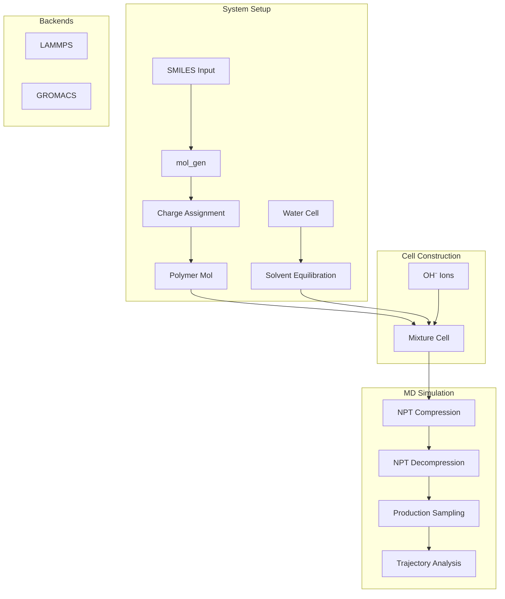

# OHMD Module

> Molecular dynamics utilities for HEM membrane simulations using LAMMPS and GROMACS.

## Table of Contents

- [Overview](#overview)
- [Architecture](#architecture)
- [Key Classes](#key-classes)
  - [HEM_MD](#hem_md)
  - [Poly_Sol_EMD](#poly_sol_emd)
  - [mol_gen](#mol_gen)
- [Simulation Workflow](#simulation-workflow)
- [Usage Examples](#usage-examples)
- [Configuration](#configuration)
- [API Reference](#api-reference)
- [See Also](#see-also)

## Overview

The OHMD module provides molecular dynamics utilities for simulating Hydroxide Exchange Membrane (HEM) systems, including:

- Polymer-solvent system setup
- LAMMPS simulation execution
- NPT equilibration protocols
- Charge assignment (RESP, Gasteiger)
- Trajectory analysis

### Module Structure

```
OHMind/OHMD/
├── __init__.py          # Package initialization
├── HEMMD.py             # HEM-specific MD simulations
├── polysol_md.py        # Polymer-solvent MD
├── mol_gen.py           # Molecule generation with charges
├── cell_utils.py        # Cell manipulation utilities
├── charge_utils.py      # Charge assignment utilities
├── make_solvent.py      # Solvent cell creation
├── core/                # Core utilities
│   ├── utils.py         # General utilities
│   ├── poly.py          # Polymer utilities
│   └── calc.py          # Calculation utilities
├── ff/                  # Force field parameters
│   └── gaff2_mod.py     # Modified GAFF2
├── sim/                 # Simulation interfaces
│   ├── lammps.py        # LAMMPS interface
│   ├── md.py            # MD protocol definitions
│   └── qm.py            # QM interface
└── PolySolSimulator/    # Polymer-solvent simulator
```

## Architecture



### Simulation Protocol

1. **Solvent Equilibration**: NPT equilibration of water cell
2. **Mixture Creation**: Add polymers and ions to equilibrated solvent
3. **Compression/Decompression**: NPT protocol with pressure cycling
4. **Production Sampling**: NPT sampling for property calculation

## Key Classes

### HEM_MD

Main class for HEM membrane MD simulations.

```python
from OHMind.OHMD.HEMMD import HEM_MD, make_work_dir

class HEM_MD:
    def __init__(self, water_cell, polymer_mol, ion_mol, n_polymer_mol,
                 n_ion_mol, work_dir, ff, omp_psi4, mpi, omp, mem, gpu):
        """
        Initialize HEM MD simulation.
        
        Parameters
        ----------
        water_cell : RDKit Mol
            Equilibrated water cell
        polymer_mol : RDKit Mol
            Polymer molecule with charges
        ion_mol : RDKit Mol
            Ion molecule (e.g., OH⁻)
        n_polymer_mol : int
            Number of polymer chains
        n_ion_mol : int
            Number of ions
        work_dir : str
            Working directory
        ff : ForceField
            Force field object (e.g., GAFF2_mod)
        omp_psi4 : int
            OpenMP threads for Psi4
        mpi : int
            MPI processes
        omp : int
            OpenMP threads for LAMMPS
        mem : int
            Memory in MB
        gpu : int
            GPU device ID
        """
```

#### Methods

| Method | Description | Returns |
|--------|-------------|---------|
| `water_emd(...)` | Create water equilibration MD | `MD` object |
| `hem_emd1(...)` | Create compression/decompression MD | `MD` object |
| `hem_emd2(...)` | Create constant pressure MD | `MD` object |
| `sampling(...)` | Create production sampling MD | `MD` object |
| `exec(protocol)` | Execute full simulation workflow | `RDKit Mol` |

#### Example Usage

```python
from OHMind.OHMD.HEMMD import HEM_MD, make_work_dir
from OHMind.OHMD.ff.gaff2_mod import GAFF2_mod
from OHMind.OHMD.core import utils

# Create working directory
work_dir = make_work_dir("hem_simulation")

# Load molecules
water_cell = utils.MolFromJSON("water_cell.json")
polymer_mol = utils.MolFromJSON("polymer.json")
ion_mol = utils.MolFromJSON("oh_ion.json")

# Initialize simulation
ff = GAFF2_mod()
hem_md = HEM_MD(
    water_cell=water_cell,
    polymer_mol=polymer_mol,
    ion_mol=ion_mol,
    n_polymer_mol=10,
    n_ion_mol=150,
    work_dir=work_dir,
    ff=ff,
    omp_psi4=10,
    mpi=10,
    omp=10,
    mem=100000,
    gpu=0
)

# Run simulation
result_mol = hem_md.exec(protocol="md1")

# Save result
utils.MolToJSON(result_mol, "hem_result.json")
```

### Poly_Sol_EMD

Polymer-solvent equilibrium MD simulation.

```python
from OHMind.OHMD.polysol_md import Poly_Sol_EMD, make_work_dir

class Poly_Sol_EMD:
    def __init__(self, solvent_cell, polymer_mol, work_dir, ff,
                 omp_psi4, mpi, omp, mem, gpu):
        """
        Initialize polymer-solvent MD simulation.
        
        Parameters
        ----------
        solvent_cell : RDKit Mol
            Solvent cell (water or other)
        polymer_mol : RDKit Mol
            Polymer molecule with charges
        work_dir : str
            Working directory
        ff : ForceField
            Force field object
        omp_psi4 : int
            OpenMP threads for Psi4
        mpi : int
            MPI processes
        omp : int
            OpenMP threads
        mem : int
            Memory in MB
        gpu : int
            GPU device ID
        """
```

#### Methods

| Method | Description |
|--------|-------------|
| `sol_emd(...)` | Create solvent equilibration MD |
| `poly_sol_emd1(...)` | Create compression/decompression MD |
| `poly_sol_emd2(...)` | Create constant pressure MD |
| `sampling(...)` | Create production sampling MD |
| `exec(protocol)` | Execute full simulation workflow |

### mol_gen

Generate molecules with charge assignment.

```python
from OHMind.OHMD.mol_gen import main as mol_gen

def main(smiles, work_dir_name, output_file_name, charge_type="RESP"):
    """
    Generate molecule with charges from SMILES.
    
    Parameters
    ----------
    smiles : str
        SMILES string (use * for connection points)
    work_dir_name : str
        Working directory name
    output_file_name : str
        Output JSON filename
    charge_type : str
        Charge method: 'RESP' or 'gasteiger'
    """
```

#### Example Usage

```python
from OHMind.OHMD.mol_gen import main as mol_gen

# Generate polystyrene monomer with RESP charges
mol_gen(
    smiles="*C(C*)c1ccccc1",
    work_dir_name="polymer_gen",
    output_file_name="polystyrene.json",
    charge_type="RESP"
)

# Generate with Gasteiger charges (faster)
mol_gen(
    smiles="*C(C*)c1ccccc1",
    work_dir_name="polymer_gen",
    output_file_name="polystyrene_gasteiger.json",
    charge_type="gasteiger"
)
```

## Simulation Workflow

### Complete HEM Simulation

```python
from OHMind.OHMD.HEMMD import HEM_MD, make_work_dir
from OHMind.OHMD.mol_gen import main as mol_gen
from OHMind.OHMD.make_solvent import create_water_cell
from OHMind.OHMD.ff.gaff2_mod import GAFF2_mod
from OHMind.OHMD.core import utils

# Step 1: Generate polymer with charges
mol_gen(
    smiles="*C(C*)c1ccc([N+](C)(C)C)cc1",  # Quaternary ammonium polymer
    work_dir_name="polymer_prep",
    output_file_name="quat_polymer.json",
    charge_type="RESP"
)

# Step 2: Create water cell
water_cell = create_water_cell(
    n_water=1000,
    density=1.0,
    output_file="water_cell.json"
)

# Step 3: Load molecules
polymer_mol = utils.MolFromJSON("quat_polymer.json")
ion_mol = utils.MolFromJSON("oh_ion.json")  # Pre-prepared OH⁻

# Step 4: Set up simulation
work_dir = make_work_dir("hem_simulation")
ff = GAFF2_mod()

hem_md = HEM_MD(
    water_cell=water_cell,
    polymer_mol=polymer_mol,
    ion_mol=ion_mol,
    n_polymer_mol=10,
    n_ion_mol=150,
    work_dir=work_dir,
    ff=ff,
    omp_psi4=10,
    mpi=10,
    omp=10,
    mem=100000,
    gpu=0
)

# Step 5: Run simulation
result = hem_md.exec(protocol="md1")

# Step 6: Save results
utils.MolToJSON(result, "hem_final.json")
```

### Solvent Equilibration Only

```python
from OHMind.OHMD.HEMMD import SolventEquilibration

sol_eq = SolventEquilibration(
    water_cell=water_cell,
    polymer_mol=None,
    ion_mol=None,
    n_polymer_mol=0,
    n_ion_mol=0,
    work_dir=work_dir,
    ff=ff,
    omp_psi4=10,
    mpi=10,
    omp=10,
    mem=100000,
    gpu=0
)

sol_eq.exec()
```

### Mixture MD Only

```python
from OHMind.OHMD.HEMMD import MixMD

mix_md = MixMD(
    water_cell=equilibrated_water,
    polymer_mol=polymer_mol,
    work_dir=work_dir,
    mpi=10,
    omp=10,
    gpu=0
)

equilibrated_mix = mix_md.exec(protocol="md1", min_dist_threshold=5)
```

### Sampling Only

```python
from OHMind.OHMD.HEMMD import SamplingMD

sampling_md = SamplingMD(
    work_dir=work_dir,
    mpi=10,
    omp=10,
    gpu=0
)

sampled_mol = sampling_md.exec(equilibrated_mix)
```

## Usage Examples

### Visualization

```python
from OHMind.OHMD.HEMMD import visualization
from OHMind.OHMD.core import utils

# Load molecule
mol = utils.MolFromJSON("hem_result.json")

# Visualize with py3Dmol
visualization(mol)
```

### Update from LAMMPS Dump

```python
from OHMind.OHMD.HEMMD import update_mol_from_dump, read_dump_last
from OHMind.OHMD.core import utils

# Read dump file
uwstr, wstr, cell, velocity, force = read_dump_last("trajectory.dump")

# Update molecule coordinates
mol = utils.MolFromJSON("initial.json")
updated_mol = update_mol_from_dump(mol, "trajectory.dump", confId=0)
```

### Custom MD Protocol

```python
from OHMind.OHMD.sim.md import MD

# Create custom MD protocol
md = MD()
md.cutoff_in = 10.0
md.cutoff_out = 12.0
md.dat_file = "system.data"
md.dump_file = "trajectory.dump"
md.xtc_file = "trajectory.xtc"
md.rst = True
md.write_data = "final.data"

# Add minimization
md.add_min(min_style="cg")

# Add NPT equilibration
md.add_md(
    "npt",
    step=100000,
    time_step=0.002,
    t_start=300,
    t_stop=300,
    p_start=1,
    p_stop=1,
    shake=True
)

# Add NVT production
md.add_md(
    "nvt",
    step=500000,
    time_step=0.002,
    t_start=300,
    t_stop=300,
    shake=True
)
```

## Configuration

### Force Field

```python
from OHMind.OHMD.ff.gaff2_mod import GAFF2_mod

# Initialize modified GAFF2 force field
ff = GAFF2_mod()
```

### Simulation Parameters

| Parameter | Default | Description |
|-----------|---------|-------------|
| `cutoff_in` | 10.0 | Inner cutoff (Å) |
| `cutoff_out` | 12.0 | Outer cutoff (Å) |
| `time_step` | 0.002 | Time step (ps) |
| `t_start` | 300 | Initial temperature (K) |
| `t_stop` | 300 | Final temperature (K) |
| `p_start` | 1 | Initial pressure (atm) |
| `p_stop` | 1 | Final pressure (atm) |
| `shake` | True | SHAKE constraints |

### Compression Protocol

Default pressure cycling for equilibration:

```python
press_ratio = [0.02, 0.60, 1.00, 0.50, 0.10, 0.01]
max_press = 1000  # atm
step_weight = [0.05, 0.1, 0.3, 0.2, 0.1, 0.05, 0.2]
```

## API Reference

### HEM_MD.exec

```python
def exec(self, protocol, min_dist_threshold=5):
    """
    Execute full HEM MD simulation.
    
    Parameters
    ----------
    protocol : str
        MD protocol: 'md1' (compression/decompression) or 'md2' (constant pressure)
    min_dist_threshold : float
        Minimum distance threshold for cell construction (Å)
        
    Returns
    -------
    RDKit Mol
        Final equilibrated system
    """
```

### mol_gen Parameters

| Parameter | Type | Default | Description |
|-----------|------|---------|-------------|
| `smiles` | `str` | required | SMILES with * for connections |
| `work_dir_name` | `str` | required | Working directory |
| `output_file_name` | `str` | required | Output JSON file |
| `charge_type` | `str` | `'RESP'` | Charge method |

### Directory Structure

After simulation, the working directory contains:

```
work_dir/
├── water_md/           # Solvent equilibration
│   ├── water_cell_ini.data
│   ├── water_npt.dump
│   └── equilibrated_solvent.json
├── HEM_md/             # Mixture equilibration
│   ├── mix_cell_ini.data
│   ├── HEM_npt.dump
│   └── equilibrated_mix.json
└── sampling/           # Production sampling
    ├── sampling.dump
    ├── sampling.xtc
    └── sampling_mix.json
```

## See Also

- [Core Library Index](./index.md) - Module overview
- [OHQM Module](./ohqm.md) - QM utilities
- [MD Agent](../agents/md-agent.md) - Agent using OHMD
- [GROMACS Server](../mcp-servers/gromacs-server.md) - MCP server tools

---
*Last updated: 2025-12-22 | OHMind v1.0.0*
