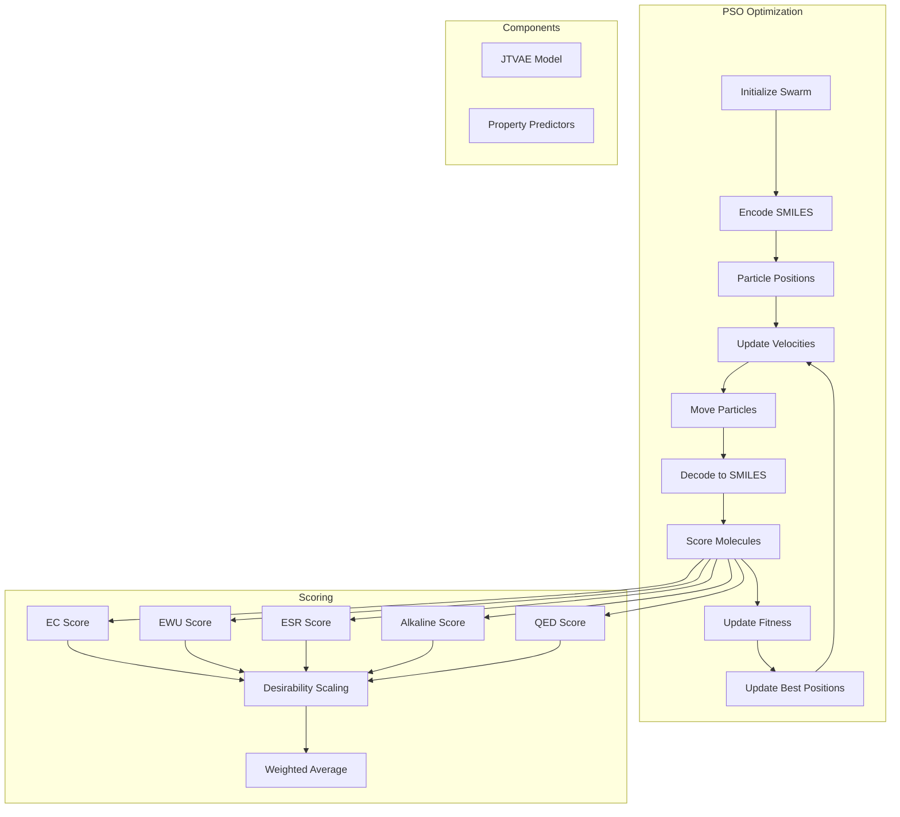

# OHPSO Module

> Particle Swarm Optimization (PSO) for molecular design in the JTVAE latent space.

## Table of Contents

- [Overview](#overview)
- [Architecture](#architecture)
- [Key Classes](#key-classes)
  - [BasePSOptimizer](#basepsoptimizer)
  - [Swarm](#swarm)
  - [ScoringFunction](#scoringfunction)
  - [InferenceModel](#inferencemodel)
- [Scoring Functions](#scoring-functions)
  - [Property Predictors](#property-predictors)
  - [Molecular Functions](#molecular-functions)
  - [Desirability Curves](#desirability-curves)
- [Usage Examples](#usage-examples)
- [Configuration](#configuration)
- [API Reference](#api-reference)
- [See Also](#see-also)

## Overview

The OHPSO module implements Particle Swarm Optimization for molecular design in the latent space of the Junction Tree VAE (OHVAE). This enables:

- Multi-objective optimization of molecular properties
- Exploration of chemical space around seed molecules
- Property-guided molecular generation
- Integration with HEM property predictors (EC, EWU, ESR)

### Module Structure

```
OHMind/OHPSO/
├── optimizer.py         # PSO optimizer classes
├── swarm.py             # Swarm class
├── inference.py         # VAE inference wrapper
├── EC.py                # Effective Conductivity predictor
├── EWU.py               # Effective Water Uptake predictor
├── ESR.py               # Effective Swelling Ratio predictor
├── alkaline.py          # Alkaline stability predictor
├── objectives/
│   ├── scoring.py       # ScoringFunction class
│   ├── mol_functions.py # Molecular scoring functions
│   └── config.yaml      # Scoring configuration
└── data/                # Model weights and data
```

## Architecture



### PSO Algorithm

The optimizer uses a modified PSO with three velocity components:

```
v_new = w * v_old + φ1 * r1 * (p_best - x) + φ2 * r2 * (g_best - x) + φ3 * r3 * (h_best - x)
```

Where:
- `w`: Inertia weight (default: 0.9)
- `φ1, φ2, φ3`: Acceleration coefficients (default: 2.0)
- `p_best`: Particle's personal best position
- `g_best`: Swarm's global best position
- `h_best`: Historical best position (randomly selected)

## Key Classes

### BasePSOptimizer

Main optimizer class for PSO-based molecular optimization.

```python
from OHMind.OHPSO.optimizer import BasePSOptimizer

class BasePSOptimizer:
    def __init__(self, swarms, inference_model, scoring_functions=None):
        """
        Initialize PSO optimizer.
        
        Parameters
        ----------
        swarms : list[Swarm]
            List of Swarm objects to optimize
        inference_model : InferenceModel
            VAE model for encoding/decoding
        scoring_functions : list[ScoringFunction], optional
            Scoring functions for fitness evaluation
        """
```

#### Class Methods

| Method | Description |
|--------|-------------|
| `from_query(init_smiles, num_part, num_swarms, ...)` | Create optimizer from single SMILES |
| `from_query_list(init_smiles, num_part, num_swarms, ...)` | Create optimizer from SMILES list |
| `from_swarm_dicts(swarm_dicts, ...)` | Create optimizer from saved swarm dictionaries |

#### Instance Methods

| Method | Description | Returns |
|--------|-------------|---------|
| `run(num_steps, num_track)` | Run optimization loop | `list[Swarm]` |
| `update_fitness(swarm)` | Calculate fitness for swarm | `Swarm` |

#### Example Usage

```python
from OHMind.OHPSO.optimizer import BasePSOptimizer
from OHMind.OHPSO.inference import InferenceModel
from OHMind.OHPSO.objectives.scoring import ScoringFunction
from OHMind.OHPSO.objectives.mol_functions import ec_score, ewu_score

# Load inference model
model = InferenceModel(
    model_path="path/to/model.pt",
    vocab_path="path/to/vocab.txt"
)

# Define scoring functions
scoring_funcs = [
    ScoringFunction(
        func=ec_score,
        name="EC",
        desirability=[{"x": 0, "y": 0}, {"x": 100, "y": 1}],
        weight=100,
        is_mol_func=True
    ),
    ScoringFunction(
        func=ewu_score,
        name="EWU",
        desirability=[{"x": 0, "y": 1}, {"x": 100, "y": 0}],
        weight=50,
        is_mol_func=True
    )
]

# Create optimizer
optimizer = BasePSOptimizer.from_query(
    init_smiles="C[N+]1(C)CCCCC1",
    num_part=200,
    num_swarms=1,
    inference_model=model,
    scoring_functions=scoring_funcs
)

# Run optimization
swarms = optimizer.run(num_steps=10, num_track=50)

# Get best solutions
print(optimizer.best_solutions.head())
```

### Swarm

Represents a particle swarm for optimization.

```python
from OHMind.OHPSO.swarm import Swarm

class Swarm:
    def __init__(self, smiles, x, v, x_min=-1., x_max=1.,
                 inertia_weight=0.9, phi1=2., phi2=2., phi3=2.):
        """
        Initialize a particle swarm.
        
        Parameters
        ----------
        smiles : list[str]
            SMILES for each particle
        x : np.ndarray
            Particle positions (num_part, latent_dim)
        v : np.ndarray
            Particle velocities (num_part, latent_dim)
        x_min, x_max : float
            Position bounds
        inertia_weight : float
            Velocity inertia
        phi1, phi2, phi3 : float
            Acceleration coefficients
        """
```

#### Attributes

| Attribute | Type | Description |
|-----------|------|-------------|
| `smiles` | `list[str]` | Current SMILES for particles |
| `x` | `np.ndarray` | Particle positions |
| `v` | `np.ndarray` | Particle velocities |
| `fitness` | `np.ndarray` | Current fitness values |
| `swarm_best_x` | `np.ndarray` | Best position found by swarm |
| `swarm_best_fitness` | `float` | Best fitness found |
| `particle_best_x` | `np.ndarray` | Personal best positions |
| `particle_best_fitness` | `np.ndarray` | Personal best fitness values |
| `best_smiles` | `str` | SMILES of best solution |

#### Methods

| Method | Description |
|--------|-------------|
| `next_step()` | Update particle positions |
| `update_fitness(fitness)` | Update fitness and best positions |
| `to_dict()` | Export swarm to dictionary |
| `from_dict(dictionary, ...)` | Create swarm from dictionary |
| `from_query(init_sml, init_emb, num_part, ...)` | Create swarm from query |

### ScoringFunction

Wraps scoring functions with desirability scaling.

```python
from OHMind.OHPSO.objectives.scoring import ScoringFunction

class ScoringFunction:
    def __init__(self, func, name, description=None, desirability=None,
                 truncate_left=True, truncate_right=True, weight=100,
                 is_mol_func=False):
        """
        Create a scoring function with desirability scaling.
        
        Parameters
        ----------
        func : callable
            Scoring function (mol -> score or embedding -> score)
        name : str
            Unique name for bookkeeping
        description : str, optional
            Function description
        desirability : list[dict], optional
            Points defining desirability curve [{"x": x, "y": y}, ...]
        truncate_left : bool
            Truncate desirability at left boundary
        truncate_right : bool
            Truncate desirability at right boundary
        weight : float
            Weight in multi-objective optimization
        is_mol_func : bool
            True if function takes RDKit mol, False for embeddings
        """
```

#### Desirability Curves

Desirability curves map raw scores to [0, 1] range:

```python
# Linear desirability (higher is better)
desirability = [{"x": 0, "y": 0}, {"x": 100, "y": 1}]

# Inverse desirability (lower is better)
desirability = [{"x": 0, "y": 1}, {"x": 100, "y": 0}]

# Target range desirability
desirability = [
    {"x": 0, "y": 0},
    {"x": 50, "y": 1},
    {"x": 100, "y": 1},
    {"x": 150, "y": 0}
]
```

### InferenceModel

Wrapper for JTVAE encoding/decoding.

```python
from OHMind.OHPSO.inference import InferenceModel

class InferenceModel:
    def __init__(self, model_path, vocab_path, use_gpu=False,
                 batch_size=100, latent_size=56, hidden_size=450,
                 depthT=20, depthG=3):
        """
        Initialize inference model.
        
        Parameters
        ----------
        model_path : str
            Path to trained JTVAE model
        vocab_path : str
            Path to vocabulary file
        use_gpu : bool
            Use GPU for inference
        batch_size : int
            Batch size for encoding
        latent_size : int
            Latent space dimension
        hidden_size : int
            Hidden layer dimension
        depthT, depthG : int
            Tree and graph encoding depths
        """
```

#### Methods

| Method | Description | Returns |
|--------|-------------|---------|
| `smi_to_emb(smiles)` | Encode SMILES to latent | `np.ndarray` |
| `emb_to_smi(embedding)` | Decode latent to SMILES | `list[str]` |

## Scoring Functions

### Property Predictors

HEM-specific property prediction models:

#### MLPEC (Effective Conductivity)

```python
from OHMind.OHPSO.EC import MLPEC

model = MLPEC(input_size=570, n_hidden1=120, n_hidden2=40, n_output=1)
```

Predicts OH⁻ conductivity (mS/cm) from:
- Cation latent vector (56 dim)
- Backbone fingerprint (512 dim)
- Temperature and thickness (2 dim)

#### MLPEWU (Effective Water Uptake)

```python
from OHMind.OHPSO.EWU import MLPEWU

model = MLPEWU(input_size=570, n_hidden1=120, n_hidden2=40, n_output=1)
```

Predicts water uptake (wt%) with same input features.

#### MLPESR (Effective Swelling Ratio)

```python
from OHMind.OHPSO.ESR import MLPESR

model = MLPESR(input_size=570, n_hidden1=120, n_hidden2=40, n_output=1)
```

Predicts swelling ratio with same input features.

#### MLPAlkaline (Alkaline Stability)

```python
from OHMind.OHPSO.alkaline import MLPAlkaline

model = MLPAlkaline(input_size=112, n_hidden1=200, n_hidden2=50, n_output=1)
```

Predicts alkaline stability from cation pair latent vectors.

### Molecular Functions

Built-in scoring functions in `objectives/mol_functions.py`:

| Function | Description | Input |
|----------|-------------|-------|
| `ec_score(mol)` | Effective conductivity | RDKit mol |
| `ewu_score(mol)` | Effective water uptake | RDKit mol |
| `esr_score(mol)` | Effective swelling ratio | RDKit mol |
| `alkaline_score(mol)` | Alkaline stability | RDKit mol |
| `qed_score(mol)` | Quantitative drug-likeness | RDKit mol |
| `sa_score(mol)` | Synthetic accessibility | RDKit mol |
| `logp_score(mol)` | Crippen LogP | RDKit mol |
| `tan_sim(mol, ref_smiles)` | Tanimoto similarity | RDKit mol |
| `heavy_atom_count(mol)` | Heavy atom count | RDKit mol |
| `molecular_weight(mol)` | Molecular weight | RDKit mol |
| `tox_alert(mol)` | Toxicity alert check | RDKit mol |

### Desirability Curves

Example desirability configurations:

```python
# High conductivity is desirable
ec_desirability = [
    {"x": 0, "y": 0},
    {"x": 50, "y": 0.5},
    {"x": 100, "y": 0.9},
    {"x": 150, "y": 1.0}
]

# Low water uptake is desirable
ewu_desirability = [
    {"x": 0, "y": 1.0},
    {"x": 20, "y": 0.8},
    {"x": 50, "y": 0.3},
    {"x": 100, "y": 0}
]

# Target swelling ratio range
esr_desirability = [
    {"x": 0, "y": 0},
    {"x": 10, "y": 0.8},
    {"x": 20, "y": 1.0},
    {"x": 30, "y": 1.0},
    {"x": 50, "y": 0.5},
    {"x": 100, "y": 0}
]
```

## Usage Examples

### Basic Optimization

```python
from OHMind.OHPSO.optimizer import BasePSOptimizer
from OHMind.OHPSO.inference import InferenceModel
from OHMind.OHPSO.objectives.scoring import ScoringFunction
from OHMind.OHPSO.objectives.mol_functions import qed_score, sa_score

# Setup
model = InferenceModel(
    model_path="data/model.epoch-29",
    vocab_path="data/vocab.txt"
)

# Define objectives
scoring_funcs = [
    ScoringFunction(
        func=qed_score,
        name="QED",
        desirability=[{"x": 0, "y": 0}, {"x": 1, "y": 1}],
        weight=100,
        is_mol_func=True
    ),
    ScoringFunction(
        func=sa_score,
        name="SA",
        desirability=[{"x": 1, "y": 1}, {"x": 5, "y": 0.5}, {"x": 10, "y": 0}],
        weight=50,
        is_mol_func=True
    )
]

# Create and run optimizer
optimizer = BasePSOptimizer.from_query(
    init_smiles="c1ccccc1",
    num_part=100,
    num_swarms=1,
    inference_model=model,
    scoring_functions=scoring_funcs,
    phi1=2.0,
    phi2=2.0,
    phi3=2.0
)

swarms = optimizer.run(num_steps=20, num_track=10)

# Results
print("Best solutions:")
print(optimizer.best_solutions)
```

### HEM Cation Optimization

```python
from OHMind.OHPSO.optimizer import BasePSOptimizer
from OHMind.OHPSO.inference import InferenceModel
from OHMind.OHPSO.objectives.scoring import ScoringFunction
from OHMind.OHPSO.objectives.mol_functions import ec_score, ewu_score, alkaline_score

# Load model
model = InferenceModel(
    model_path="data/model.epoch-29",
    vocab_path="data/vocab.txt"
)

# Multi-objective scoring for HEM
scoring_funcs = [
    ScoringFunction(
        func=ec_score,
        name="Conductivity",
        desirability=[{"x": 0, "y": 0}, {"x": 100, "y": 1}],
        weight=100,
        is_mol_func=True
    ),
    ScoringFunction(
        func=ewu_score,
        name="WaterUptake",
        desirability=[{"x": 0, "y": 1}, {"x": 50, "y": 0.5}, {"x": 100, "y": 0}],
        weight=50,
        is_mol_func=True
    ),
    ScoringFunction(
        func=alkaline_score,
        name="Stability",
        desirability=[{"x": 0, "y": 0}, {"x": 1, "y": 1}],
        weight=80,
        is_mol_func=True
    )
]

# Start from known cation
optimizer = BasePSOptimizer.from_query(
    init_smiles="C[N+]1(C)CCCCC1",  # N,N-dimethylpiperidinium
    num_part=200,
    num_swarms=1,
    inference_model=model,
    scoring_functions=scoring_funcs
)

# Run optimization
swarms = optimizer.run(num_steps=15, num_track=50)

# Export results
optimizer.best_solutions.to_csv("optimized_cations.csv", index=False)
```

### Multiple Swarms

```python
# Initialize multiple swarms from different starting points
init_smiles_list = [
    "C[N+]1(C)CCCCC1",      # Piperidinium
    "C[N+](C)(C)C",          # Tetramethylammonium
    "c1cc[nH+]cc1"           # Pyridinium
]

optimizer = BasePSOptimizer.from_query_list(
    init_smiles=init_smiles_list,
    num_part=100,
    num_swarms=3,
    inference_model=model,
    scoring_functions=scoring_funcs
)

swarms = optimizer.run(num_steps=20, num_track=30)
```

### Resume Optimization

```python
# Save swarm state
swarm_dicts = [swarm.to_dict() for swarm in optimizer.swarms]

# Later, resume from saved state
optimizer = BasePSOptimizer.from_swarm_dicts(
    swarm_dicts=swarm_dicts,
    inference_model=model,
    scoring_functions=scoring_funcs
)

swarms = optimizer.run(num_steps=10, num_track=50)
```

## Configuration

### Scoring Configuration (config.yaml)

```yaml
# Backbone polymer configuration
phi: "c1ccc(C(C)(C)c2ccccc2)cc1"  # Hydrophilic monomer
pho: "c1ccccc1"                    # Hydrophobic monomer
frac: 0.5                          # Hydrophilic fraction
temperature: 80                    # Temperature (°C)
thickness: 50                      # Membrane thickness (μm)
```

### PSO Hyperparameters

| Parameter | Default | Description |
|-----------|---------|-------------|
| `num_part` | 200 | Particles per swarm |
| `num_swarms` | 1 | Number of swarms |
| `phi1` | 2.0 | Personal best acceleration |
| `phi2` | 2.0 | Global best acceleration |
| `phi3` | 2.0 | Historical best acceleration |
| `inertia_weight` | 0.9 | Velocity inertia |
| `x_min` | -1.0 | Position lower bound |
| `x_max` | 1.0 | Position upper bound |
| `v_min` | -0.6 | Initial velocity lower bound |
| `v_max` | 0.6 | Initial velocity upper bound |

## API Reference

### BasePSOptimizer.from_query

```python
@classmethod
def from_query(cls, init_smiles, num_part, num_swarms, inference_model,
               scoring_functions=None, phi1=2., phi2=2., phi3=2.,
               x_min=-1., x_max=1., v_min=-0.6, v_max=0.6, **kwargs):
    """
    Create optimizer from query SMILES.
    
    Parameters
    ----------
    init_smiles : str or list[str]
        Starting SMILES (if list, randomly sample num_part)
    num_part : int
        Number of particles per swarm
    num_swarms : int
        Number of swarms
    inference_model : InferenceModel
        VAE model for encoding/decoding
    scoring_functions : list[ScoringFunction]
        Scoring functions for evaluation
    phi1, phi2, phi3 : float
        PSO acceleration coefficients
    x_min, x_max : float
        Position bounds
    v_min, v_max : float
        Initial velocity bounds
        
    Returns
    -------
    BasePSOptimizer
        Initialized optimizer
    """
```

### BasePSOptimizer.run

```python
def run(self, num_steps, num_track=10):
    """
    Run optimization loop.
    
    Parameters
    ----------
    num_steps : int
        Number of optimization steps
    num_track : int
        Number of best solutions to track
        
    Returns
    -------
    list[Swarm]
        Optimized swarms
    """
```

## See Also

- [Core Library Index](./index.md) - Module overview
- [OHVAE Module](./ohvae.md) - VAE for molecular generation
- [OHScore Module](./ohscore.md) - Additional metrics
- [HEM Agent](../agents/hem-agent.md) - Agent using OHPSO
- [HEM Server](../mcp-servers/hem-server.md) - MCP server tools

---
*Last updated: 2025-12-22 | OHMind v1.0.0*
