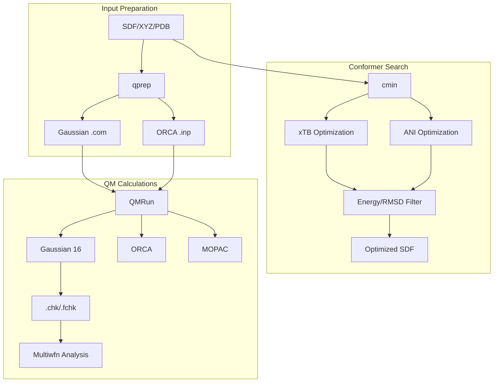

# OHQM Module

> Quantum chemistry utilities for conformer search, input preparation, and QM calculations.

## Table of Contents

- [Overview](#overview)
- [Architecture](#architecture)
- [Key Classes](#key-classes)
  - [qprep](#qprep)
  - [cmin](#cmin)
  - [QMRun](#qmrun)
- [Conformer Search](#conformer-search)
- [Usage Examples](#usage-examples)
- [Configuration](#configuration)
- [API Reference](#api-reference)
- [See Also](#see-also)

## Overview

The OHQM module provides quantum chemistry utilities for molecular calculations, including:

- Input file preparation for Gaussian and ORCA
- Conformer minimization with xTB and ANI
- QM calculation execution and result parsing
- Integration with Multiwfn for wavefunction analysis

### Module Structure

```
OHMind/OHQM/
├── qprep.py             # QM input file preparation
├── cmin.py              # Conformer minimization
├── qrun.py              # QM job execution
├── qcorr.py             # Output correction/analysis
├── qdescp.py            # Descriptor calculation
├── filter.py            # Conformer filtering
├── utils.py             # Utility functions
├── csearch/             # Conformer search (CREST)
├── calculator/          # QM calculators
├── templates/           # Input templates
└── MOPAC2016/           # MOPAC integration
```

## Architecture



## Key Classes

### qprep

Prepares QM input files from molecular structures.

```python
from OHMind.OHQM.qprep import qprep

class qprep:
    def __init__(self, create_dat=True, **kwargs):
        """
        Prepare QM input files.
        
        Parameters
        ----------
        files : str or list[str]
            Input files (SDF, XYZ, PDB, LOG, OUT, JSON)
        program : str
            Target program: 'gaussian' or 'orca'
        qm_input : str
            Keywords line (e.g., 'B3LYP/6-31G opt freq')
        charge : int, optional
            Molecular charge (default: 0)
        mult : int, optional
            Spin multiplicity (default: 1)
        destination : str, optional
            Output directory
        nprocs : int
            Number of processors (default: 2)
        mem : str
            Memory allocation (default: '4GB')
        chk : bool
            Include checkpoint file (Gaussian)
        gen_atoms : list[str]
            Atoms for Gen/ECP basis set
        bs_gen : str
            Basis set for Gen/ECP atoms
        bs_nogen : str
            Basis set for non-Gen/ECP atoms
        lowest_only : bool
            Only process lowest energy conformer
        lowest_n : int
            Process n lowest energy conformers
        """
```

#### Supported Input Formats

| Format | Extension | Description |
|--------|-----------|-------------|
| SDF | `.sdf` | Structure-Data File |
| XYZ | `.xyz` | Cartesian coordinates |
| PDB | `.pdb` | Protein Data Bank |
| Gaussian LOG | `.log` | Gaussian output |
| ORCA OUT | `.out` | ORCA output |
| JSON | `.json` | cclib JSON format |

#### Example Usage

```python
from OHMind.OHQM.qprep import qprep

# Prepare Gaussian input
qprep(
    files=["molecule.sdf"],
    program="gaussian",
    qm_input="B3LYP/6-31G* opt freq",
    charge=1,
    mult=1,
    nprocs=8,
    mem="16GB",
    chk=True,
    destination="QCALC"
)

# Prepare ORCA input
qprep(
    files=["molecule.sdf"],
    program="orca",
    qm_input="B3LYP def2-SVP D3BJ OPT",
    charge=1,
    mult=1,
    nprocs=4,
    mem="4GB",
    destination="ORCA_CALC"
)

# With ECP basis set
qprep(
    files=["metal_complex.sdf"],
    program="gaussian",
    qm_input="B3LYP genecp opt",
    charge=0,
    mult=1,
    gen_atoms=["Pd", "I"],
    bs_gen="def2svp",
    bs_nogen="6-31G*"
)
```

### cmin

Conformer minimization using xTB or ANI.

```python
from OHMind.OHQM.cmin import cmin

class cmin:
    def __init__(self, **kwargs):
        """
        Conformer minimization.
        
        Parameters
        ----------
        files : str or list[str]
            Input files (SDF, XYZ, GJF, COM, PDB)
        program : str
            Optimization program: 'xtb' or 'ani'
        charge : int, optional
            Molecular charge
        mult : int, optional
            Spin multiplicity
        nprocs : int
            Number of processors (default: 2)
        ewin_cmin : float
            Energy window in kcal/mol (default: 5.0)
        energy_threshold : float
            Energy difference threshold (default: 0.25)
        rms_threshold : float
            RMSD threshold (default: 0.25)
        destination : str, optional
            Output directory
        
        xTB-specific Parameters
        -----------------------
        xtb_keywords : str
            Additional xTB keywords
        constraints_atoms : list[int]
            Frozen atom indices
        constraints_dist : list[list]
            Distance constraints [[AT1, AT2, DIST], ...]
        constraints_angle : list[list]
            Angle constraints [[AT1, AT2, AT3, ANGLE], ...]
        constraints_dihedral : list[list]
            Dihedral constraints [[AT1, AT2, AT3, AT4, DIHEDRAL], ...]
        
        ANI-specific Parameters
        -----------------------
        opt_steps : int
            Maximum optimization steps (default: 1000)
        opt_fmax : float
            Force convergence criterion (default: 0.05)
        ani_method : str
            ANI model: 'ANI2x', 'ANI1x', etc. (default: 'ANI2x')
        """
```

#### Example Usage

```python
from OHMind.OHQM.cmin import cmin

# xTB optimization
cmin(
    files=["conformers.sdf"],
    program="xtb",
    charge=1,
    mult=1,
    nprocs=4,
    ewin_cmin=5.0,
    energy_threshold=0.25,
    rms_threshold=0.25,
    destination="CMIN"
)

# ANI optimization
cmin(
    files=["conformers.sdf"],
    program="ani",
    ani_method="ANI2x",
    opt_steps=1000,
    opt_fmax=0.05,
    destination="CMIN_ANI"
)

# With constraints
cmin(
    files=["ts_guess.sdf"],
    program="xtb",
    charge=0,
    mult=1,
    constraints_atoms=[1, 2, 3],  # Freeze atoms 1, 2, 3
    constraints_dist=[[4, 5, 1.8]],  # Fix distance between atoms 4-5
    destination="CMIN_CONSTRAINED"
)
```

### QMRun

Execute QM calculations and parse results.

```python
from OHMind.OHQM.qrun import QMRun

class QMRun:
    def __init__(self, com_file):
        """
        Run QM calculations.
        
        Parameters
        ----------
        com_file : str
            Path to Gaussian .com input file
        """
```

#### Methods

| Method | Description |
|--------|-------------|
| `gaussian()` | Run Gaussian 16 calculation |
| `mopac()` | Run MOPAC calculation |
| `multiwfn()` | Run Multiwfn analysis |
| `parser(program)` | Parse calculation results |

#### Example Usage

```python
from OHMind.OHQM.qrun import QMRun

# Run Gaussian calculation
qm = QMRun("molecule.com")
qm.gaussian()

# Run Multiwfn analysis
qm.multiwfn()

# Parse results
results = qm.parser(program='gaussian')
print(f"LUMO: {results['lumo']} eV")
print(f"HOMO: {results['homo']} eV")
print(f"ESP min: {results['esp_min']} a.u.")
print(f"ESP max: {results['esp_max']} a.u.")
```

## Conformer Search

### CSEARCH Integration

The module integrates with CREST for conformer searching:

```python
from OHMind.OHQM.csearch.crest import xyzall_2_xyz, xtb_opt_main

# Split multi-conformer XYZ file
xyzall_2_xyz("conformers.xyz", "output_prefix")

# xTB optimization
mol, energy, valid = xtb_opt_main(
    name="molecule",
    dup_data=dataframe,
    dup_data_idx=0,
    self_obj=cmin_instance,
    charge=0,
    mult=1,
    smi=None,
    constraints_atoms=[],
    constraints_dist=[],
    constraints_angle=[],
    constraints_dihedral=[],
    method='xtb',
    geom='normal',
    complex_ts=False,
    mol=rdkit_mol
)
```

### Filtering

Conformer filtering based on energy and RMSD:

```python
from OHMind.OHQM.filter import ewin_filter, pre_E_filter, RMSD_and_E_filter

# Energy window filter
filtered_cids = ewin_filter(
    sorted_cids,
    energies,
    dup_data,
    dup_data_idx,
    program='xtb',
    ewin=5.0  # kcal/mol
)

# Pre-filter by energy only
selected_cids = pre_E_filter(
    filtered_cids,
    energies,
    dup_data,
    dup_data_idx,
    program='xtb',
    threshold=0.0001  # kcal/mol
)

# Final filter by energy and RMSD
final_cids = RMSD_and_E_filter(
    mols,
    selected_cids,
    energies,
    args,
    dup_data,
    dup_data_idx,
    program='xtb'
)
```

## Usage Examples

### Complete Workflow

```python
from OHMind.OHQM.qprep import qprep
from OHMind.OHQM.cmin import cmin
from OHMind.OHQM.qrun import QMRun

# Step 1: Conformer search and minimization
cmin(
    files=["molecule.sdf"],
    program="xtb",
    charge=1,
    mult=1,
    nprocs=4,
    ewin_cmin=5.0,
    destination="CMIN"
)

# Step 2: Prepare DFT input for lowest conformers
qprep(
    files=["CMIN/molecule_xtb.sdf"],
    program="gaussian",
    qm_input="B3LYP/6-311+G(d,p) opt freq",
    charge=1,
    mult=1,
    nprocs=16,
    mem="32GB",
    chk=True,
    lowest_n=5,
    destination="DFT"
)

# Step 3: Run DFT calculations
import glob
for com_file in glob.glob("DFT/*.com"):
    qm = QMRun(com_file)
    qm.gaussian()
    qm.multiwfn()
    results = qm.parser(program='gaussian')
    print(f"{com_file}: LUMO = {results['lumo']} eV")
```

### ORCA Workflow

```python
from OHMind.OHQM.qprep import qprep

# Prepare ORCA input for geometry optimization
qprep(
    files=["molecule.sdf"],
    program="orca",
    qm_input="B3LYP def2-SVP D3BJ TightSCF OPT",
    charge=0,
    mult=1,
    nprocs=8,
    mem="4GB",
    destination="ORCA_OPT"
)

# Prepare ORCA input for single point with larger basis
qprep(
    files=["optimized.xyz"],
    program="orca",
    qm_input="B3LYP def2-TZVP D3BJ TightSCF",
    charge=0,
    mult=1,
    nprocs=8,
    mem="8GB",
    destination="ORCA_SP"
)
```

### Batch Processing

```python
from OHMind.OHQM.qprep import qprep
import glob

# Process all SDF files in directory
sdf_files = glob.glob("molecules/*.sdf")

qprep(
    files=sdf_files,
    program="orca",
    qm_input="B3LYP def2-SVP D3BJ OPT FREQ",
    charge=1,
    mult=1,
    nprocs=4,
    mem="4GB",
    destination="BATCH_CALC"
)
```

## Configuration

### Environment Variables

| Variable | Description | Example |
|----------|-------------|---------|
| `ORCA_PATH` | Path to ORCA executable | `/opt/orca/orca` |
| `XTB_PATH` | Path to xTB executable | `/opt/xtb/bin/xtb` |
| `GAUSSIAN_PATH` | Path to Gaussian | `/opt/g16/g16` |
| `MULTIWFN_PATH` | Path to Multiwfn | `/opt/Multiwfn/Multiwfn` |

### Settings File (settings.ini)

```ini
[paths]
orca = /opt/orca/orca
xtb = /opt/xtb/bin/xtb
gaussian = /opt/g16/g16
multiwfn = /opt/Multiwfn/Multiwfn

[defaults]
nprocs = 4
mem = 4GB
charge = 0
mult = 1
```

## API Reference

### qprep Parameters

| Parameter | Type | Default | Description |
|-----------|------|---------|-------------|
| `files` | `str/list` | required | Input file(s) |
| `program` | `str` | required | 'gaussian' or 'orca' |
| `qm_input` | `str` | `''` | Keywords line |
| `qm_end` | `str` | `''` | Final section |
| `charge` | `int` | `0` | Molecular charge |
| `mult` | `int` | `1` | Spin multiplicity |
| `nprocs` | `int` | `2` | Processors |
| `mem` | `str` | `'4GB'` | Memory |
| `chk` | `bool` | `False` | Checkpoint file |
| `destination` | `str` | `'QCALC'` | Output directory |
| `prefix` | `str` | `''` | Filename prefix |
| `suffix` | `str` | `''` | Filename suffix |
| `lowest_only` | `bool` | `False` | Lowest conformer only |
| `lowest_n` | `int` | `None` | N lowest conformers |

### cmin Parameters

| Parameter | Type | Default | Description |
|-----------|------|---------|-------------|
| `files` | `str/list` | required | Input file(s) |
| `program` | `str` | required | 'xtb' or 'ani' |
| `charge` | `int` | auto | Molecular charge |
| `mult` | `int` | auto | Spin multiplicity |
| `nprocs` | `int` | `2` | Processors |
| `ewin_cmin` | `float` | `5.0` | Energy window (kcal/mol) |
| `energy_threshold` | `float` | `0.25` | Energy threshold |
| `rms_threshold` | `float` | `0.25` | RMSD threshold |
| `destination` | `str` | `'CMIN'` | Output directory |
| `xtb_keywords` | `str` | `None` | Extra xTB keywords |
| `ani_method` | `str` | `'ANI2x'` | ANI model |
| `opt_steps` | `int` | `1000` | Max ANI steps |
| `opt_fmax` | `float` | `0.05` | ANI force criterion |

## See Also

- [Core Library Index](./index.md) - Module overview
- [OHMD Module](./ohmd.md) - MD utilities
- [QM Agent](../agents/qm-agent.md) - Agent using OHQM
- [ORCA Server](../mcp-servers/orca-server.md) - MCP server tools
- [Multiwfn Server](../mcp-servers/multiwfn-server.md) - Wavefunction analysis

---
*Last updated: 2025-12-22 | OHMind v1.0.0*
