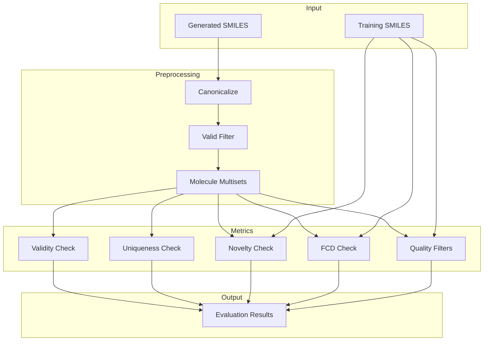
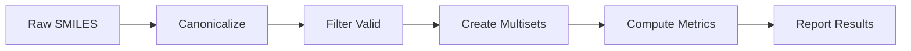

# OHScore Module

> Property prediction metrics and molecular evaluation functions for generated molecules.

## Table of Contents

- [Overview](#overview)
- [Architecture](#architecture)
- [Key Classes](#key-classes)
  - [ValidCheck](#validcheck)
  - [UniquenessCheck](#uniquenesscheck)
  - [NoveltyCheck](#noveltycheck)
  - [FCDCheck](#fcdcheck)
  - [QualityFiltersCheck](#qualityfilterscheck)
- [Usage Examples](#usage-examples)
- [Evaluation Pipeline](#evaluation-pipeline)
- [API Reference](#api-reference)
- [See Also](#see-also)

## Overview

The OHScore module provides metrics for evaluating generated molecules, including:

- Validity checking
- Uniqueness assessment
- Novelty detection against training data
- Fréchet ChemNet Distance (FCD)
- Quality filters for drug-likeness

These metrics are essential for evaluating molecular generation models like OHVAE and optimization results from OHPSO.

### Module Structure

```
OHMind/OHScore/
├── __init__.py          # Package initialization
├── metrics.py           # Evaluation metrics
├── utils.py             # Utility functions
├── alert_collection.csv # Structural alerts
└── rules.json           # Quality filter rules
```

## Architecture



## Key Classes

### ValidCheck

Computes the fraction of valid molecules.

```python
from OHMind.OHScore.metrics import ValidCheck

class ValidCheck:
    """
    Computes the number of valid molecules.
    
    A molecule is valid if:
    - It can be parsed by RDKit
    - It passes sanitization
    
    Parameters
    ----------
    gen : list[str]
        List of SMILES strings
    n_jobs : int
        Number of threads for calculation
        
    Returns
    -------
    float
        Fraction of valid molecules (0-1)
    """
```

#### Example Usage

```python
from OHMind.OHScore.metrics import ValidCheck, get_mol, mapper

# Check validity
generated_smiles = ["CCO", "CCCO", "invalid_smiles", "c1ccccc1"]

# Using mapper for parallel processing
n_jobs = 4
gen = mapper(n_jobs)(get_mol, generated_smiles)
validity = 1 - gen.count(None) / len(gen)

print(f"Validity: {validity:.2%}")  # 75%
```

### UniquenessCheck

Checks for unique molecules in generated set.

```python
from OHMind.OHScore.metrics import UniquenessCheck

class UniquenessCheck:
    """
    Computes uniqueness of generated molecules.
    
    A molecule bag is unique if it contains at least one molecule
    that has not been generated so far.
    
    Returns
    -------
    float
        Fraction of unique molecule bags (0-1)
    """
    
    def __call__(self, valid_molecule_bags):
        """
        Parameters
        ----------
        valid_molecule_bags : list[multiset.BaseMultiset]
            List of molecule multisets
            
        Returns
        -------
        float
            Uniqueness score
        """
```

#### Example Usage

```python
from OHMind.OHScore.metrics import UniquenessCheck, filter_valid_and_map_to_ms

# Generate some molecules
generated_smiles = [
    "CCO",
    "CCO",  # Duplicate
    "CCCO",
    "c1ccccc1",
    "c1ccccc1",  # Duplicate
]

# Convert to valid multisets
valid_ms = filter_valid_and_map_to_ms(generated_smiles)

# Check uniqueness
uniqueness_checker = UniquenessCheck()
uniqueness = uniqueness_checker(valid_ms)

print(f"Uniqueness: {uniqueness:.2%}")
```

### NoveltyCheck

Checks for novel molecules not in training data.

```python
from OHMind.OHScore.metrics import NoveltyCheck

class NoveltyCheck:
    """
    Computes novelty against training dataset.
    
    A molecule bag is novel if at least one molecule does not
    appear in the training dataset.
    
    Parameters
    ----------
    training_canonical_smiles : list[str]
        List of canonical SMILES from training data
    """
    
    def __init__(self, training_canonical_smiles):
        self.training_smiles = set(training_canonical_smiles)
    
    def __call__(self, valid_molecule_bags):
        """
        Parameters
        ----------
        valid_molecule_bags : list[multiset.BaseMultiset]
            List of molecule multisets
            
        Returns
        -------
        float
            Novelty score (0-1)
        """
```

#### Example Usage

```python
from OHMind.OHScore.metrics import NoveltyCheck, filter_valid_and_map_to_ms

# Training data
training_smiles = ["CCO", "CCCO", "c1ccccc1", "CC(=O)O"]

# Generated molecules
generated_smiles = [
    "CCO",      # In training
    "CCCCO",    # Novel
    "c1ccc(O)cc1",  # Novel
]

# Convert to valid multisets
valid_ms = filter_valid_and_map_to_ms(generated_smiles)

# Check novelty
novelty_checker = NoveltyCheck(training_smiles)
novelty = novelty_checker(valid_ms)

print(f"Novelty: {novelty:.2%}")
```

### FCDCheck

Computes Fréchet ChemNet Distance.

```python
from OHMind.OHScore.metrics import FCDCheck

class FCDCheck:
    """
    Computes Fréchet ChemNet Distance between training and generated molecules.
    
    FCD measures the similarity of molecular distributions using
    activations from a pretrained ChemNet model.
    
    Lower FCD indicates more similar distributions.
    
    Parameters
    ----------
    training_smi : list[str]
        List of training SMILES
    sample_size : int
        Number of samples for estimation (default: 10000)
        
    Notes
    -----
    - FCD is estimated from samples; variance may be high for small sets
    - Returns raw FCD, not the GuacaMol "FCD Score" (exp(-0.2*FCD))
    """
    
    def __init__(self, training_smi, sample_size=10000):
        pass
    
    def __call__(self, valid_molecule_bags):
        """
        Parameters
        ----------
        valid_molecule_bags : list[multiset.BaseMultiset]
            List of molecule multisets
            
        Returns
        -------
        float
            FCD value (lower is better)
        """
```

#### Example Usage

```python
from OHMind.OHScore.metrics import FCDCheck, filter_valid_and_map_to_ms

# Training data (should be large for accurate FCD)
training_smiles = load_training_smiles("training_data.smi")

# Generated molecules
generated_smiles = load_generated_smiles("generated.smi")

# Convert to valid multisets
valid_ms = filter_valid_and_map_to_ms(generated_smiles)

# Compute FCD
fcd_checker = FCDCheck(training_smiles, sample_size=10000)
fcd_score = fcd_checker(valid_ms)

print(f"FCD: {fcd_score:.4f}")
```

### QualityFiltersCheck

Applies quality filters for drug-likeness.

```python
from OHMind.OHScore.metrics import QualityFiltersCheck

class QualityFiltersCheck:
    """
    Quality filters from GuacaMol paper.
    
    Filters out compounds that are:
    - Potentially unstable
    - Reactive
    - Laborious to synthesize
    - Unpleasant to medicinal chemists
    
    Uses rules from GuacaMol supplementary material and
    rd_filters package.
    
    Parameters
    ----------
    training_data_smi : list[str]
        Training SMILES for normalization
        
    Filter Rules
    ------------
    - Structural alerts (PAINS, etc.)
    - Molecular weight range
    - LogP range
    - HBD/HBA counts
    - TPSA range
    """
    
    def __init__(self, training_data_smi):
        pass
    
    def __call__(self, valid_molecule_bags):
        """
        Parameters
        ----------
        valid_molecule_bags : list[multiset.BaseMultiset]
            List of molecule multisets
            
        Returns
        -------
        float
            Fraction passing filters (normalized to training data)
        """
```

#### Example Usage

```python
from OHMind.OHScore.metrics import QualityFiltersCheck, filter_valid_and_map_to_ms

# Training data
training_smiles = load_training_smiles("training_data.smi")

# Generated molecules
generated_smiles = load_generated_smiles("generated.smi")

# Convert to valid multisets
valid_ms = filter_valid_and_map_to_ms(generated_smiles)

# Apply quality filters
quality_checker = QualityFiltersCheck(training_smiles)
quality_score = quality_checker(valid_ms)

print(f"Quality Filter Score: {quality_score:.2%}")
```

## Usage Examples

### Complete Evaluation Pipeline

```python
from OHMind.OHScore.metrics import (
    filter_valid_and_map_to_ms,
    UniquenessCheck,
    NoveltyCheck,
    FCDCheck,
    QualityFiltersCheck
)

def evaluate_generated_molecules(generated_smiles, training_smiles):
    """
    Comprehensive evaluation of generated molecules.
    
    Parameters
    ----------
    generated_smiles : list[str]
        Generated SMILES strings
    training_smiles : list[str]
        Training SMILES strings
        
    Returns
    -------
    dict
        Dictionary of metric scores
    """
    results = {}
    
    # Convert to valid multisets
    valid_ms = filter_valid_and_map_to_ms(generated_smiles)
    
    # Validity
    results['validity'] = len(valid_ms) / len(generated_smiles)
    
    # Uniqueness
    uniqueness_checker = UniquenessCheck()
    results['uniqueness'] = uniqueness_checker(valid_ms)
    
    # Novelty
    novelty_checker = NoveltyCheck(training_smiles)
    results['novelty'] = novelty_checker(valid_ms)
    
    # FCD (if enough samples)
    if len(valid_ms) >= 1000:
        fcd_checker = FCDCheck(training_smiles, sample_size=min(10000, len(valid_ms)))
        results['fcd'] = fcd_checker(valid_ms)
    else:
        results['fcd'] = None
    
    return results

# Example usage
training_smiles = load_smiles("training.smi")
generated_smiles = load_smiles("generated.smi")

metrics = evaluate_generated_molecules(generated_smiles, training_smiles)

print("Evaluation Results:")
print(f"  Validity:   {metrics['validity']:.2%}")
print(f"  Uniqueness: {metrics['uniqueness']:.2%}")
print(f"  Novelty:    {metrics['novelty']:.2%}")
if metrics['fcd'] is not None:
    print(f"  FCD:        {metrics['fcd']:.4f}")
```

### Evaluating OHPSO Results

```python
from OHMind.OHScore.metrics import (
    filter_valid_and_map_to_ms,
    NoveltyCheck,
    UniquenessCheck
)
from OHMind.OHPSO.optimizer import BasePSOptimizer

# After PSO optimization
optimizer = BasePSOptimizer.from_query(...)
swarms = optimizer.run(num_steps=10, num_track=50)

# Get generated SMILES
generated_smiles = optimizer.best_solutions['smiles'].tolist()

# Load training data
training_smiles = load_smiles("cation_training.smi")

# Evaluate
valid_ms = filter_valid_and_map_to_ms(generated_smiles)

novelty_checker = NoveltyCheck(training_smiles)
uniqueness_checker = UniquenessCheck()

print(f"Generated: {len(generated_smiles)}")
print(f"Valid: {len(valid_ms)}")
print(f"Novelty: {novelty_checker(valid_ms):.2%}")
print(f"Uniqueness: {uniqueness_checker(valid_ms):.2%}")
```

### Batch Evaluation with Config

```python
from OHMind.OHScore.metrics import Params, evaluating

# Create params with config
params = Params(
    processed_data_dir="data/",
    experiments_config="evaluation_config.json"
)

# Run evaluation
evaluating(params)
```

Example config file (`evaluation_config.json`):

```json
{
    "data_dir": "results/",
    "table_format": "github",
    "tables_to_create": [
        {
            "metrics": ["validity", "uniqueness", "novelty", "FCD"],
            "rows": {
                "OHVAE": ["ohvae_generated.smi", 10000],
                "OHPSO": ["ohpso_optimized.smi", 1000],
                "Baseline": ["baseline_generated.smi", 10000]
            }
        }
    ]
}
```

## Evaluation Pipeline

### Standard Workflow



### Parallel Processing

```python
from OHMind.OHScore.metrics import mapper, get_mol

# Use multiple cores
n_jobs = 8
parallel_map = mapper(n_jobs)

# Parallel validity check
mols = parallel_map(get_mol, smiles_list)
validity = 1 - mols.count(None) / len(mols)
```

## API Reference

### filter_valid_and_map_to_ms

```python
def filter_valid_and_map_to_ms(smiles_in):
    """
    Filter valid SMILES and convert to canonical multisets.
    
    Parameters
    ----------
    smiles_in : list[str]
        Input SMILES strings
        
    Returns
    -------
    list[multiset.FrozenMultiset]
        List of canonical molecule multisets
    """
```

### get_mol

```python
def get_mol(smiles_or_mol):
    """
    Load SMILES/molecule into RDKit object.
    
    Parameters
    ----------
    smiles_or_mol : str or RDKit Mol
        Input SMILES string or molecule
        
    Returns
    -------
    RDKit Mol or None
        Sanitized molecule or None if invalid
    """
```

### mapper

```python
def mapper(n_jobs):
    """
    Returns function for parallel map calls.
    
    Parameters
    ----------
    n_jobs : int or Pool
        Number of jobs (1 for serial) or Pool object
        
    Returns
    -------
    callable
        Map function
    """
```

### Metric Summary

| Metric | Range | Ideal | Description |
|--------|-------|-------|-------------|
| Validity | 0-1 | 1.0 | Fraction of valid molecules |
| Uniqueness | 0-1 | 1.0 | Fraction of unique molecules |
| Novelty | 0-1 | 1.0 | Fraction novel to training |
| FCD | 0-∞ | 0.0 | Distribution distance |
| Quality | 0-1 | 1.0 | Fraction passing filters |

## See Also

- [Core Library Index](./index.md) - Module overview
- [OHVAE Module](./ohvae.md) - Molecular generation
- [OHPSO Module](./ohpso.md) - PSO optimization
- [HEM Agent](../agents/hem-agent.md) - Agent using OHScore

---
*Last updated: 2025-12-22 | OHMind v1.0.0*
