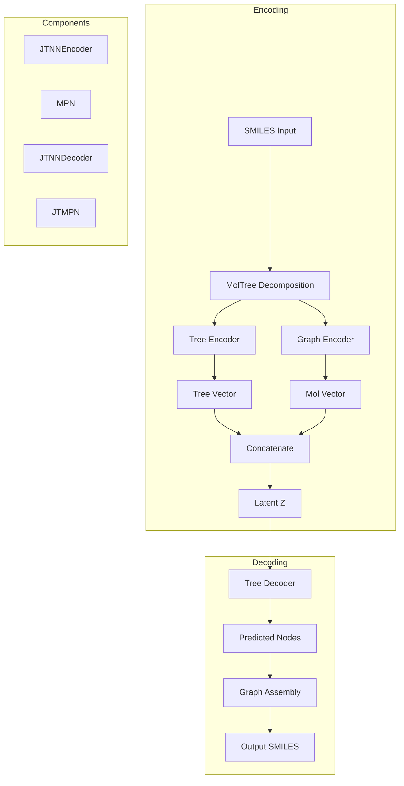

# OHVAE Module

> Junction Tree Variational Autoencoder (JT-VAE) for molecular generation and latent space optimization.

## Table of Contents

- [Overview](#overview)
- [Architecture](#architecture)
- [Key Classes](#key-classes)
  - [JTNNVAE](#jtnnvae)
  - [MolTree](#moltree)
  - [Vocab](#vocab)
  - [JTNNEncoder](#jtnnencoder)
  - [JTNNDecoder](#jtnndecoder)
- [Data Utilities](#data-utilities)
- [Usage Examples](#usage-examples)
- [Training](#training)
- [Model Loading](#model-loading)
- [API Reference](#api-reference)
- [See Also](#see-also)

## Overview

The OHVAE module implements a Junction Tree Variational Autoencoder (JT-VAE) for molecular generation. This architecture decomposes molecules into tree-structured scaffolds of chemical substructures, enabling:

- Valid molecule generation by construction
- Smooth latent space for optimization
- Efficient encoding/decoding of molecular structures
- Integration with PSO optimization (OHPSO module)

### Module Structure

```
OHMind/OHVAE/
├── __init__.py          # Package exports
├── jtnn_vae.py          # Main VAE model
├── jtnn_enc.py          # Junction tree encoder
├── jtnn_dec.py          # Junction tree decoder
├── mol_tree.py          # Molecular tree decomposition
├── vocab.py             # Vocabulary management
├── mpn.py               # Message passing network
├── jtmpn.py             # Junction tree MPN
├── chemutils.py         # Chemistry utilities
├── datautils.py         # Data loading utilities
├── nnutils.py           # Neural network utilities
├── sascorer.py          # Synthetic accessibility scorer
└── sparse_gp.py         # Sparse Gaussian process
```

## Architecture



### Latent Space

The VAE uses a dual latent space:
- **Tree latent vector**: Encodes the junction tree structure
- **Molecular latent vector**: Encodes the molecular graph

Total latent dimension = `latent_size` (split equally between tree and mol)

## Key Classes

### JTNNVAE

The main VAE model class for molecular encoding and decoding.

```python
from OHMind.OHVAE import JTNNVAE, Vocab

class JTNNVAE(nn.Module):
    def __init__(self, vocab, hidden_size, latent_size, depthT, depthG):
        """
        Initialize Junction Tree VAE.
        
        Parameters
        ----------
        vocab : Vocab
            Vocabulary of molecular substructures
        hidden_size : int
            Hidden dimension for neural networks
        latent_size : int
            Total latent space dimension (split between tree/mol)
        depthT : int
            Depth of tree message passing
        depthG : int
            Depth of graph message passing
        """
```

#### Key Methods

| Method | Description | Returns |
|--------|-------------|---------|
| `encode(jtenc_holder, mpn_holder)` | Encode tensorized batch | `(tree_vecs, tree_mess, mol_vecs)` |
| `encode_from_smiles(smiles_list)` | Encode SMILES directly | `torch.Tensor` (latent vectors) |
| `encode_latent(jtenc_holder, mpn_holder)` | Encode to mean/var | `(mean, var)` tensors |
| `decode(x_tree_vecs, x_mol_vecs, prob_decode)` | Decode latent to SMILES | `str` or `None` |
| `sample_prior(prob_decode)` | Sample from prior | `str` (SMILES) |
| `forward(x_batch, beta)` | Training forward pass | `(loss, kl_div, word_acc, topo_acc, assm_acc)` |

#### Example Usage

```python
from OHMind.OHVAE import JTNNVAE, Vocab, MolTree
from OHMind.OHVAE.datautils import tensorize

# Load vocabulary
vocab_list = open("vocab.txt").read().strip().split('\n')
vocab = Vocab(vocab_list)

# Initialize model
model = JTNNVAE(
    vocab=vocab,
    hidden_size=450,
    latent_size=56,
    depthT=20,
    depthG=3
)

# Encode SMILES to latent space
smiles_list = ["CCO", "CCCO", "c1ccccc1"]
latent_vectors = model.encode_from_smiles(smiles_list)
print(f"Latent shape: {latent_vectors.shape}")  # [3, 56]

# Decode from latent space
tree_vec = latent_vectors[0, :28].unsqueeze(0)
mol_vec = latent_vectors[0, 28:].unsqueeze(0)
decoded_smiles = model.decode(tree_vec, mol_vec, prob_decode=False)
print(f"Decoded: {decoded_smiles}")
```

### MolTree

Represents a molecule as a junction tree of substructures.

```python
from OHMind.OHVAE import MolTree

class MolTree:
    def __init__(self, smiles):
        """
        Create junction tree from SMILES.
        
        Parameters
        ----------
        smiles : str
            Input SMILES string
            
        Attributes
        ----------
        smiles : str
            Original SMILES
        mol : rdkit.Chem.Mol
            RDKit molecule object
        nodes : list[MolTreeNode]
            List of tree nodes (substructures)
        out_of_vocab : bool
            True if molecule contains out-of-vocabulary fragments
        """
```

#### MolTreeNode

```python
class MolTreeNode:
    def __init__(self, smiles, clique=[]):
        """
        A node in the junction tree.
        
        Attributes
        ----------
        smiles : str
            SMILES of the substructure
        mol : rdkit.Chem.Mol
            RDKit molecule
        clique : list[int]
            Atom indices in parent molecule
        neighbors : list[MolTreeNode]
            Connected nodes
        nid : int
            Node ID
        is_leaf : bool
            True if leaf node
        wid : int
            Vocabulary index
        cands : list[str]
            Assembly candidates
        label : str
            Ground truth label
        """
```

#### Example Usage

```python
from OHMind.OHVAE import MolTree

# Create junction tree
mol_tree = MolTree("c1ccc(C(=O)O)cc1")

print(f"Number of nodes: {mol_tree.size()}")
for node in mol_tree.nodes:
    print(f"  Node {node.nid}: {node.smiles}, leaf={node.is_leaf}")

# Recover labels for training
mol_tree.recover()

# Generate assembly candidates
mol_tree.assemble()
```

### Vocab

Manages the vocabulary of molecular substructures.

```python
from OHMind.OHVAE import Vocab

class Vocab:
    def __init__(self, smiles_list):
        """
        Initialize vocabulary from list of SMILES.
        
        Parameters
        ----------
        smiles_list : list[str]
            List of substructure SMILES
        """
```

#### Methods

| Method | Description | Returns |
|--------|-------------|---------|
| `get_index(smiles)` | Get vocabulary index | `int` |
| `get_smiles(idx)` | Get SMILES from index | `str` |
| `get_slots(idx)` | Get attachment slots | `list[tuple]` |
| `size()` | Vocabulary size | `int` |

#### Example Usage

```python
from OHMind.OHVAE import Vocab

# Load vocabulary from file
vocab_list = open("vocab.txt").read().strip().split('\n')
vocab = Vocab(vocab_list)

print(f"Vocabulary size: {vocab.size()}")

# Look up substructure
idx = vocab.get_index("c1ccccc1")
smiles = vocab.get_smiles(idx)
slots = vocab.get_slots(idx)
print(f"Index: {idx}, SMILES: {smiles}, Slots: {slots}")
```

### JTNNEncoder

Encodes junction trees using message passing.

```python
from OHMind.OHVAE import JTNNEncoder

class JTNNEncoder(nn.Module):
    def __init__(self, hidden_size, depth, embedding):
        """
        Junction tree encoder with GRU message passing.
        
        Parameters
        ----------
        hidden_size : int
            Hidden dimension
        depth : int
            Number of message passing iterations
        embedding : nn.Embedding
            Vocabulary embedding layer
        """
```

#### Static Methods

| Method | Description |
|--------|-------------|
| `tensorize(tree_batch)` | Convert tree batch to tensors |
| `tensorize_nodes(node_batch, scope)` | Convert nodes to tensors |

### JTNNDecoder

Decodes latent vectors to junction trees.

```python
from OHMind.OHVAE.jtnn_dec import JTNNDecoder

class JTNNDecoder(nn.Module):
    def __init__(self, vocab, hidden_size, latent_size, embedding):
        """
        Junction tree decoder.
        
        Parameters
        ----------
        vocab : Vocab
            Vocabulary object
        hidden_size : int
            Hidden dimension
        latent_size : int
            Latent vector dimension
        embedding : nn.Embedding
            Vocabulary embedding layer
        """
```

## Data Utilities

### MolTreeFolder

Data loader for training batches.

```python
from OHMind.OHVAE.datautils import MolTreeFolder

class MolTreeFolder:
    def __init__(self, data_folder, vocab, batch_size, 
                 num_workers=4, shuffle=True, assm=True, replicate=None):
        """
        Iterable data loader for molecular trees.
        
        Parameters
        ----------
        data_folder : str
            Path to preprocessed data
        vocab : Vocab
            Vocabulary object
        batch_size : int
            Batch size
        num_workers : int
            DataLoader workers
        shuffle : bool
            Shuffle data
        assm : bool
            Include assembly data
        replicate : int, optional
            Replicate dataset N times
        """
```

### tensorize

Convert molecule batch to tensors.

```python
from OHMind.OHVAE.datautils import tensorize

def tensorize(tree_batch, vocab, assm=True):
    """
    Tensorize a batch of MolTree objects.
    
    Parameters
    ----------
    tree_batch : list[MolTree]
        Batch of molecular trees
    vocab : Vocab
        Vocabulary object
    assm : bool
        Include assembly tensors
        
    Returns
    -------
    tuple
        (tree_batch, jtenc_holder, mpn_holder) or
        (tree_batch, jtenc_holder, mpn_holder, jtmpn_holder)
    """
```

## Usage Examples

### Basic Encoding/Decoding

```python
import torch
from OHMind.OHVAE import JTNNVAE, Vocab, MolTree
from OHMind.OHVAE.datautils import tensorize

# Setup
vocab_list = open("vocab.txt").read().strip().split('\n')
vocab = Vocab(vocab_list)
model = JTNNVAE(vocab, hidden_size=450, latent_size=56, depthT=20, depthG=3)
model.cuda()
model.eval()

# Load pretrained weights
model.load_state_dict(torch.load("model.pt"))

# Encode molecules
smiles_list = ["c1ccccc1", "CCO", "CC(=O)O"]
with torch.no_grad():
    latent = model.encode_from_smiles(smiles_list)
    
print(f"Encoded {len(smiles_list)} molecules to shape {latent.shape}")

# Decode back
for i in range(len(smiles_list)):
    tree_vec = latent[i, :28].unsqueeze(0)
    mol_vec = latent[i, 28:].unsqueeze(0)
    decoded = model.decode(tree_vec, mol_vec, prob_decode=False)
    print(f"Original: {smiles_list[i]} -> Decoded: {decoded}")
```

### Latent Space Interpolation

```python
import torch
import numpy as np

# Encode two molecules
mol1 = "c1ccccc1"  # benzene
mol2 = "c1ccc(O)cc1"  # phenol

with torch.no_grad():
    z1 = model.encode_from_smiles([mol1])
    z2 = model.encode_from_smiles([mol2])

# Interpolate
interpolations = []
for alpha in np.linspace(0, 1, 10):
    z_interp = (1 - alpha) * z1 + alpha * z2
    tree_vec = z_interp[:, :28]
    mol_vec = z_interp[:, 28:]
    decoded = model.decode(tree_vec, mol_vec, prob_decode=False)
    interpolations.append(decoded)
    
print("Interpolation path:")
for i, smi in enumerate(interpolations):
    print(f"  {i}: {smi}")
```

### Random Sampling

```python
# Sample from prior distribution
samples = []
for _ in range(100):
    with torch.no_grad():
        smi = model.sample_prior(prob_decode=True)
        if smi is not None:
            samples.append(smi)
            
print(f"Generated {len(samples)} valid molecules")
print("Examples:", samples[:5])
```

## Training

### Data Preprocessing

```python
from OHMind.OHVAE.mol_tree import main_mol_tree

# Generate vocabulary from training data
main_mol_tree(
    oinput="train_smiles.txt",
    ovocab="vocab.txt",
    MAX_TREE_WIDTH=50
)
```

### Training Loop

```python
import torch
import torch.optim as optim
from OHMind.OHVAE import JTNNVAE, Vocab
from OHMind.OHVAE.datautils import MolTreeFolder

# Setup
vocab_list = open("vocab.txt").read().strip().split('\n')
vocab = Vocab(vocab_list)
model = JTNNVAE(vocab, hidden_size=450, latent_size=56, depthT=20, depthG=3)
model.cuda()

optimizer = optim.Adam(model.parameters(), lr=1e-3)
data_loader = MolTreeFolder("processed_data/", vocab, batch_size=32)

# Training
beta = 0.0  # KL weight (anneal from 0 to 1)
for epoch in range(100):
    for batch in data_loader:
        model.zero_grad()
        loss, kl_div, word_acc, topo_acc, assm_acc = model(batch, beta)
        loss.backward()
        optimizer.step()
        
    # Anneal beta
    beta = min(1.0, beta + 0.01)
    print(f"Epoch {epoch}: loss={loss.item():.4f}, KL={kl_div:.4f}")
```

## Model Loading

### Load Pretrained Model

```python
import torch
from OHMind.OHVAE import JTNNVAE, Vocab

# Load vocabulary
vocab_list = open("vocab.txt").read().strip().split('\n')
vocab = Vocab(vocab_list)

# Initialize model with same architecture
model = JTNNVAE(
    vocab=vocab,
    hidden_size=450,
    latent_size=56,
    depthT=20,
    depthG=3
)

# Load weights
checkpoint = torch.load("model.pt", map_location="cuda")
model.load_state_dict(checkpoint)
model.cuda()
model.eval()
```

### Save Model

```python
# Save model weights
torch.save(model.state_dict(), "model.pt")

# Save full checkpoint
torch.save({
    'model_state_dict': model.state_dict(),
    'optimizer_state_dict': optimizer.state_dict(),
    'epoch': epoch,
    'vocab': vocab_list,
}, "checkpoint.pt")
```

## API Reference

### JTNNVAE

| Parameter | Type | Default | Description |
|-----------|------|---------|-------------|
| `vocab` | `Vocab` | required | Vocabulary object |
| `hidden_size` | `int` | required | Hidden layer dimension |
| `latent_size` | `int` | required | Total latent dimension |
| `depthT` | `int` | required | Tree message passing depth |
| `depthG` | `int` | required | Graph message passing depth |

### Recommended Hyperparameters

| Parameter | Recommended Value | Notes |
|-----------|-------------------|-------|
| `hidden_size` | 450 | Standard for drug-like molecules |
| `latent_size` | 56 | 28 for tree + 28 for mol |
| `depthT` | 20 | Tree encoding depth |
| `depthG` | 3 | Graph encoding depth |
| `batch_size` | 32-64 | Training batch size |
| `learning_rate` | 1e-3 | Adam optimizer |

## See Also

- [Core Library Index](./index.md) - Module overview
- [OHPSO Module](./ohpso.md) - PSO optimization using OHVAE
- [OHScore Module](./ohscore.md) - Scoring functions
- [HEM Agent](../agents/hem-agent.md) - Agent using OHVAE
- [HEM Server](../mcp-servers/hem-server.md) - MCP server tools

---
*Last updated: 2025-12-22 | OHMind v1.0.0*
