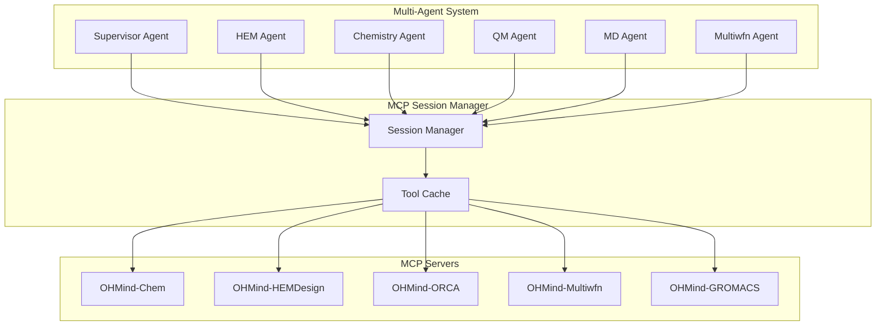
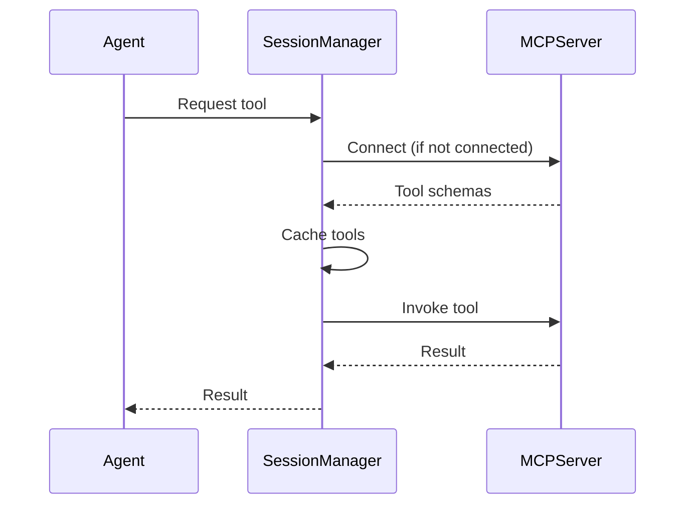

# MCP Server Reference

> Comprehensive documentation for OHMind's five domain-specific MCP servers that provide tools to the multi-agent system.

## Table of Contents

- [Overview](#overview)
- [Server Architecture](#server-architecture)
- [Server Summary](#server-summary)
- [Transport Modes](#transport-modes)
- [Connection Management](#connection-management)
- [Configuration](#configuration)
- [See Also](#see-also)

## Overview

OHMind uses the Model Context Protocol (MCP) to provide domain-specific tools to its agents. Five specialized MCP servers handle different aspects of computational chemistry and HEM design:

| Server | Purpose | Tool Count |
|--------|---------|------------|
| [OHMind-Chem](./chem-server.md) | Molecular informatics & web search | 17 |
| [OHMind-HEMDesign](./hem-server.md) | PSO optimization & job management | 7 |
| [OHMind-ORCA](./orca-server.md) | Quantum chemistry calculations | 10 |
| [OHMind-Multiwfn](./multiwfn-server.md) | Wavefunction analysis | 16 |
| [OHMind-GROMACS](./gromacs-server.md) | Molecular dynamics simulations | 25+ |

### Key Features

- **Tool Discovery**: MCP protocol enables automatic tool discovery and schema validation
- **Input Validation**: All tools validate inputs using Pydantic models
- **Error Handling**: Consistent error responses with helpful messages
- **Result Storage**: Unified workspace for all computation results
- **Progress Monitoring**: Long-running jobs support progress tracking

## Server Architecture



### Tool Distribution

Each agent has access to specific MCP servers:

| Agent | MCP Servers |
|-------|-------------|
| HEM Agent | OHMind-HEMDesign |
| Chemistry Agent | OHMind-Chem |
| QM Agent | OHMind-ORCA |
| MD Agent | OHMind-GROMACS |
| Multiwfn Agent | OHMind-Multiwfn |
| Web Search Agent | OHMind-Chem (WebSearch tool) |

## Server Summary

### OHMind-Chem

Molecular informatics and cheminformatics operations.

**Entry Point**: `python -m OHMind_agent.MCP.Chem.server --transport stdio`

**Key Tools**:
- SMILES validation and canonicalization
- Molecular property calculations (weight, formula, atom counts)
- Name/SMILES/IUPAC conversions
- Functional group identification
- Molecular similarity (Tanimoto)
- Structure visualization
- Chemistry-aware web search (Tavily)

[Full Documentation →](./chem-server.md)

### OHMind-HEMDesign

HEM optimization and PSO-based cation design.

**Entry Point**: `python -m OHMind_agent.MCP.HEMDesign.server --transport stdio`

**Key Tools**:
- List available backbones and cation types
- Validate optimization configurations
- Run PSO optimization
- Check optimization results
- Monitor and manage running jobs

[Full Documentation →](./hem-server.md)

### OHMind-ORCA

Quantum chemistry calculations via ORCA.

**Entry Point**: `python -m OHMind_agent.MCP.ORCA.server --transport stdio`

**Key Tools**:
- SMILES to XYZ conversion
- Single point energy calculations
- Geometry optimization
- Frequency calculations
- Proton affinity and pKa estimation
- Binding energy calculations
- Charge analysis

[Full Documentation →](./orca-server.md)

### OHMind-Multiwfn

Wavefunction and electronic structure analysis.

**Entry Point**: `python -m OHMind_agent.MCP.Multiwfn.server --transport stdio`

**Key Tools**:
- Orbital analysis (HOMO/LUMO)
- Population analysis (Mulliken, Hirshfeld, ADCH)
- Electron density analysis (AIM, ELF, LOL)
- Weak interaction analysis (NCI, RDG)
- Orbital visualization (2D/3D)
- Spectrum simulation

[Full Documentation →](./multiwfn-server.md)

### OHMind-GROMACS

Molecular dynamics simulations for IEMs.

**Entry Point**: `python -m OHMind_agent.MCP.GROMACS.server --transport stdio`

**Key Tools**:
- Polymer building from SMILES
- Force field parameterization
- System preparation and solvation
- MD simulation (EM, NVT, NPT, production)
- Trajectory and energy analysis
- Complete IEM workflow automation

[Full Documentation →](./gromacs-server.md)

## Transport Modes

OHMind MCP servers support two transport modes:

### stdio Transport (Default)

Standard input/output transport for local process communication.

```bash
python -m OHMind_agent.MCP.Chem.server --transport stdio
```

**Use Cases**:
- CLI application
- Local development
- Chainlit UI integration

### HTTP Transport (Streamable)

HTTP-based transport for remote access and IDE integration.

```bash
python -m OHMind_agent.MCP.Chem.server --transport streamable-http --port 8101
```

**Default Ports**:
| Server | Port |
|--------|------|
| OHMind-Chem | 8101 |
| OHMind-HEMDesign | 8102 |
| OHMind-ORCA | 8103 |
| OHMind-Multiwfn | 8104 |
| OHMind-GROMACS | 8105 |

**Use Cases**:
- IDE plugins (VS Code, Cursor)
- Remote access
- External MCP clients

### Starting HTTP Servers

Use the `start_OHMind.sh` script to start all HTTP servers:

```bash
cd OHMind
./start_OHMind.sh
```

This starts both stdio servers (for CLI/UI) and HTTP servers (for IDE integration).

## Connection Management

### Session Manager

The `MCPSessionManager` handles MCP server connections:

```python
from OHMind_agent.agents.mcp_session_manager import MCPSessionManager

# Initialize session manager
session_manager = MCPSessionManager()

# Connect to servers
await session_manager.connect()

# Get tools for a specific server
chem_tools = session_manager.get_tools("OHMind-Chem")

# Invoke a tool
result = await session_manager.invoke_tool(
    server_name="OHMind-Chem",
    tool_name="MoleculeWeight",
    arguments={"smiles": "CCO"}
)
```

### Persistent Connections

MCP connections are kept alive for the duration of the session:

- **Long-lived Sessions**: Context managers maintain tool references
- **Automatic Reconnection**: Failed connections are automatically retried
- **Tool Caching**: Tool schemas are cached after initial discovery

### Connection Lifecycle



## Configuration

### mcp.json Format

MCP servers are configured in `mcp.json`:

```json
{
  "mcpServers": {
    "OHMind-Chem": {
      "command": "python",
      "args": ["-m", "OHMind_agent.MCP.Chem.server", "--transport", "stdio"],
      "env": {
        "PYTHONPATH": "/path/to/OHMind",
        "TAVILY_API_KEY": "tvly-..."
      }
    },
    "OHMind-ORCA": {
      "command": "python",
      "args": ["-m", "OHMind_agent.MCP.ORCA.server", "--transport", "stdio"],
      "env": {
        "PYTHONPATH": "/path/to/OHMind",
        "OHMind_ORCA": "/path/to/orca",
        "QM_WORK_DIR": "/OHMind_workspace/ORCA"
      }
    }
  }
}
```

### Environment Variables

Common environment variables for MCP servers:

| Variable | Purpose | Used By |
|----------|---------|---------|
| `PYTHONPATH` | Python module path | All servers |
| `OHMind_workspace` | Base workspace directory | All servers |
| `TAVILY_API_KEY` | Web search API key | Chem |
| `HEM_SAVE_PATH` | HEM results directory | HEMDesign |
| `OHMind_ORCA` | ORCA binary path | ORCA |
| `QM_WORK_DIR` | QM working directory | ORCA |
| `MULTIWFN_PATH` | Multiwfn binary path | Multiwfn |
| `MULTIWFN_WORK_DIR` | Multiwfn working directory | Multiwfn |
| `MD_WORK_DIR` | MD working directory | GROMACS |

### Workspace Structure

All MCP servers write results to the unified workspace:

```
$OHMind_workspace/
├── HEM/           # HEMDesign optimization results
├── ORCA/          # QM calculation results
├── GROMACS/       # MD simulation results
└── Multiwfn/      # Wavefunction analysis results
```

## Troubleshooting

### Common Issues

#### Server Not Starting

```bash
# Check if dependencies are installed
python -c "import mcp; print('MCP OK')"
python -c "import rdkit; print('RDKit OK')"

# Run server manually with verbose logging
PYTHONPATH=/path/to/OHMind python -m OHMind_agent.MCP.Chem.server --transport stdio
```

#### Tool Not Found

- Verify server is connected in session manager
- Check server logs for registration errors
- Ensure all dependencies are installed

#### Connection Timeout

- Check if server process is running
- Verify environment variables are set
- Check network connectivity (for HTTP transport)

### Debug Commands

```bash
# Test Chem server
echo '{"jsonrpc":"2.0","method":"tools/list","id":1}' | \
  python -m OHMind_agent.MCP.Chem.server --transport stdio

# Check server logs
tail -f OHMind_logs/chem_mcp.log
```

## See Also

- [Architecture Overview](../architecture/overview.md) - System architecture
- [MCP Integration](../architecture/mcp-integration.md) - Protocol details
- [Configuration Reference](../configuration/mcp-config.md) - Full configuration guide
- [Agent Reference](../agents/index.md) - Agent-tool mapping

---
*Last updated: 2025-12-22 | OHMind v1.0.0*
